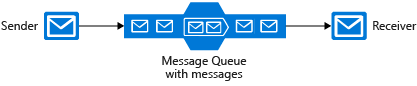
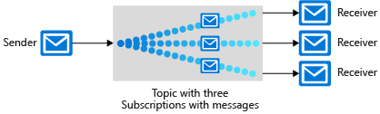
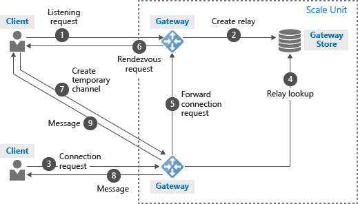

# Connect your services together

This is the second chapter of the online Azure Developer Associate course.

## Choose a messaging model in Azure to loosely connect your services

Reliable messaging is often a critical problem. That's why Azure has some tools for it.

### Choose whether to use messages or events

There are two kinds of communication strategies:

- **Messages**:
  - Contains data.
  - Does not hold a reference to the data.
  - Expects that the message content is processed in a certain way.
- **Events** (components for sending events are known as *publishers* and *subscribers*):
  - Indicates that something happened.
  - Can be send to multiple receivers or none at all.
  - No expectation about the action a receiving component takes.
  - Some events are unrelated to other events while some of them are part of a related and ordered series.

These communication strategies are also called **datagrams**: packages of data sent from one component to another.

While events are more likely to be used for broadcasts and are often ephemeral, messages are more likely to be used where the distributed application requires a guarantee that the communication will be processed.

### Choosing a messaging technology

For *messaging* systems, there are two Azure technologies that can be used. They both utilize the idea of a *queue*, which holds sent messages until the target is ready to receive them:

- **Azure Queue Storage** uses Azure Storage to store large numbers of messages that can be securely accessed from anywhere in the world using a simple REST-based interface. Queues can contain millions of messages, limited only by the capacity of the storage account that owns it.

  You should use it when:
  - Need an audit trail of all messages that pass through the queue.
  - Expect the queue to exceed 80 GB in size.
  - Want to track progress for processing a message inside of the queue.

- **Azure Service Bus Queues** is a message broker system intended for enterprise applications. These apps often utilize multiple communication protocols, have different data contracts, higher security requirements, and can include both cloud and on-premises services.

  Another feature of this service are *Azure Service Bus Topics*. Instead of connecting to a single subscriber, you can connect to multiple subscriptions. Because it behaves like a queue, it will only remove the message if all the subscribed branches have processed the message.

  You should use it when:
  - Need an At-Most-Once delivery guarantee.
  - Need a FIFO guarantee.
  - Need to group messages into transactions.
  - Want to receive messages without polling the queue.
  - Need to provide a role-based access model to the queues.
  - Need to handle messages larger than 64 KB but less than 256 KB.
  - Queue size will not grow larger than 80 GB.
  - Want to publish and consume batches of messages.
  - (Topics only) Need multiple receivers to handle each message

Queues have their advantages:

- **Increased reliability**. Because messages are placed inside the queue and don't get removed until they have been read, you can ensure that the message gets processed (even at times of high demand)
- **Message delivery guarantees**. There are three different approaches on how a guarantee delivery can work:
  - *At-Least-Once Delivery*: Each message is guaranteed delivery to at least one of the components that retrieve messages from the queue. But keep in mind that it is possible that the same message may be delivered more than once.
  - *At-Most-Once Delivery*: Each message is not guaranteed for delivery, and there is a small chance that it may not arrive. But there is no chance that the message will be delivered twice. This is sometimes referred to as *automatic duplicate detection*.
  - *First-In-First-Out (FIFO)*: If your distributed application requires that messages are processed in precisely the correct order, you must choose a queue system that includes a FIFO guarantee.

If required, you can put all the messages in a **transaction**. This can avoid problems for when one of the messages isn't received by it's subscriber.

### Choosing an event technology

To start it off, **Azure Event Grid** is a fully-managed event routing service running on top of Azure Service Fabric. It supports most Azure services as a publisher or subscriber and can be used with third-party services. It provides a dynamically scalable, low-cost, messaging system that allows publishers to notify subscribers about a status change.

Event Grid exists from the following concepts:

- **Events**: What happened.
- **Publisher**: The user or organization that decides to send events to Event Grid.
- **Event sources**: Where the event took place. This can be Azure Storage for blob events or IoT Hub for device created events.
- **Topics**: They are represented by a public endpoint and are where the publisher sends events to. There are two kinds of topics:
  - *System topics* are built-in topics provided by Azure services. You don't see system topics in your Azure subscription because the publisher owns the topics, but you can subscribe to them.
  - *Custom topics* are application and third-party topics. When you create or are assigned access to a custom topic, you see that custom topic in your subscription.
- **Event subscriptions**: The endpoint or built-in mechanism to route events, sometimes to multiple handlers. Subscriptions are also used by handlers to filter incoming events intelligently.
- **Event handlers (subscriber)**: The app or service reacting to the event.


An event from the Event Grid is self-contained and can be up to 64KB:

```JSON
[
  {
    "topic": "string",
    "subject": "string",
    "id": "string",
    "eventType": "string",
    "eventTime": "string",
    "data":{
      "object-unique-to-each-publisher"
    },
    "dataVersion": "string",
    "metadataVersion": "string"
  }
]
```

Explanation of the JSON properties:

- *topic*: The full resource path to the event source. Event Grid provides this value.
- *subject*: Publisher-defined path to the event subject.
- *id*: The unique identifier for event.
- *eventType*: One of the registered event types for this event source. This is a value you can create filters against, e.g. `CustomerCreated`, `BlobDeleted`, `HttpRequestReceived`, etc.
- *eventTime*: The time the event was generated based on the provider's UTC time.
- *object-unique-to-each-publisher*: Specific information that is relevant to the type of event. For example, an event about a new file being created in Azure Storage has details about the file, such as the lastTimeModified value. Or, an Event Hubs event has the URL of the Capture file. This field is optional.
- *dataVersion*: The schema version of the data object. The publisher defines the schema version.
- *metadataVersion*: The schema version of the event metadata. Event Grid defines the schema of the top-level properties. Event Grid provides this value.

Use Event Grid when you need these features:

- **Simplicity**: It is straightforward to connect sources to subscribers in Event Grid.
- **Advanced filtering**: Subscriptions have close control over the events they receive from a topic.
- **Fan-out**: You can subscribe to an unlimited number of endpoints to the same events and topics.
- **Reliability**: Event Grid retries event delivery for up to 24 hours for each subscription.
- **Pay-per-event**: Pay only for the number of events that you transmit.

You can use Event Grid to deliver discrete events to subscribers, which will receive those events reliably and quickly. But what if we want to deliver a large stream of events? In this scenario, Event Grid isn't a great solution because it's designed for one-event-at-a-time delivery. Instead, we need to turn to another Azure service: **Event Hubs**.

There are some subtle differences between Event Grid and Event Hubs:

- **Partitions** are buffers into which the communications are saved. Event Hubs have at least two partitions and each partition has a separate set of subscribers. A subscriber can "catch up" to these events if they have been busy/offline. After a default time of 24 hours, the message expires.
- **Captures**. Event Hubs can send all your events immediately to Azure Data Lake or Azure Blob storage for inexpensive, permanent persistence.
- **Authentication**. All publishers are authenticated and issued a token. This means Event Hubs can accept events from external devices and mobile apps without worrying.

Event Hubs has support for pipelining event streams to other Azure services. Using it with Azure Stream Analytics, for instance, allows complex analysis of data in near real time, with the ability to correlate multiple events and look for patterns. In this case, Stream Analytics would be considered a subscriber.

You should choose Event Hubs if:

- You need to support authenticating a large number of publishers.
- You need to save a stream of events to Data Lake or Blob storage.
- You need aggregation or analytics on your event stream.
- You need reliable messaging or resiliency.

Otherwise, you should choose Azure Event Grid.

## Implement message-based communication workflows with Azure Service Bus

A fundamental challenge with distributed applications is how to communicate reliably between the components. This is where Azure Service Bus comes in.

### Service Bus message queue types

Azure comes with two types of message queues: **Service Bus** and **Azure Storage accounts**. While storage queues are simpler, Service Bus is more sophisticated and flexible. The advantages of a Service Bus queue are:

- Supports larger messages sizes of 256 KB (standard tier) or 1MB (premium tier) per message versus 64 KB
- Supports both at-most-once and at-least-once delivery - choose between a very small chance that a message is lost or a very small chance it is handled twice
- Guarantees first-in-first-out (FIFO) order - messages are handled in the same order they are added (although FIFO is the normal operation of a queue, it is not guaranteed for every message)
- Can group multiple messages into a transaction - if one message in the transaction fails to be delivered, all messages in the transaction will not be delivered
- Supports role-based security
- Does not require destination components to continuously poll the queue

A storage queue has the following advantages:

- Supports unlimited queue size (versus 80-GB limit for Service Bus queues)
- Maintains a log of all messages

### Service Bus message exchange types

A service bus can exchange messages in three different ways: queues, topics and relays.

A **queue** is a simple temporary storage location for messages. A sending component adds a message to the queue. A destination component picks up the message at the front of the queue. Under ordinary circumstances, each message is received by only one receiver. If messages need to be handled relatively quickly, you can add additional instances of your destination component to share the load.



A **topic** is similar to a queue but can have multiple subscriptions. This means that multiple destination components can subscribe to a single topic, so each message is delivered to multiple receivers. Subscriptions can also filter the messages in the topic to receive only messages that are relevant.

*Topics are not supported in the Basic pricing tier.*



A **relay** is an object that performs synchronous, two-way communication between applications. Unlike queues and topics, it is not a temporary storage location for messages. Instead, it provides bidirectional, unbuffered connections across network boundaries such as firewalls. Only use a relay when you want direct communications between components as if they were located on the same network segment but separated by network security devices.



### Building with the Azure Service Bus

For using the Azure Service Bus queues, the following is important:

- **Microsoft.Azure.ServiceBus** is the NuGet package for implementing the Service Bus into your application.
- Both the source and destination components need two pieces of information to connect with a queue (both can be found as a connection string inside the `QueueClient` object of the NuGet package):
  - The location of the Service Bus namespace, also known as an **endpoint**. The location is specified as a fully qualified domain name within the servicebus.windows.net domain.
  - An **access key**. Service Bus restricts access to queues, topics, and relays by requiring an access key.
- Write your code `async`.

For *sending* to a queue, you can do the following:

```C#
// The using statements needed for connecting with the queue
using System.Threading;
using System.Threading.Tasks;
using Microsoft.Azure.ServiceBus;

// Creating a QueueClient object
queueClient = new QueueClient(TextAppConnectionString, "PrivateMessageQueue");

// And send the message to the queue in a UTF-8 encoded string
string message = "Sure would like a large pepperoni!";
var encodedMessage = new Message(Encoding.UTF8.GetBytes(message));
await queueClient.SendAsync(encodedMessage);
```

For *receiving* messages from a queue, you can do the following:

```C#
// Register a message handler - a method that will be called when a message is available
queueClient.RegisterMessageHandler(MessageHandler, messageHandlerOptions);

// Remove the message from the queue
await queueClient.CompleteAsync(message.SystemProperties.LockToken);
```

For using the Azure Service Bus Topics, the following is important:

- Instead of using the `QueueClient`, we are going to use the `TopicClient` class to send messages.
- For receiving messages, we will use the `SubscriptionClient` class.
- You can place filters on each subscription in a topic if you want to control specific messages that will be delivered. There are three types of filters:
  - **Boolean Filters**. Basically a switch that determines if messages can be received or not.
  - **SQL Filters**. Specifies a condition by using the same syntax as a WHERE clause in a SQL query. Are also the most computationally expensive.
  - **Correlation Filters**. Holds a set of conditions that are matched against the properties of each message.

For *sending* to a Topic, you can do the following:

```C#
// The using statements needed for connecting with the queue
using System.Threading;
using System.Threading.Tasks;
using Microsoft.Azure.ServiceBus;

// Creating a TopicClient object
topicClient = new TopicClient(TextAppConnectionString, "GroupMessageTopic");

// And send the message to the queue in a UTF-8 encoded string
string message = "Cancel! I can't believe you use canned mushrooms!";
var encodedMessage = new Message(Encoding.UTF8.GetBytes(message));
await topicClient.SendAsync(encodedMessage);
```

For *receiving* messages from a Topic, you can do the following:

```C#
// Create a SubscriptionClient object where you need to pass:
// - the connection string
// - name of the topic 
// - name of the subscription
subscriptionClient = new SubscriptionClient(ServiceBusConnectionString, "GroupMessageTopic", "NorthAmerica");

// Register a Topic handler - a method that will be called when a message is available
subscriptionClient.RegisterMessageHandler(MessageHandler, messageHandlerOptions);

// Remove the message from the queue
await subscriptionClient.CompleteAsync(message.SystemProperties.LockToken);
```

## Communicate between applications with Azure Queue storage

A storage queue is a high-performance message buffer that can act as a broker between the front-end components (the "producers") and the middle tier (the "consumer").

### Azure Queue storage explained

Azure Queue storage is an Azure service that implements cloud-based queues. Each queue maintains a list of messages. Application components access a queue using a REST API or an Azure-supplied client library. Such applications have one or more *sender* and *receiver* components.


Some notes:

- A queue can be up to 500 TB in size.
- The target throughput for a single queue is 2000 messages per second.
- By using the *Autoscale* feature, the application will automatically scale based on the demand.

You can create a message (byte array) up to 64 KB in size. If you want, you can use XML or JSON to format the message:

```JSON
{
    "Message": {
        "To": "news@contoso.com",
        "From": "writer@contoso.com",
        "Subject": "Support request",
        "Body": "Send me a photographer!"
    }
}
```

Finally, you'll need an Azure Storage account for this to work. A few settings are important:

- Queues are only available as part of Azure general-purpose storage accounts (v1 or v2). You cannot add them to Blob storage accounts.
- The Access tier setting which is shown for StorageV2 accounts applies only to Blob storage and does not affect queues.
- You should choose a location that is close to either the source components or destination components or (preferably) both.
- Data is always replicated to multiple servers to guard against disk failures and other hardware problems. You have a choice of replication strategies: Locally Redundant Storage (LRS) is low-cost but vulnerable to disasters that affect an entire data center while Geo-Redundant Storage (GRS) replicates data to other Azure data centers.
- The performance tier determines how your messages are stored: Standard uses magnetic drives while Premium uses solid-state drives. Choose Standard if you expect peaks in demand to be short. Consider Premium if queue length sometimes becomes long and you need to minimize the time to access messages.
- Require secure transfer if sensitive information may pass through the queue. This setting ensures that all connections to the queue are encrypted using Secure Sockets Layer (SSL).

### Identify a queue

We can access a queue using the REST API. For this we need to build a URL with some information like this: `http://<storage account>.queue.core.windows.net/<queue name>`. Furthermore, we need to send an `Authorization` header with each request.

To sum it all up, we need three pieces of information to access a queue inside our application:

- **Storage account name**. Combined with the Queue name, this can uniquely identify your queue.
- **Queue name**. Combined with the Storage account name, this can uniquely identify your queue.
- **Authorization token**. There are three options when it comes down to authorization:
  - *Azure Active Directory*: You can use role-based authentication and identify specific clients based on AAD credentials.
  - *Shared Key*: Sometimes referred to as an *account key*. Every storage account has two of these keys that can be passed with each request to authenticate access. It gains *full access* to the storage account.

  ```CMD
  az storage account keys list --account-name <your storage account name>

  Get-AzStorageAccountKey
  ```

  - *Shared access signature*: A shared access signature (SAS) is a generated URI that grants limited access to objects in your storage account to clients. You can restrict access to specific resources, permissions, and scope to a date range to automatically turn off access after a period of time.

While working with .NET, you can use the `Azure.Storage.Queues` NuGet for using queues. The other one (`WindowsAzure.Storage`) is obsolete. But to connect with the queue, you'll need to supply the connection string.

```C#
string connectionString = "DefaultEndpointsProtocol=https;AccountName=<your storage account name>;AccountKey=<your key>;EndpointSuffix=core.windows.net"
```

### Access a queue programmers style

In the following picture, you'll see an overview of the flow of this process:


One thing to mention is that step 4 and 5 (get, delete) are separate operations. This arrangement handles potential failures in the receiver and implements a concept called **at-least-once delivery**. After the receiver gets a message, that message remains in the queue but is invisible for 30 seconds. If the receiver crashes or experiences a power failure during processing, then it will never delete the message from the queue. After 30 seconds, the message will reappear in the queue and another instance of the receiver can process it to completion.

When using the `Azure.Storage.Queues` package, you'll get the following objects to interact with:

- `CloudStorageAccount` represents your Azure storage account.
- `CloudQueueClient` represents Azure Queue storage.
- `CloudQueue` represents one of your queue instances.
- `CloudQueueMessage` represents a message.

The first thing we should do is connect with a queue:

```C#
// Creating a CloudStorageAccount with your connection string
CloudStorageAccount account = CloudStorageAccount.Parse(connectionString);

// Creating a CloudQueueClient from the CloudStorageAccount
CloudQueueClient client = account.CreateCloudQueueClient();

// Creating a CloudQueue instance with the CloudQueueClient
// But this doesn't mean the queue exists!!!
CloudQueue queue = client.GetQueueReference("myqueue");
```

We also want to create a queue if it doesn't exists:

```C#
CloudQueue queue;
//...

// Remember to have Write/Create permission on the storage account for this!
await queue.CreateIfNotExistsAsync();
```

After we created the queue, we want to send messages:

```C#
// Create the queue message
var message = new CloudQueueMessage("your message here");

CloudQueue queue;
//...

await queue.AddMessageAsync(message);
```

And receive and delete the message:

```C#
CloudQueue queue;
//...

CloudQueueMessage message = await queue.GetMessageAsync();

if (message != null)
{
    // Process the message
    //...

    await queue.DeleteMessageAsync(message);
}
```
