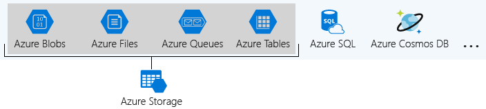
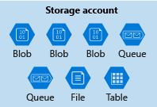

# Store data in Azure

This is the third chapter of the online Azure Developer Associate course.

## Choose a data storage approach in Azure

The key factors to consider in deciding on the optimal storage solution are: how to classify your data, how your data will be used, and how you can get the best performance for your application.

### Classify the data

**Structured data**, sometimes referred to as *relational data*, is data that adheres to a strict schema, so all of the data has the same fields or properties. This type of data can be searched with SQL.

**Semi-structured** (also referred to as *NoSQL*) data is less organized than structured data, and is not stored in a relational format, as the fields do not neatly fit into tables, rows, and columns. The expression and structure of the data in this style is defined by a *serialization language*.
Data serialization languages are important because they can be used to write data stored in memory to a file, sent to another system (that uses the same language), parsed and read. There are three of those languages:

- XML (extensible markup language)
- JSON (JavaScript Object Notation)
- YAML (YAML Ain’t Markup Language)

**Unstructured data** is often delivered in files, such as photos or videos. The video file itself may have an overall structure and come with semi-structured metadata, but the data that comprises the video itself is unstructured. Some examples:

- Media files, such as photos, videos, and audio files
- Office files, such as Word documents
- Text files
- Log files

When choosing the type of data, you can ask yourself one of these questions:

- Will you be doing simple lookups using an ID?
- Do you need to query the database for one or more fields?
- How many create, update, and delete operations do you expect?
- Do you need to run complex analytical queries?
- How quickly do these operations need to complete?

### Data transactions

A transaction is a logical group of database operations that execute together. Transactions are often defined by a set of four requirements, referred to as ACID guarantees. ACID stands for:

- **Atomicity** means a transaction must execute exactly once and must be atomic; either all of the work is done, or none of it is. Operations within a transaction usually share a common intent and are interdependent.
- **Consistency** ensures that the data is consistent both before and after the transaction.
- **Isolation** ensures that one transaction is not impacted by another transaction.
- **Durability** means that the changes made due to the transaction are permanently saved in the system. Committed data is saved by the system so that even in the event of a failure and system restart, the data is available in its correct state.

Transactional databases are often called **OLTP** (Online Transaction Processing) systems. OLTP systems commonly support lots of users, have quick response times, handle large volumes of data and are highly available but handle small/simple transactions.
There are also **OLAP** (Online Analytical Processing) systems, but they commonly support fewer users, have longer response times, can be less available, and typically handle large and complex transactions.

### Determine which service is best for the data type

Semi-structured data that requires a high number of reads and writes (high throughput and low latency) should use **Azure Cosmos DB**. This also has transactional support (ACID-compliant) for when it's needed. Data replication is also supported around the world by a single click, based on your consistency level (a tradeoff between consistency, availability, latency, and throughput)
One thing to note is that other Azure services such as Azure Table storage, Azure HBase as a part of HDInsight, and Azure Cache for Redis, can also store NoSQL data. But if you want to query on multiple fields, Azure Cosmos DB is a better fit because it indexes every field by default. Other services are limited in the data they index, and querying on non-indexed fields results in reduced performance.

Unstructured data that requires retrieval by ID, a high number of read operations with a low latency, but for the create/update a higher latency than read operations should use **Azure Blob storage**. Because this service can work with Azure Content Delivery Network (CDN), it can reduce the latency for serving the files.
Other options are to upload the files to the Azure App Services so that the same server that is running your app is serving up your images. But this solution only works if you don't have many files.

Structured data that we all know and love can make use of **Azure SQL Database**. Another service is for example Azure Synapse. It supports OLAP solutions and SQL queries but no cross-database queries.

Some extra stuff about BI databases:

- Azure Stream Analytics can be used in addition to Azure SQL Database. But you need to use Power BI instead of SQL.
- Azure Analyses Services is a great way to analyze data and transform it into actionable insights, but its focus is on real-time data that is streaming in. If you need historical data only, you don't need it.

## Create an Azure Storage account

Most organizations have diverse requirements for their cloud-hosted data. For example, storing data in a specific region, or needing separate billing for different data categories. Azure storage accounts let you formalize these types of policies and apply them to your Azure data.

### Azure storage explained

While you have a lot of services inside Azure that can store stuff, there are four services selected to be under the name of **Azure Storage**:



A **storage account** is a container that groups a set of Azure Storage services together. The settings you specify when you create the account, or any that you change after creation, are applied to everything in the account. Deleting the storage account deletes all of the data stored inside it. A group can for example look like this:



While a storage account is an Azure resource and is included in a resource group, other services like Azure SQL and Azure Cosmos DB are managed as independent Azure resources. See the following example:


First, you need to determine which account type you want:

- **General-purpose v2 (GPv2)**: General-purpose v2 (GPv2) accounts are storage accounts that support all of the latest features for blobs, files, queues, and tables. Pricing for GPv2 accounts has been designed to deliver the lowest per gigabyte prices.
- **General-purpose v1 (GPv1)**: General-purpose v1 (GPv1) accounts provide access to all Azure Storage services but may not have the latest features or the lowest per gigabyte pricing. For example, cool storage and archive storage are not supported in GPv1. Pricing is lower for GPv1 transactions, so workloads with high churn or high read rates may benefit from this account type.
- **Blob storage accounts**: A legacy account type, blob storage accounts support all the same block blob features as GPv2, but they are limited to supporting only block and append blobs. Pricing is broadly similar to pricing for general-purpose v2 accounts.

If you are configuring the settings of one storage account, it will act as a policy for all the services inside that account. Some of those settings are:

Non-cost effective settings:

- **Name**: Each storage account has a name. The name must be globally unique within Azure, use only lowercase letters and digits and be between 3 and 24 characters.
- **Deployment model**: This is the system Azure uses to organize your resources. There are two selectable:
  - *Resource Manager*: The one you know and love. Supports the concept of a resource groups compared to Classic. Microsoft recommends this.
  - *Classic*: A legacy offering that uses the Azure Service Management API.
- **Account kind**: This is a set of policies that determine which data services you can include in the account and the pricing of those services. There are three available with two legacy variants (but they can be cheaper to use):
  - *StorageV2 (general purpose v2)*: the current offering that supports all storage types and all of the latest features. Microsoft recommends this.
  - *Storage (general purpose v1)*: a legacy kind that supports all storage types but may not support all features.
  - *Blob storage*: a legacy kind that allows only block blobs and append blobs.

Cost effective settings:

- **Subscription**: The Azure subscription that will be billed for the services in the account.
- **Location**: The datacenter that will store the services in the account.
- **Performance**: Type of hardware to save your files on:
  - *Standard* allows you to have any data service (Blob, File, Queue, Table) and uses magnetic disk drives.
  - *Premium* introduces additional services for storing data. For example, storing unstructured object data as block blobs or append blobs, and specialized file storage used to store and create premium file shares. These storage accounts use solid-state drives (SSD) for storage.
- **Replication**: At a minimum, Azure will automatically maintain three copies of your data within the data center associated with the storage account. This is called *locally-redundant storage (LRS)*, and guards against hardware failure but does not protect you from an event that incapacitates the entire datacenter. You can upgrade to one of the other options such as *geo-redundant storage (GRS)* to get replication at different datacenters across the world.
- **Access tier**: Controls how quickly you will be able to access the blobs in this storage account (Hot, cool, etc.).
- **Secure transfer required**: A security feature that determines the supported protocols for access. Enabled requires HTTPs, while disabled allows HTTP.
- **Virtual networks**: A security feature that allows inbound access requests only from the virtual network(s) you specify.

There are a few things that determine how many storage account you will need:

- Different settings means different storage accounts.
- If you have a lot of data diversity, multiple storage accounts are probably needed (different regions, different departments, etc.).
- Different settings leads to different costs.
- Implementing management by using different accounts.

---

Note:

- Instead of the common Portal/CLI/PowerShell options, you can use **Management client libraries** to work with storage accounts.

## Connect an app to Azure Storage

The power to save files to Azure Storage

### Exploring Azure storage services

Microsoft Azure Storage is a managed service that provides durable, secure, and scalable storage in the cloud:

- **Durable**: Redundancy ensures that your data is safe in the event of transient hardware failures. You can also replicate data across datacenters or geographical regions for extra protection from local catastrophe or natural disaster. 
- **Secure**: All data written to Azure Storage is encrypted by the service. Azure Storage provides you with fine-grained control over who has access to your data.
- **Scalable**: Azure Storage is designed to be massively scalable to meet the data storage and performance needs of today's applications.
- **Managed**: Microsoft Azure handles maintenance and any critical problems for you.

A single Azure subscription can host up to 200 storage accounts, each of which can hold 500 TB of data. These types of data can be:

- **Blobs**: A massively scalable object store for unstructured text and binary data. Can include support for Azure Data Lake Storage Gen2. Use it for video's/backups/archiving/ect. There are three kinds of blobs:
  - *Block blobs*: Are used to hold text or binary files up to ~5 TB (50,000 blocks of 100 MB) in size.
  - *Page blobs*: Are used to hold random-access files up to 8 TB in size.
  - *Append blobs*: Are made up of blocks like block blobs, but they are optimized for append operations.
- **Files**: Managed file shares for cloud or on-premises deployments using the standard Server Message Block (SMB) protocol.
- **Queues**: A messaging store for reliable messaging between application components. They can be up to 64 KB in size, and a queue can contain millions of messages.
- **Table Storage**: A NoSQL store for schema-less storage of structured data. Table Storage is not covered in this module.

There are two ways of interacting with the storage account:

- Using the REST API. By using the following URL, you can list all the blobs in a container: `GET https://[url-for-service-account]/?comp=list&include=metadata`.
- Using a client library. Basically wrappers around the data models and the API. For example, by using the following piece of code, you can retrieve the same list, but it's parsed already:

```C#
string containerName = "...";
BlobContainerClient container = new BlobContainerClient(connectionString, containerName);

var blobs = container.GetBlobs();
foreach (var blob in blobs)
{
    Console.WriteLine($"{blob.Name} --> Created On: {blob.Properties.CreatedOn:YYYY-MM-dd HH:mm:ss}  Size: {blob.Properties.ContentLength}");
}
```

To use these client libraries described above, you want to use a connection string. This string looks like the following: `DefaultEndpointsProtocol=https;AccountName={your-storage}; AccountKey={your-access-key}; EndpointSuffix=core.windows.net`. The information in the string is the following:

- Each storage account has **two unique access keys** that can be used to connect to the storage. This is done so security keys can be rotated.
- The app needs to know which endpoint it needs to use, because the data types require all different endpoints:
  - Blobs: https://[name].blob.core.windows.net/
  - Queues: https://[name].queue.core.windows.net/
  - Table: https://[name].table.core.windows.net/
  - Files: https://[name].file.core.windows.net/
  - Custom domain: https://[customdomain].*.core.windows.net/

If you don't want a user to gain root access with the access key, you can use **Shared access signatures (SAS)**. It support expiration and limited permissions for scenarios where you need to grant limited access.

## Secure your Azure Storage account

Azure Storage accounts provide a wealth of security options that protect your cloud-based data.

### Explore Azure Storage security features

There are several factors that Azure Storage secures:

- **Encryption at rest**: All data written to Azure Storage is automatically encrypted by Storage Service Encryption (SSE) with a 256-bit Advanced Encryption Standard (AES) cipher, and is FIPS 140-2 compliant. SSE automatically encrypts data when writing it to Azure Storage. When you read data from Azure Storage, Azure Storage decrypts the data before returning it. This process incurs no additional charges and doesn't degrade performance. It can't be disabled. For

  For *virtual machines (VMs)*, Azure lets you encrypt virtual hard disks (VHDs) by using Azure Disk Encryption. This encryption uses BitLocker for Windows images, and it uses dm-crypt for Linux.

  *Azure Key Vault* stores the keys automatically to help you control and manage the disk-encryption keys and secrets. So even if someone gets access to the VHD image and downloads it, they can't access the data on the VHD.
- **Encryption in transit**: Use:
  - Transport-level security
  - HTTPS
  - Enforce secure transfer (only HTTPS and SMB 3.0)
- **CORS support**: AZ supports cross-domain access through cross-origin resource sharing (CORS). CORS uses HTTP headers so that a web application at one domain can access resources from a server at a different domain. This is an optional flag on Storage accounts.
- **Role-based access control**: You can assign RBAC roles that are scoped to the storage account. Use Active Directory to authorize resource management operations, such as configuration. Active Directory is supported for data operations on *Blob* and *Queue* storage.
- **Auditing access**: *Storage Analytics* logs every operation in real time, and you can search the Storage Analytics logs for specific requests. Filter based on the authentication mechanism, the success of the operation, or the resource that was accessed.

Azure Storage accounts can create authorized apps in Active Directory to control access to the data in blobs and queues. This authentication approach is the best solution for apps that use Blob storage or Queue storage. Otherwise, you can use a *shared key* for authorization. You can supply the key in the authorization header while sending your request: `Authorization: SharedKey myaccount:CY1OP3O3jGFpYFbTCBimLn0Xov0vt0khH/E5Gy0fXvg=`. You get two keys that give permission to the entire Storage account. For security reasons, you can regenerate them.

To connect with third party clients, you must use a *shared access signature (SAS)*. This is a string that contains a security token that can be attached to a URI. Use a SAS to delegate access to storage objects and specify constraints, such as the permissions and the time range of access. There are two types of SAS:

- **Service-level SAS**: Allow access to specific resources in a storage account.
- **Account-level SAS**: Allow access to anything that a service-level SAS can allow, plus additional resources and abilities.

At last, you have the possibility to enable **Azure Defender for Storage**. This is currently available for Blob storage, Azure Files, and Azure Data Lake Storage Gen2. Account types that support Azure Defender include general-purpose v2, block blob, and Blob storage accounts. Azure Defender for Storage is available in all public clouds and US government clouds, but not in other sovereign or Azure Government cloud regions.
A storage activity anomaly will trigger an email with the following information about the event:

- Nature of the anomaly
- Storage account name
- Event time
- Storage type
- Potential causes
- Investigation steps
- Remediation steps
- Email also includes details about possible causes and recommended actions to investigate and mitigate the potential threat

This can also be reviewed inside the Azure Security Center's Security alters tile.

### Azure Data Lake Storage security features

Azure Data Lake is built on Azure Blob storage, so it inherits all of the security features summed up earlier. It also supports access control lists (ACLs) that are POSIX-compliant, and that restrict access to only authorized users, groups, or service principals. This comes down to Azure Active Directory OAuth 2.0 bearer tokens, allowing flexible authentication schemes, including federation with Azure AD Connect and multifactor authentication. These authentication schemes are integrated into the main analytics services that use the data (like Azure Databricks, HDInsight, ...).

---

Extra notes:

- By default, storage accounts accept connections from clients on any network. To limit access to selected networks, you must first change the default action. You can restrict access to specific IP addresses, ranges, or virtual networks.

## Store application data with Azure Blob storage

Blobs give you file storage in the cloud and an API that lets you build apps to access the data.

### What are blobs?

Blobs are:

- Files for the cloud: Should work the same was as files for the disk.
- Unstructured: No limit to the structure.
- Not limited to file formats: Big, small, encrypted, it doesn't matter.

They should not be used for structured data that needs to be queried frequency.

Every blob lives inside a *blob container*. You can store an unlimited number of blobs in a container and an unlimited number of containers in a storage account. Containers are "flat" — they can only store blobs, not other containers.

By using metadata (in the form of name-value string pairs), you can give some extra information to a blob. This information can't be used for searching/sorting blobs!

### Designing a blob storage implementation

There are a few things to point out when implementing blobs:

- Save the blob access url into a database
- Containers and blobs have naming limitations
- By default, all blobs require authentication to access. However, individual containers can be configured to allow public downloading of their blobs without authentication. Enabling public access is important for scalability because data downloaded directly from Blob storage doesn't generate any traffic in your server-side app.
- Blobs have a shared access signature feature that allows fine-grained permissions control on containers.
- By giving blobs hierarchical names that look like paths (such as `finance/budgets/2017/q1.xls`), the API's listing operation can filter results to specific prefixes. This enables you to navigate the list as if it was a hierarchical system of files and folders (also called *virtual directories*).
- Remember the three types of blobs and determine which one to use:
  - Block blobs
  - Append blobs
  - Page blobs

### Implementing blob storage

In the Azure Storage SDK for .NET Core, the standard pattern for using Blob storage consists of the following steps:

- To get a `CloudStorageAccount`, call `CloudStorageAccount.Parse` (or `TryParse`) with your connection string.
- To get a `CloudBlobClient`, call `CreateCloudBlobClient` on the `CloudStorageAccount`.
- To get a `CloudBlobContainer`, call `GetContainerReference` on the `CloudBlobClient`.
- To get a list of blobs and/or get references to individual blobs to upload and download data, use methods on the container.

```C#
CloudStorageAccount storageAccount = CloudStorageAccount.Parse(connectionString); // or TryParse()
CloudBlobClient blobClient = storageAccount.CreateCloudBlobClient();
CloudBlobContainer container = blobClient.GetContainerReference(containerName);
```

To create a container when your app starts or when it first tries to use it, call `CreateIfNotExistsAsync` on a `CloudBlobContainer`. This won't thrown an exception when the container is already there, but you make a network call for it.

When requesting a `ICloudBlob`, you can use a blob specific call like `GetBlockBlobReference`, `GetAppendBlobReference` or `GetPageBlobReference`. Keep in mind that this does not make a network call and only create a reference to the blob locally. Using `GetBlobReferenceFromServerAsync` does make the network call and checks if the blob is already there.

To loop through all the blobs in a container, the following pattern will suffice. This is because they are returning *segments* and a single call to `ListBlobsSegmentedAsync` will most of the time not suffice.

```C#
BlobContinuationToken continuationToken = null;
BlobResultSegment resultSegment = null;

do
{
    resultSegment = await container.ListBlobsSegmentedAsync(continuationToken);

    // Do work here on resultSegment.Results

    continuationToken = resultSegment.ContinuationToken;
} while (continuationToken != null);
```

To get the Blob from the `ListBlobsSegmentedAsync`, you need to filter and cast the results to more specific blob objects using the `OfType<>` method.

```C#
// Get all blobs
var allBlobs = resultSegment.Results.OfType<ICloudBlob>();

// Get only block blobs
var blockBlobs = resultSegment.Results.OfType<CloudBlockBlob>();
```

To create a new blob, call one of the `Upload` methods (like `UploadFromStreamAsync` or `UploadTextAsync`) on a reference to a blob that doesn't exist in storage. This does two things: creates the blob in storage, and uploads the data. Remember that streams do perform better for larger files (for example the method `OpenReadAsync`).
