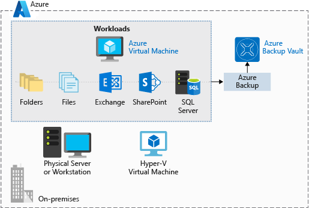
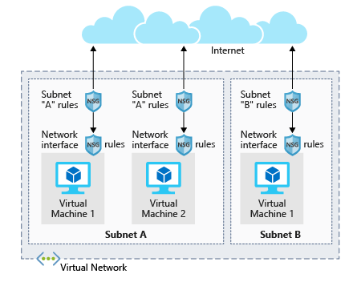

# Deploy a website with Azure virtual machines

This is the fourth chapter of the online Azure Developer Associate course.

## Introduction to Azure virtual machines

Azure VMs are one of several types of on-demand, scalable computing resources that Azure offers. With VMs, you have total control over the configuration and can install anything you need to perform the work. You don't need to purchase physical hardware when you need to scale or extend your datacenter. Finally, Azure provides additional services to monitor, secure, and manage updates and patches to the OS.

### A VM checklist

There are several things that need to be considered when you want to move/migrate to a VM:

**Networking**. By setting up Virtual Networks (VNets), you can connect privately between your azure resources. External networks aren't allowed at default but can be enabled. You should think about this resource first because you can't just change it.

When setting this all up, you need to specify the available *address spaces*, *subnets* and *security*. If the VNet will be connected to other VNets, you must select address ranges that are not overlapping.

After deciding the virtual network address space(s), you can create one or more subnets for your virtual network (like 10.1.0.0 to VMs, 10.2.0.0 to back-end services, ect.).

While there is no default security boundary between subnets, you can set up Network Security Groups (NSGs) to control traffic flow to and from subnets/VMs. They act like firewalls, applying custom rules to each inbound or outbound request at the network interface and subnet level.

**Plan the VM deployment**. Before creating the VM, there are a couple of things to add into consideration:

- The **name** of the VM. Can be up to 15 characters on Windows and 64 on Linux. Also defines a manageable Azure resource that can't be changed (easily) later. An example is `devusc-webvm01`. Think of the following subjects when choosing the name:
  - Environment: dev, prod, QA
  - Location: uw, ue, we
  - Instance: 01, 02
  - Product or Service: service
  - Role: sql, web, messaging
- The **location** is also important. There are two major things to consider:
  - Hardware availability.
  - Price differences.
- The **size** can also differ from what you want. You can change the size later, even when the VM is running (but this will restart the VM and can change some options). But only when your VM is deallocated, you can select all the sizes in your region, otherwise it is only the sizes in your current hardware cluster.

  There are a few sets of workloads to choice from, all with their own options:
  - *General purpose*: Designed to have a balanced CPU-to-memory ratio. Ideal for testing and development, small to medium databases, and low to medium traffic web servers.
  - *Compute optimized*: Designed to have a high CPU-to-memory ratio. Suitable for medium traffic web servers, network appliances, batch processes, and application servers.
  - *Memory optimized*: Designed to have a high memory-to-CPU ratio. Great for relational database servers, medium to large caches, and in-memory analytics.
  - *Storage optimized*: Designed to have high disk throughput and IO. Ideal for VMs running databases.
  - *GPU*: Specialized virtual machines targeted for heavy graphics rendering and video editing. These VMs are ideal options for model training and inferencing with deep learning.
  - *High performance computes*: The fastest and most powerful CPU virtual machines with optional high-throughput network interfaces.

For pricing, there are two separated costs:

- **Compute costs**: Priced on a per-hour basis but billed on a per-minute basis. For example, you are only charged for 55 minutes of usage if the VM is deployed for 55 minutes. You are not charged for compute capacity if you stop and deallocate the VM since this releases the hardware. Reusing existing licenses for Windows with the Azure Hybrid benefit can save you some costs.
- **Storage costs**: Priced for using storage. Even when the VM is deallocated, you still get charged for this.

You can pay for the compute costs by:

- **Pay as you go**: You pay for compute capacity by the second, with no long-term commitment or upfront payments. You're able to increase or decrease compute capacity on demand as well as start or stop at any time.
- **Reserved Virtual Machine Instances**: An advance purchase of a virtual machine for one or three years in a specified region. The commitment is made up front, and in return, you get up to 72% price savings compared to pay-as-you-go pricing. RIs are flexible and can easily be exchanged or returned for an early termination fee.

Azure VMs have at least two virtual hard disks (VHDs), one for the OS and one for temporary storage. It's possible to add new disks but it can be limited (two per CPU). The data of these disks is held in Azure Storage as *page blobs* which allows Azure to allocate space only for the storage you use.
Virtual disks can be either *Standard* or *Premium*, depending on what you need. The big difference is that Premium uses SSDs.

For disks, you also need to choose either:

- **Unmanaged disks**: You are responsible for the storage accounts that are used to hold the VHDs that correspond to your VM disks. You pay the storage account rates for the amount of space you use. A single storage account has a fixed-rate limit of 20,000 I/O operations/sec. This means that a storage account is capable of supporting 40 standard virtual hard disks at full utilization. If you need to scale out with more disks, then you'll need more storage accounts, which can get complicated.
- **Managed disks**: Managed disks are the newer and recommended disk storage model. They elegantly solve this complexity by putting the burden of managing the storage accounts onto Azure. You specify the size of the disk, up to 4 TB per disk, and Azure creates and manages both the disk and the storage. You don't have to worry about storage account limits, which makes managed disks easier to scale out.

Oh and don't forget the OS itself. You can select some from the marketplace if the default ones aren't enough. Also Azure supports only 64-bit operating systems.

There are a couple ways to create and manage Azure Virtual Machines:

- Azure Resource Manager: Organizes resources into named resource groups that let you deploy, update, or delete all of the resources together. Can also be used to create templates, so you can easily replicate multiple versions of your infrastructure, such as staging and production.
- Azure PowerShell: Create VMs by command line.
- Azure CLI: Create Vms by command line.
- Azure REST API: Call the API to manage VMs.
- Azure Client SDK: Call Azure with code.
- Azure VM Extensions: Small applications that enable you to configure and automate tasks on Azure VMs after initial deployment. They can be run with the Azure CLI, PowerShell, Azure Resource Manager templates, and the Azure portal.
- Azure Automation Services: Enables you to integrate services that allow you to automate frequent, time-consuming, and error-prone management tasks with ease. These services include:
  - Process Automation
  - Configuration Management
  - Update Management

### Managing the availability of the VMs

Availability is the percentage of time a service is available for use. This is found in the SLA (Service Level Agreement) of the service you are using. To make sure a VM keeps up and running, consider using an availability set.

An **availability set** is a logical feature used to ensure that a group of related VMs are deployed so that they aren't all subject to a single point of failure and not all upgraded at the same time during a host operating system upgrade in the datacenter. VMs placed in an availability set should perform an identical set of functionalities and have the same software installed. If you use two or more availability sets, you gain an 99.95% uptime guaranteed from the Microsoft SLA.

A **fault domain** is a logical group of hardware in Azure that shares a common set of hardware components, and that share a single point of failure. The first two VMs in an availability set will be provisioned into two different racks so that if the network or the power failed in a rack, only one VM would be affected. Fault domains are also defined for managed disks attached to VMs.

An **update domain** is a logical group of hardware that can undergo maintenance, or be rebooted at the same time. Azure will automatically place availability sets into update domains to minimize the impact when the Azure platform introduces host operating system changes. Azure then processes each update domain one at a time.

**Azure Site Recovery** is about replication of virtual or physical machines; it keeps your workloads available in an outage. It has at least the following business advantages:

- Site Recovery enables the use of Azure as a destination for recovery, thus eliminating the cost and complexity of maintaining a secondary physical datacenter.
- Site Recovery makes it incredibly simple to test failovers for recovery drills without impacting production environments.

The recovery plans you create with Site Recovery can be as simple or as complex as your scenario requires. They can include custom PowerShell scripts, Azure Automation runbooks, or manual intervention steps. It works with Azure resources, or Hyper-V, VMware, and physical servers in your on-premises infrastructure and can be a key part of your organization’s business continuity and disaster recovery (BCDR) strategy by orchestrating the replication, failover, and recovery of workloads and applications if the primary location fails.

### Backing up Vms

**Azure Backup** is a backup as a service offering that protects physical or virtual machines no matter where they reside: on-premises or in the cloud. It works with a lot of scenarios like:

- Files and folders on Windows OS machines (physical or virtual, local or cloud)
- Application-aware snapshots (Volume Shadow Copy Service)
- Popular Microsoft server workloads such as Microsoft SQL Server, Microsoft SharePoint, and Microsoft Exchange
- Native support for Azure Virtual Machines, both Windows, and Linux
- Linux and Windows 10 client machines

It has some benefits over traditional backup systems:

- **Automatic storage management**: Automatically allocates and manages backup storage and uses a pay-as-you-use model. You only pay for what you use.
- **Unlimited scaling**: Uses the power and scalability of Azure to deliver high availability.
- **Multiple storage options**: Offers locally redundant storage where all copies of the data exist within the same region and geo-redundant storage where your data is replicated to a secondary region.
- **Unlimited data transfer**: Does not limit the amount of inbound or outbound data you transfer. Azure Backup also does not charge for the data that is transferred.
- **Data encryption**: Allows for secure transmission and storage of your data in Azure.
- **Application-consistent backup**: An application-consistent backup means that a recovery point has all required data to restore the backup copy. Azure Backup provides application-consistent backups.
- **Long-term retention**: Azure doesn't limit the length of time you keep the backup data.

If you want to use Azure Backup, there are several components that need depending on what you want to backup:

- Azure Backup agent
- System Center Data Protection Manager
- Azure Backup Server
- Azure Backup VM extension

Azure Backup uses a **Recovery Services vault** for storing the backup data. A *vault* is backed by Azure Storage blobs, making it a very efficient and economical long-term storage medium. With the vault in place, you can select the machines to back up, and define a backup policy (when snapshots are taken and for how long they’re stored).

## Create a Linux virtual machine in Azure

Using Linux VMs in Azure

### Creating a Linux VM in Azure

When creating a Linux VM in Azure, you also create resources to host the VM. These resources work together to virtualize a computer and run the Linux operating system. These must exist (and be selected during VM creation), or they will be created with the VM:

- A virtual machine that provides CPU and memory resources
- An Azure Storage account to hold the virtual hard disks
- Virtual disks to hold the OS, applications, and data
- A virtual network (VNet) to connect the VM to other Azure services or your on-premises hardware
- A network interface to communicate with the VNet
- An optional public IP address so you can access the VM

First, you need to select the **VM image**. This image can be selected from the store or you can create/upload one yourself.

Secondly, **sizing the vm**. VM sizes are grouped into categories, starting with the B-series for basic testing and running up to the H-series for massive computing tasks. You should select the size of the VM based on the workload you want to perform. It is possible to change the size of a VM after it's been created, but the VM must be stopped first. Sizes differ from:

- *General use computing/web*: Testing and development, small to medium databases, or low to medium traffic web servers. (**B, Dsv3, Dv3, DSv2, Dv2**)
- *Heavy computational tasks*: Medium traffic web servers, network appliances, batch processes, and application servers. (**Fsv2, Fs, F**)
- *Large memory usage*: Relational database servers, medium to large caches, and in-memory analytics. (**Esv3, Ev3, M, GS, G, DSv2, Dv2**)
- *Data storage and processing*: Big data, SQL, and NoSQL databases that need high disk throughput and I/O. (**Ls**)
- *Heavy graphics rendering* or video editing, as well as model training and inferencing (ND) with deep learning. (**NV, NC, NCv2, NCv3, ND**)
- *High-performance computing (HPC)*: Your workloads need the fastest and most powerful CPU virtual machines with optional high-throughput network interfaces. (**H**)

Third, you need to determine the storage options. You can choose between HDDs and SSDs ranging in speed and performance.
Azure uses virtual hard disks (VHDs) to represent physical disks for the VM. VHDs replicate the logical format and data of a disk drive but are stored as page blobs in an Azure Storage account. There will be two virtual hard disks created be default:

- The **operating system disk**: This is your primary drive, and it has a maximum capacity of 2048 GB. It will be labeled as /dev/sda by default.
- A **temporary disk**: This provides temporary storage for the OS or any apps. On Linux virtual machines, the disk is /dev/sdb and is formatted and mounted to /mnt by the Azure Linux Agent. It is sized based on the VM size and is used to store the swap file.

For actual data, you should create dedicated *data disks*. Each disk can hold up to 32,767 gibibytes (GiB, one GiB is approximately 1.074 GB) of data, with the maximum amount of storage determined by the VM size you select. Also, you can create a VHD image from a real disk. This allows you to easily migrate existing information from an on-premises computer to the cloud.

Fourth, you should choose between **unmanaged** or **managed** disks.

With unmanaged disks, you are responsible for the storage accounts that are used to hold the VHDs that correspond to your VM disks. You pay the storage account rates for the amount of space you use. A single storage account has a fixed rate limit of 20,000 I/O operations/sec. This means that a single storage account is capable of supporting 40 standard virtual hard disks at full throttle
Managed disks are the newer and recommended disk storage model. They elegantly solve this complexity by putting the burden of managing the storage accounts onto Azure. You don't have to worry about storage account limits, which makes them easier to scale out. There are also the following benefits:

- Increased reliability
- Better security
- Snapshot support (read-only copy of a VHD (recommended to take the snapshot offline))
- Backup support

At last, the **network**. They communicate with external resources using a virtual network (VNet). It represents a private network in a single region that your resources communicate on. It is possible to use the network created by Azure, but it's better if you plan your requirements up front and create the VNet structure separately.

### Azure virtual machines IP addresses and SSH options

With a public IP, we can interact with the VM over the Internet. Alternatively, we can set up a virtual private network (VPN) that connects our on-premises network to Azure - letting us securely connect to the VM without exposing a public IP.

Public IP addresses in Azure are dynamically allocated by default. You can pay more to assign static addresses, if you want to connect directly to an IP address and need to ensure that the IP address will not change.

By using SSH, you can actually connect to the VM itself. You need the following items:

- Public IP address of the VM
- Username of the local account on the VM
- Public key configured in that account
- Access to the corresponding private key
- Port 22 open on the VM

### Network and security settings

New VMs are locked down, what means traffic can only go outside, but it can't receive incoming traffic. For that to change, you need a Network Security Group (NSG) and create an inbound rule for the ports.

Network security groups (NSGs) are the primary tool you use to enforce and control network traffic rules at the networking level. NSGs are an optional security layer that provides a software firewall by filtering inbound and outbound traffic on the VNet.
Security groups can be associated to a network interface (for per host rules), a subnet in the virtual network (to apply to multiple resources), or both levels.

NSGs use rules to allow or deny traffic moving through the network. Each rule identifies the source and destination address (or range), protocol, port (or range), direction (inbound or outbound), a numeric priority, and whether to allow or deny the traffic that matches the rule. Each security group has a set of default security rules to apply the default network rules previously described. These default rules cannot be modified but can be overridden.

For inbound traffic, Azure processes the security group associated to the subnet, and then the security group applied to the network interface. Outbound traffic is handled in the opposite order (the network interface first, followed by the subnet).

The rules are evaluated in priority order, starting with the lowest priority rule. Deny rules always stop the evaluation. For example, if a network interface rule blocks an outbound request, any rules applied to the subnet will not be checked. For traffic to be allowed through the security group, it must pass through all applied groups.

The last rule is always a Deny All rule. This is a default rule added to every security group for both inbound and outbound traffic with a priority of 65500. That means to have traffic pass through the security group, you must have an allow rule, or the final default rule will block it.
