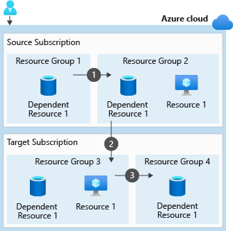

# Manage resources in Azure

This is the fifth chapter of the online Azure Developer Associate course.

## Align requirements with cloud types and service models in Azure

Azure supports three approaches to deploying cloud resources - public, private, and the hybrid cloud. Yes, it's recap time.

### Azure solutions for public, private, and hybrid cloud

We will not go down to the details inside this chapter, but a small recap will work.

There are three cloud computing models, each with their respective use cases:

- Public cloud: Building inside the cloud of someone else like Azure. Examples of why you would use public cloud:
  - Service consumption through on-demand or subscription model.
  - No up-front investment of hardware.
  - Automation.
  - Geographic dispersity.
  - Reduced hardware maintenance
- Private cloud: Building inside your cloud maintained on your machines. Examples of why you would use private cloud:
  - Pre-existing environment.
  - Legacy applications.
  - Data sovereignty and security.
  - Regulatory compliance / certification.
- Hybrid cloud: Building on both the public and private cloud. Examples of why you would use hybrid cloud:
  - Existing hardware investment.
  - Regulatory requirements.
  - Unique operating environment.
  - Migration.

There are three different service models inside the cloud:

- Infrastructure-as-a-service (IaaS) provides instant computing infrastructure that you can provision and manage over the Internet.
- Platform as a service (PaaS) provides ready-made development and deployment environments that you can use to deliver your own cloud services.
- Software as a service (SaaS) delivers applications over the Internet as a web-based service.

## Control Azure services with the CLI

The Azure portal is great for performing single tasks, and to see a quick overview of the state of your resources. But for tasks that need to be repeated daily, or even hourly, using the command line and a set of tested commands or scripts can help get your work done more quickly and avoid errors.

### What is the Azure CLI?

The Azure CLI is a command-line program to connect to Azure and execute administrative commands on Azure resources. It provides cross-platform command-line tools for managing Azure resources, and can be installed locally on Linux, Mac, or Windows computers. The Azure CLI can also be used from a browser through the Azure Cloud Shell.

### Working with the Azure CLI

Commands in the CLI are structured in *groups* and *subgroups*. Each group represents a service provided by Azure, and the subgroups divide commands for these services into logical groupings. For example, the storage group contains subgroups including account, blob, and queue.

Some examples are:

- Setting variables in the Azure CLI is as simple as `variable="test"` or `export AZURE_REGION=centralus`.
- Finding stuff about (for example) blobs without going to the documentation can be done with `az find blob`.
- When the command is found, but want more help use: `az storage blob --help`
- Connecting to the Azure CLI can be done with `az login`. This will redirect you to an Azure sign-in page.
- Creating resource groups can be done with: `az group create --name <name> --location <location>`
- If you want to see what you are working on, you can for example use `az group list` (or something like `az group list --output table`) to display a list of your resource groups.
- If you have a lot of stuff, you can filter the list result down with a query like `az group list --query "[?name == '$RESOURCE_GROUP']"`. This is formatted using JMESPath which is a standard query language for JSON requests.
- To create an entire App Service Plan, you can use `az appservice plan create --name $AZURE_APP_PLAN --resource-group $RESOURCE_GROUP --location $AZURE_REGION --sku FREE`.
- In the App Service Plan, you can create a web app with `az webapp create --name $AZURE_WEB_APP --resource-group $RESOURCE_GROUP --plan $AZURE_APP_PLAN`
- If you want to deploy a branch from a repo on GitHub, you can specify the following: `az webapp deployment source config --name $AZURE_WEB_APP --resource-group $RESOURCE_GROUP --repo-url "https://github.com/Azure-Samples/php-docs-hello-world" --branch master --manual-integration`

### Automate Azure tasks using scripts with PowerShell

Creating administration scripts is a powerful way to optimize your work flow. You can automate common, repetitive tasks, and once a script has been verified, it will run consistently, likely reducing errors.

## Decide if Azure PowerShell is right for your tasks

Azure provides three administration tools to choose from. All three are cross-platform, running on Windows, macOS, and Linux. They differ in syntax, setup requirements, and whether they support automation.

- **The Azure portal**. Only available inside the portal. Does not provide any way to automate repetitive tasks.
- **The Azure CLI**. Can be found inside the Azure Cloud SHell or with a local install. To automate repetitive tasks, you assemble the commands into a shell script using the script syntax of your chosen shell and then execute the script.
- **Azure PowerShell**. Can be found inside the Azure Cloud SHell or with a local install. Has two modes to choose from:
  - *Interactive mode*: Execute manually one command at a time.
  - *Scripting mode*: Execute a script that consists of multiple commands.

There are certain factors to consider while choosing the tools:

- Automation.
- Learning curve.
- Team skillset.

A PowerShell command is called a **cmdlet** (pronounced "command-let"). A cmdlet is a command that manipulates a single feature. The term cmdlet is intended to imply "small command".
Cmdlets are shipped in **modules**. A PowerShell Module is a DLL that includes the code to process each available cmdlet. You load cmdlets into PowerShell by loading the module they are contained in.

A few commands to get you up and running:

- `Connect-AzAccount`. Connects with your Azure account
- `Get-AzResourceGroup`. Gets the resource groups.
- `Get-AzResourceGroup | Format-Table`. Get the resource groups, but better.
- `New-AzResourceGroup -Name <name> -Location <location>`. Creating a resource group.
- `Get-AzResource` Get resources.
- `Get-AzResource | Format-Table`. Get resources, but better.
- `Get-AzResource -ResourceGroupName ExerciseResources`. Get resources filtered on name.
- `Get-Credential`. Fill in the credentials for creating a resource.

Creating a virtual machine is as easy as pie:

```PowerShell
New-AzVm
       -ResourceGroupName <resource group name>
       -Name <machine name>
       -Credential <credentials object>
       -Location <location>
       -Image <image name>
```

And you even can create cool scripts:

```PowerShell
$ResourceGroupName = "ExerciseResources"
$vm = Get-AzVM  -Name MyVM -ResourceGroupName $ResourceGroupName
$vm.HardwareProfile.vmSize = "Standard_DS3_v2"

Update-AzVM -ResourceGroupName $ResourceGroupName  -VM $vm
```

## Control and organize Azure resources with Azure Resource Manager

Azure Resource Manager has a number of features that you can use to organize resources, enforce standards, and protect critical Azure resources from accidental deletion.

### Principles of resource groups

Resource groups are a fundamental element of the Azure platform. A resource group is a logical container for resources deployed on Azure. There are some guidelines for creating them though:

- Consistent naming convention.
- Organizing principles.
- Organize for authorization.
- Organize for lifecycle.
- Organize for billing.

### Using tags

A resource can have up to 50 tags. The name is limited to 512 characters for all types of resources except storage accounts, which have a limit of 128 characters. The tag value is limited to 256 characters for all types of resources. Tags aren't inherited from parent resources. Not all resource types support tags, and tags can't be applied to classic resources.

You can assign them inside the portal or by CLI:

```BASH
az resource tag --tags Department=Finance \
    --resource-group msftlearn-core-infrastructure-rg \
    --name msftlearn-vnet1 \
    --resource-type "Microsoft.Network/virtualNetworks"
```

Scenario's in which you can use tags:

- Billing different organizations.
- Monitoring systems can use tag data with alerts, giving you the ability to know exactly who is impacted.
- Automation (for example: shutdown -> 6PM).

### Using policies

Azure Policy is a service you can use to create, assign, and manage policies. These policies apply and enforce rules that your resources need to follow. These policies can enforce these rules when resources are created, and can be evaluated against existing resources to give visibility into compliance.

Scenario's in which you can use policies:

- Certain regions.
- Restricting virtual machine sizes.
- Naming conventions.

### Using RBAC

RBAC provides fine-grained access management for Azure resources, enabling you to grant users the specific rights they need to perform their jobs. RBAC is considered a core service and is included with all subscription levels at no cost.

Some best practices for RBAC:

- Segregate duties within your team and grant only the amount of access to users that they need to perform their jobs. Instead of giving everybody unrestricted permissions in your Azure subscription or resources, allow only specific actions at a particular scope.
- When planning your access control strategy, grant users the lowest privilege level that they need to do their work.
- Use Resource Locks to ensure critical resources aren't modified or deleted (as you'll see in the next unit).

### Using resource locks

Resource locks are a setting that can be applied to any resource to block modification or deletion. Resource locks can set to either Delete or Read-only. Delete will allow all operations against the resource but block the ability to delete it. Read-only will only allow read activities to be performed against it, blocking any modification or deletion of the resource. Resource locks can be applied to subscriptions, resource groups, and to individual resources, and are inherited when applied at higher levels.

You want to use them to protect those key pieces of Azure that could have a large impact if they were removed or modified.

## Move Azure resources to another resource group

Working with resources.

### Identify incorrectly assigned resources in Azure

Organization of resource groups can be done in different ways. But you need to make sure that all the resources in your resource group have a single lifecycle. You want to update, delete, or deploy these resources together. If you believe a resource doesn't fit into the lifecycle of other resources, move it to another resource group.

If you want to locate a resource (group), you can search on the name or the applied tags of it. Remember though that tags have limitations:

- Always check whether your Azure resource supports tags. For example, you can't set tags on generalized VMs.
- You can apply tags to resource groups, but tags aren't automatically inherited by resources from their resource group. If you want all the resources in a resource group to have a tag, you must do this manually.
- You can apply a maximum of 50 tags to a single resource or resource group in Azure.

### Moving resources

Because some resource can and can't be moved, Microsoft created an extended list that displays all the services with move information (see <https://docs.microsoft.com/en-us/azure/azure-resource-manager/management/move-support-resources>). For example, these resources can be moved:

- Azure Storage accounts
- Azure virtual machines
- Azure virtual networks

These resources can't be moved:

- Azure Active Directory domain services
- Azure Backup vaults
- Azure App Service gateways

But there is more, because while you can move Virtual machines, they have their limitations:

- If you want to move a virtual machine, all of its dependants must go with it.
- You can't move virtual machines with certificates in Azure Key Vault between subscriptions.
- You can't move virtual machine scale sets with standard load balancers or a standard public IP.
- You can't move any managed disks that are in availability zones to different subscriptions.

### Validating resources

To validate if your move would succeed, you could use the `validate move` operation from the Azure REST API. This can also be called from the Azure CLI, but you need to provide a valid REST URI. This URI needs to contain the following:

- Your Azure subscription ID.
- The name of the resource group currently holding your resources.
- The resource ID for each of the resources in your original resource group.
- The resource ID for the destination resource group where you want to move your resources.
- Your account access token.

```Bash
az rest --method post \
   --uri https://management.azure.com/subscriptions/{subscriptionId}/resourceGroups/<your-source-group>/validateMoveResources?api-version=2019-05-10 \
   --body "{\"resources\": [\"<your-resource-id-1>\", \"<your-resource-id-2>\", \"<your-resource-id-3>\"], \"targetResourceGroup\": \"/subscriptions/<your-subscription-id>/resourceGroups/<your-target-group>\"}" \
   --verbose
```

You'll get back the following:

```HTTP
Response Code: 202
cache-control: no-cache
pragma: no-cache
expires: -1
location: https://management.azure.com/subscriptions/<your-subscription-id>/operationresults/<your-operation-id>?api-version=2018-02-01
retry-after: 15
```

This means that your request has been accepted, but the validation has not been run yet. You first need to wait the `retry-after` amount before sending a GET request to the provided `location` URL. This will look like:

```Bash
az rest --method get --uri <location-url>
```

If the move would be successful, you would get back an 204 status code. Otherwise, you'll get a error back with a message that explains the problem.

### Identify steps to move resources between Azure resource groups

When you start a move operation, the resource group holding your resources and the new destination resource group are locked. You can't do write or delete operations on the resource groups until the move operation ends.

Like described earlier, when moving for example a VM, you need to have all the dependant resources into one resource group before you can move. The following picture will display moving an vm from one subscription to the other one:



In the following commands, we will move a resource by the Azure CLI:

```Bash
az group create --name <destination resource group name> --location <location name>

yourResource=$(az resource show --resource-group <resource group name> --name <resource name> --resource-type <resource type> --query id --output tsv)

az resource move --destination-group <destination resource group name> --ids $yourResource

az resource list --resource-group <destination resource group name> --query [].type --output tsv | uniq
```
