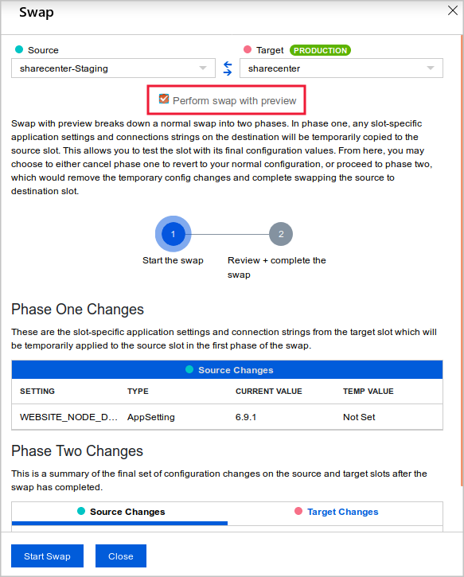
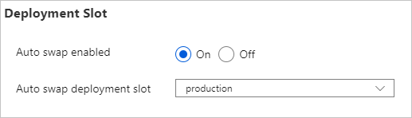

# Deploy a website to Azure with Azure App Service

This is the sixth chapter of the online Azure Developer Associate course.

Modules not summarized:

- *Prepare your development environment for Azure development*. Setting up an development environment module? Really?
- *Scale an App Service web app to efficiently meet demand with App Service scale up and scale out*. The only important takeaway in this module is that if you scale the App Service Plan, all apps inside this plan will be scaled as well.

## Host a web application with Azure App Service

Setting up an Azure App Service web app using the Azure portal.

### Create a web app in the Azure portal

**Azure App Service** is a fully managed web application hosting platform (a PAAS). It offers some cool features:

- **Deployment slots**: Swapping environments easy (like from staging to production).
- **Continuous integration/deployment support**: Connect with your favorite services and define a complete pipeline.
- **Integrated Visual Studio publishing and FTP publishing**: Deploy with Visual Studio Web Deploy or just use FTP-based publishing.
- **Built-in auto scale support (automatic scale-out based on real-world load)**: Scaling up/down (more power) is supported as is scaling out (more machines).

**App Service plans** are the unit of billing for App Service. The size of each App Service plan in your subscription, in addition to the bandwidth resources used by the apps deployed to those plans, determines the price that you pay. The number of web apps deployed to your App Service plans has no effect on your bill.

Azure supports automated deployment directly from several sources like Azure DevOps or GitHub. But if you want to do it manually, you can for example use:

- Git
- `az webapp up` (can also create a new App Service web app)
- `az webapp deployment source config-zip`
- etc.

## Publish a web app to Azure with Visual Studio

Go go with Azure and Visual Studio.

### Visual Studio workloads

A **workload** is a pre-configured bundle of tools within Visual Studio that are grouped to enable developers to build certain types of applications, use certain development languages, or develop for specific platforms. For example, "Desktop development with C++" is a workload.

### Using the App Service Plan

The App Service plan defines the compute resources your app will consume, where those resources are located, how many additional resources the plan can consume, and the pricing tier. You can host more apps on a App Service Plan but it will use the same hardware.

When choosing the App Service Plan you need to make decision's on the pricing and reliability levels (some tiers aren't available on Linux like *Shared*):

- **Shared compute**: Run an app on the same Azure VM as other App Service apps, including apps of other customers. It should have a set limit of 165 MB of outbound data every 24 hours. It has the following tiers:
  - *Free*: Provides 1 GB of disk space and support for up to 10 apps, but only a single shared instance and no SLA for availability. Each app has a compute quota of 60 minutes per day. The Free service plan is mainly suitable for app development and testing rather than production deployments.
  - *Shared*: Provides support for more apps (up to 100) also running on a single shared instance. Apps have a compute quota of 240 minutes per day. There is no availability SLA.
- **Dedicated compute**: Here, only apps in the same App Service plan share the same compute resources. It has the following tiers:
  - *Basic*: Supports an unlimited number of apps and provides more disk space. Apps can be scaled out to three dedicated instances. This tier provides an SLA of 99.95% availability. There are three levels in this tier that offer varying amounts of computing power, memory, and disk storage.
  - *Standard*: Supports an unlimited number of apps. This tier can scale to 10 dedicated instances and has an availability SLA of 99.95%. Has three levels that offer an increasingly powerful set of computing, memory, and disk options.
  - *Premium*: Gives you up to 20 dedicated instances, an availability SLA of 99.95%, and multiple levels of hardware.
  - *Premium V2*: Better than standard premium
  - *Premium V3*: Better than premium v2.
- **Isolated**: This tier runs dedicated Azure VMs on dedicated Azure virtual networks, which provide network isolation on top of compute isolation to your apps. It provides the maximum scale-out capabilities. You should only choose this tier when:
  - The app is resource-intensive
  - You want to scale the app independently from the other apps in the existing plan
  - The app needs resources in a different geographical region

## Stage a web app deployment for testing and rollback by using App Service deployment slots

You want a way to deploy a new version of the app without downtime or a service interruption. You also want to be able to rapidly roll back a new deployment to the previous version if it causes problems. Yes, it's time for deployment slots.

### Understanding and creating deployment slots

Within a single Azure App Service web app, you can create multiple deployment slots. Each slot is a separate instance of that web app, and it has a separate hostname. You can deploy a different version of your web app into each slot.

Unlike a code deployment, a slot swap is instantaneous. When you swap slots, the slot hostnames are exchanged, immediately sending production traffic to the new version of the app. When you use slot swaps to deploy, your app is never exposed to the public web in a partially deployed state.

Swaps do prevent *cold starts*. This is because the swap sends a request to the root of the site. The warm-up request ensures that all compilation and caching tasks finish.

When you use more than one deployment slot for a web app, those slots are treated as separate instances of that web app. For example, they're listed separately on the All resources page in the Azure portal. They also come in different tiers:

- Free: 0 staging slots.
- Shared: 0 staging slots.
- Basic: 0 staging slots.
- Standard: 5 staging slots.
- Premium: 20 staging slots.
- Isolated: 20 staging slots.

You can deploy your code to the new slot the same way you deploy it for the production slot. Just substitute the new slot's name or URL in the configuration of the deployment tool you use. If you use FTP to deploy, you'll see the FTP hostname and username just under the slot's URL.

The new slot is effectively a separate web app with a different hostname. That's why anyone on the internet can access it if they know that hostname. Unless you register the slot with a search engine or link to it from a crawled page, the slot won't appear in search engine indexes. You can also enable IP whitelisting (inside the firewall) to ensure no unauthorized access is granted.

### Deploy a web app by swapping deployment slots

When you swap two slots, the app's configuration travels to the new slot along with the app. You can override this behavior for individual application settings and configuration strings by configuring them as **slot settings**. In here, you can configure settings that should be added/modified for the specific slot.

To help you discover problems before your app goes live into production, Azure App Service offers a swap-with-preview feature. When you choose this option, the swap proceeds in two phases:

- Phase 1: Slot settings from the target slot are applied to the web app in the source slot. Azure then warms up the staging slot. At this point, the swap operation pauses so you can test the app in the source slot to make sure it works with the target slot configuration. If you find no problems, begin the next phase.
- Phase 2: The hostnames for the two sites are swapped. The version of the app now in the source slot receives its slot settings.



You can also use Auto swap (**not on Linux**). This brings the zero-downtime and easy rollback benefits of swap-based deployment to automated deployment pipelines. Furthermore, there is not really a reason to use this.



## Deploy and run a containerized web app with Azure App Service

You can build and deploy Azure-based web apps by using Docker containers. This approach enables you to roll out a web app quickly. Support for continuous delivery ensures that users see the latest build of the app while minimizing administrative overhead.

### Build and store images by using Azure Container Registry

**Azure Container Registry** enables you to store Docker images in the cloud, in an Azure storage account. Like *Docker Hub*, Container Registry is organized around repositories that contain one or more images. Container Registry also lets you automate tasks such as redeploying an app when an image is rebuilt.

Docker Hub vs Container Registry:

- Security wise:
  - You have much more control over who can see and use your images.
  - You can sign images to increase trust and reduce the chances of an image becoming accidentally (or intentionally) corrupted or otherwise infected.
  - All images stored in a container registry are encrypted at rest.
- Unique benefits:
  - Container Registry runs in Azure. The registry can be replicated to store images near where they're likely to be deployed.
  - Container Registry is highly scalable, providing enhanced throughput for Docker pulls that can span many nodes concurrently. The Premium SKU of Container Registry includes 500 GiB of storage.

You can create a registry by using the portal or the following command:

```Bash
az acr create --name myregistry --resource-group mygroup --sku standard --admin-enabled true
```

And if you want Azure to let the images be build (instead of locally), you can use:

```Bash
az acr build --file Dockerfile --registry myregistry --image myimage .
```

### Deploying a web app

When you create a web app from a Docker image, you configure the following properties:

- *Registry that contains the image*: The registry can be Docker Hub, Container Registry, or some other private registry.
- *Image*: This item is the name of the repository.
- *Tag*: This item indicates which version of the image to use from the repository. By convention, the most recent version is given the tag latest when it's built.
- *Startup file*: This item is the name of an executable file or a command to be run when the image is loaded. It's equivalent to the command that you can supply to Docker when loading an image from the command line by running `docker run`. If you're deploying a ready-to-run, containerized app that already has the `ENTRYPOINT` and/or `COMMAND` values configured, you don't need to fill this in.

### Update the image and automatically redeploy the web app

A web app that uses App Service can subscribe to a **Container Registry webhook** to receive notifications about updates to the image that contains the web app. When the image is updated, and App Service receives a notification, your app automatically restarts the site, and pulls the latest version of the image.

You can also use **the tasks feature of Container Registry** to rebuild your image whenever its source code changes automatically. You configure a Container Registry task to monitor the GitHub repository that contains your code and trigger a build each time it changes. If the build finishes successfully, Container Registry can store the image in the repository. If your web app is set up for continuous integration in App Service, it receives a notification via the webhook and updates the app.

You can create such a task by command line. Before running this command, you need to create a GitHub personal access token with permissions to create a webhook in your repository. For private repositories, the token will also need full repository read permission.

```Bash
az acr task create --registry <container_registry_name> --name buildwebapp --image webimage --context https://github.com/MicrosoftDocs/mslearn-deploy-run-container-app-service.git --file Dockerfile --git-access-token <access_token>
```
