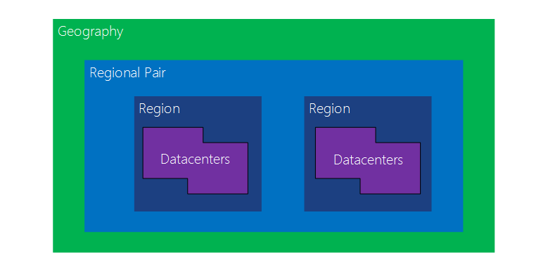
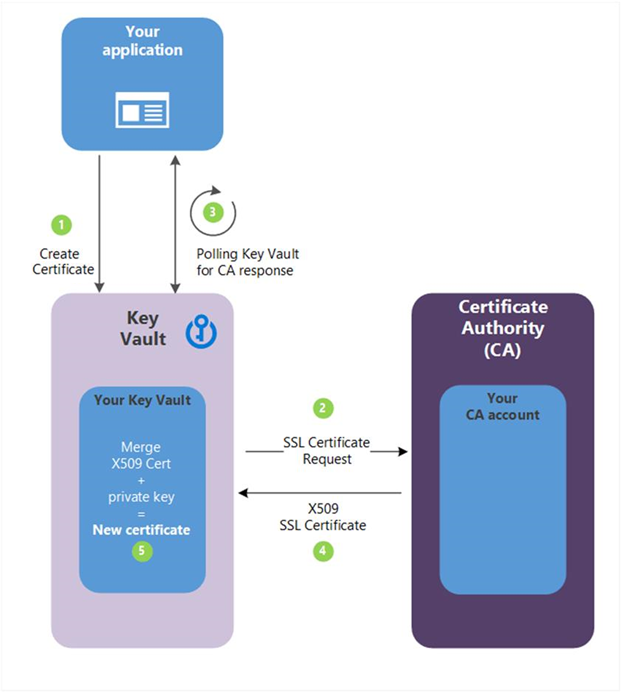

# Secure your cloud data

This is the seventh chapter of the online Azure Developer Associate course.

## Protect against security threats on Azure

Recap of the previous exam (az-900)

### Protect against security threats by using Azure Security Center

Azure Security Center is a monitoring service that provides visibility of your security posture across all of your services, both on Azure and on-premises. The term *security posture* refers to cybersecurity policies and controls, as well as how well you can predict, prevent, and respond to security threats.

It can be used for:

- *Monitor* security settings across on-premises and cloud workloads.
- Automatically *apply required security settings* to new resources as they come online.
- Provide *security recommendations* that are based on your current configurations, resources, and networks.
- Continuously *monitor your resources* and perform automatic security assessments to identify potential vulnerabilities before those vulnerabilities can be exploited.
- Use *machine learning* to detect and block malware from being installed on your virtual machines (VMs) and other resources. You can also use adaptive application controls to define rules that list allowed applications to ensure that only applications you allow can run.
- *Detect and analyze potential inbound attacks* and investigate threats and any post-breach activity that might have occurred.
- Provide *just-in-time access control for network ports*.

Two other niece features are:

- Viewing its overall *regulatory compliance* from a security perspective all from one place.
- Viewing the *Resource security hygiene section*, the health of its resources from a security perspective can been seen.
- Viewing the *Secure Score* (based on security controls, or groups of related security recommendations) can also give you an security insight.

The Security Center has some threat protection:

- **Just-in-time VM access**: This access blocks traffic by default to specific network ports of VMs, but allows traffic for a specified time when an admin requests and approves it.
- **Adaptive application controls**: In the background, Security Center uses machine learning to look at the processes running on a VM. It creates exception rules for each resource group that holds the VMs and provides recommendations. This process provides alerts that inform the company about unauthorized applications that are running on its VMs.
- **Adaptive network hardening**: Security Center can monitor the internet traffic patterns of the VMs, and compare those patterns with the company's current network security group (NSG) settings. From there, Security Center can make recommendations about whether the NSG should be locked down further and provide remediation steps.
- **File integrity monitoring**: Monitor changes of important files on both Windows and Linux, registry settings, applications, and other aspects that might indicate a security attack.

But what if it goes wrong:

- You can manually review all alerts and investigate them further.
- Using *workflow automation* (see Azure Logic Apps), you can automate this process (like sending mails etc.).

### Detect and respond to security threats by using Azure Sentinel

Security management on a large scale can benefit from a dedicated **security information and event management** (SIEM) system. A SIEM system aggregates security data from many different sources (as long as those sources support an open-standard logging format). It also provides capabilities for threat detection and response. Azure Sentinel is a SIEM platform created by Microsoft.

The platform can do the following:

- Collect cloud data at scale across all users, devices, applications
- Detect previously undetected threats
- Investigate threats with artificial intelligence
- Respond to incidents rapidly with built-in orchestration and automation of common tasks.

You can connect it to multiple data sources to analyse security events. For example:

- Connectors provide real-time integration for *Microsoft services* like Microsoft Threat Protection solutions, Microsoft 365 sources (including Office 365), Azure Active Directory, and Windows Defender Firewall.
- Connectors are available for common *non-Microsoft services and solutions*, including AWS CloudTrail, Citrix Analytics (Security), Sophos XG Firewall, VMware Carbon Black Cloud, and Okta SSO.
- Azure Sentinel supports data from *other sources* that use the Common Event Format (CEF) messaging standard, Syslog, or REST API.

It can detect threats by using templates. There are two kinds of templates available:

- **Build in analytics**: Designed by Microsoft's team of security experts and analysts based on known threats, common attack vectors, and escalation chains for suspicious activity.
- **Custom analytics**: Rules that you create to search for specific criteria within your environment. You can preview the number of results that the query would generate (based on past log events) and set a schedule for the query to run. You can also set an alert threshold.

If a problem arises, you can investigate specific alerts or *incidents* (a group of related alerts) in a *investigation graph*. But instead of manually detecting all this, you can use the **Azure Monitor Workbook** to automate responses to threats. For example:

1. When the alert is triggered, open a ticket in the IT ticketing system.
2. Send a message to the security operations channel in Microsoft Teams or Slack to make sure the security analysts are aware of the incident.
3. Send all of the information in the alert to the senior network admin and to the security admin. The email message includes two user option buttons: Block or Ignore.

### Store and manage secrets by using Azure Key Vault

Azure Key Vault is a centralized cloud service for storing an application's secrets in a single, central location. It provides secure access to sensitive information by providing access control and logging capabilities.

With this service, you can do the following:

- **Manage secrets**: You can use Key Vault to securely store and tightly control access to tokens, passwords, certificates, API keys, and other secrets.
- **Manage encryption keys**: You can use Key Vault as a key management solution. Key Vault makes it easier to create and control the encryption keys that are used to encrypt your data.
- **Manage SSL/TLS certificates**: Key Vault enables you to provision, manage, and deploy your public and private Secure Sockets Layer/Transport Layer Security (SSL/TLS) certificates for both your Azure resources and your internal resources.
- **Store secrets backed by hardware security modules (HSMs)**: These secrets and keys can be protected either by software or by FIPS 140-2 Level 2 validated HSMs.

It has the following benefits:

- Centralized application secrets.
- Securely stored secrets and keys.
- Access monitoring and access control.
- Simplified administration of application secrets and to enroll and renew certificates from public certificate authorities (CAs).
- Integration with other Azure services like storage accounts, container registries and many more Azure services.

### Host your Azure virtual machines on dedicated physical servers by using Azure Dedicated Host

Some organizations must follow regulatory compliance that requires them to be the only customer using the physical machine that hosts their virtual machines (it's shared machinery otherwise). Azure Dedicated Host provides dedicated physical servers to host your Azure VMs for Windows and Linux.

A *dedicated host* is mapped to a physical server in an Azure datacenter. A *host group* is a collection of dedicated hosts. See the following picture:


But why should you use it?

- Gives you visibility into, and control over, the server infrastructure that's running your Azure VMs.
- Helps address compliance requirements by deploying your workloads on an isolated server.
- Lets you choose the number of processors, server capabilities, VM series, and VM sizes within the same host.

---

Extra notes on the dedicated host:

- For higher availability, you can provision multiple hosts in a host group, and deploy your VMs across this group.
- VMs on dedicated hosts can also take advantage of *maintenance control* (control when regular maintenance updates occur).
- It's more expensive than a normal vm.

## Top 5 security items to consider before pushing to production

Security is top-of-mind for most people working in technology, and this is especially true when it comes to software. It seems we are constantly hearing about companies and governments that we entrusted our private data to, being compromised.

### Azure Security Center

**Azure Security Center** (ASC) is a monitoring service that provides threat protection across all of your services both in Azure, and on-premises. There are two versions:

- Free: Provides security policies, assessments, and recommendations
- Standard: Provides a robust set of features, including threat intelligence


To upgrade a subscription to the Standard tier, you must be assigned the role of Subscription Owner, Subscription Contributor, or Security Admin.

In general, ASC can:

- Provide security recommendations based on your configurations, resources, and networks.
- Monitor security settings across on-premises and cloud workloads and automatically apply required security to new services as they come online.
- Continuously monitor all your services and perform automatic security assessments to identify potential vulnerabilities before they can be exploited.
- Use machine learning to detect and block malware from being installed in your services and virtual machines. You can also allowlist applications to ensure that only the apps you validate are allowed to execute.
- Analyze and identify potential inbound attacks and help to investigate threats and any post-breach activity which might have occurred.
- **Just-In-Time access control** for ports, reducing your attack surface by ensuring the network only allows traffic you require.

### Inputs and Outputs

When writing application, you should validate all input. Some tips:

- Always use an allow list approach, which means you only accept "known good" input, instead of a deny list (where you specifically look for bad input).
- Validate on the server, not the client-side (or in addition to the client-side), to ensure that your defenses cannot be circumvented. 
- Treat ALL data as untrusted and you will protect yourself from most of the common web app vulnerabilities.

And some application specific tips:

- Using parameterized queries
- Encode your output

### Secrets in Key Vault

**Azure Key Vault** is a secret store: a centralized cloud service for storing application secrets. It allows users to store connection strings, secrets, passwords, certificates, access policies, file locks (making items in Azure read-only), and automation scripts. It also logs access and activity, allows you to monitor access control (IAM) in your subscription, and it also has diagnostic, metrics, alerts and troubleshooting tools, to ensure you have the access you need.

---

Other notes that can make your application more secure are:

- Using the latest version of your framework
- Verify if your dependencies and libraries are safe for use

## Configure security policies to manage data

Classifying (or categorizing) stored data by sensitivity and business impact helps organizations determine the risks associated with the data. After your data has been classified, organizations can manage their data in ways that reflect their internal value instead of treating all data the same way.

### Classify your data at rest, in process, and in transit

Digital data always exists in one of three states: at **rest**, in **process**, and in **transit**. Data that is classified as **confidential** needs to stay confidential in each state.

To protect data at rest, you can:

- Apply disk encryption to help safeguard your data. You can use **Microsoft Azure Disk Encryption**, which can encrypt both Windows infrastructure as a service (IaaS) and Linux IaaS virtual machine (VM) disks
- Use encryption to help mitigate risks related to unauthorized data access.

To protect data in transit:

- Secure access from multiple workstations located on-premises to an Azure virtual network. To comply with this, you can use a **site-to-site VPN**.
- Secure access from an individual workstation located on-premises to an Azure virtual network. To comply with this, you can use a **point-to-site VPN**.
- Move large data sets over a dedicated high-speed wide-area network (WAN) link. To comply with this, you can use **Azure ExpressRoute** (you can also encrypt the data at the application level by using SSL/TLS or other protocols for added protection).
- Interact with Azure Storage through the Azure portal. To comply with this, make sure all transactions occur via **HTTPS**.

For databases, you can use a feature called **Data discovery** and **classification** (in preview modus). It's part of the *Advanced Data Security* offering, which is a unified package for advanced Microsoft SQL Server security capabilities. It can do the following:

- **Discovery and recommendations**: The classification engine scans your database and identifies columns containing potentially sensitive data. It then provides you with a more natural way to review and apply the appropriate classification recommendations via the Azure portal.
- **Labeling**: Sensitivity classification labels can be persistently tagged on columns using new classification metadata attributes introduced into the SQL Server Engine. This metadata can then be utilized for advanced sensitivity-based auditing and protection scenarios.
- **Query result set sensitivity**: The sensitivity of the query result set is calculated in real-time for auditing purposes.
- **Visibility**: You can view the database classification state in a detailed dashboard in the Azure portal. Additionally, you can download a report (in Microsoft Excel format) that you can use for compliance and auditing purposes, in addition to other needs.

Classifications have two metadata attributes:

- **Labels**: These are the main classification attributes used to define the sensitivity level of the data stored in the column.
- **Information Types**: These provide additional granularity into the type of data stored in the column.

SQL data discovery and classification comes with a built-in set of sensitivity labels and information types and discovery logic. You can now customize this taxonomy and define a set and ranking of classification constructs specifically for your environment. This can be done in one place for the entire Azure tenant: **Azure Security Center**.

### Explore data recovery, retention, and disposal

A **data retention policy** defines the principles for data recovery and disposal and enforced in the same manner as data reclassification. For example, a *data retention policy* for cloud service providers can be considered as "for the duration of the subscription," meaning as long as the service is paid for, the data is retained.

**Immutable storage** for Azure Blob Storage enables users to store business-critical data in a write once, read many (WORM) state. This state makes the data unerasable and unmodifiable for a user-specified interval. Blobs can be created and read, but not modified or deleted, for the duration of the retention interval.

It enables:

- **Time-based retention policy support**: Users set policies to store data for a specified interval.
- **Legal hold policy support**: When the retention interval is not known, users can set legal holds to store data immutably until the legal hold is cleared. When a legal hold is set, blobs can be created and read, but not modified or deleted. Each legal hold is associated with a user-defined alphanumeric tag that is used as an identifier string (such as a case ID).
- **Support for all blob tiers**: WORM policies are independent of the Azure Blob Storage tier and apply to all tiers: hot, cool, and archive. Users can transition data to the most cost-optimized tier for their workloads while maintaining data immutability.
- **Container-level configuration**: Users can configure time-based retention policies and legal hold tags at the container level. By using simple container-level settings, users can create and lock time-based retention policies, extend retention intervals, set and clear legal holds, and more. These policies apply to all the blobs in the container, both existing and new.
- **Audit logging support**: Each container includes an audit log, which displays up to five time-based retention commands for locked time-based retention policies. However, the log has a maximum of three logs for retention interval extensions or time-based retention. The log contains the user ID, command type, time stamps, and retention interval. For legal holds, the log contains the user ID, command type, time stamps, and legal hold tags.

Immutable storage for Azure Blob storage supports two types of WORM or immutable policies:

- **Time-based retention**: When a time-based retention policy is applied on a container, all blobs in the container will stay in the immutable state for the duration of the effective retention period. The effective retention period for existing blobs is equal to the user-specified retention interval minus the time elapsed since the blob creation time.
- **Legal Holds**: When a reasonable expectation of litigation exists, organizations are required to preserve electronically stored information (ESI). This expectation often exists before the specifics of the case are known, and preservation is often broad. When you set a legal hold, all new and existing blobs stay in the immutable state until the legal hold is cleared.

### Understand data sovereignty

**Data sovereignty** is data that is subjected to the laws of the country/region where it's stored.

Azure geography is a defined area of the world that contains at least one Azure Region. An Azure region is an area containing one or more data centers. Each Azure region is paired with another region within the same geography, forming a region pair.



Some notable services:

- **Azure Compute (IaaS)**: To ensure resources are available in another region during a disaster, you must provision additional compute resources in advance.
- **Azure Storage**: Geo-redundant storage (GRS) is configured by default when an Azure Storage account is created. With GRS, data is automatically replicated three times within the primary region, and three times in a paired region.
- **Azure SQL Database**: With Azure SQL Database geo-replication, you can configure asynchronous replication of transactions to any region in the world; however, we recommend you deploy these resources in a paired region for most disaster recovery scenarios.
- **Azure Resource Manager**: Resource Manager inherently provides logical isolation of components across regions. This means that logical failures in one region are less likely to impact other regions.

Microsoft also complies with international data protection laws regarding transfers of customer data across borders. For example, to accommodate the continuous flow of information required by the international business (including the cross-border transfer of personal data), many Microsoft business cloud services offer customers European Union Model Clauses that provide additional contractual guarantees around transfers of personal data for in-scope cloud services.

## Configure and manage secrets in Azure Key Vault

Azure Key Vault helps safeguard cryptographic keys and secrets that cloud applications and services use.

### Guidelines for using Azure Key Vault

**Azure Key Vault** is a centralized cloud service for storing application secrets such as encryption keys, certificates, and server-side tokens. Key Vault helps you control your applications' secrets by keeping them in a single central location and providing secure access, permissions control, and access logging.

You use Azure Key Vault to create multiple secure containers, called **vaults**. Each key vault is a collection of cryptographic keys and cryptographically protected data (call them "secrets") managed by one or more responsible individuals within your organization. You can create them like this:

```CLI
az keyvault create \
    --resource-group <resource-group> \
    --name <your-unique-vault-name>
```

Microsoft and your apps don't have access to the **stored keys** directly once a key is created or added to a key vault. Applications must use your keys by calling cryptography methods on the Key Vault service. The Key Vault service performs the requested operation within its hardened boundary. The application never has direct access to the keys. Key Vault also supports asymmetric keys (RSA 2048). Your applications may use these for encryption or digital signatures.

There are two kinds of keys:

- **Hardware-protected keys**: Azure has dedicated HSMs (Hardware Security Modules) validated to FIPS 140-2 Level 2 that Key Vault uses to generate or store keys. These HSM-backed keys are always locked to the boundary of the HSM. When you query the Key Vault service to decrypt or sign with a key, the operation is performed inside an HSM. You can also BYOK (Bring Your Own Key) and transfer it to the Key Vault.
- **Software-protected keys**: Almost the same as hardware but two differences:
  - The price
  - The cryptographic operations are performed in software using Azure compute services while for HSM-protected keys the cryptographic operations are performed within the HSM.

At last, the **secrets** are small (less than 10K) data blobs protected by a HSM-generated key created with the Key Vault. Secrets exist to simplify the process of persisting sensitive settings that almost every application has: storage account keys, .PFX files, SQL connection strings, data encryption keys, etc.

### Manage access to secrets, certificates, and keys

Key Vault access has two facets: the management of the Key Vault itself (**Management plane**), and accessing the data contained in the Key Vault (**Data plane**). To access the key vault, all users or apps should be authenticated and authorized.

*Authentication* is always performed by associating the Azure AD tenant of the subscription that the Key Vault is part of, and every user or app making a request having to be known to Azure AD. There is no support for anonymous access to a Key Vault.

*Authorization* is performed with the build in role-based access control (RBAC). By using the **Key Vault Contributor** role, you can manage but not access the data. If you want to have full admin rights, use the **Contributor** role. This all works with a separate *Key Value access policy*.


To increase the security even further, you can make use of **restricted network access**. Limit access for example to a subnet, ip address or any other trusted Microsoft service.

### Managing certificates

Azure Key Vault manages X.509 based certificates that can come from several sources:

- Creates self-signed certificates directly in the Azure portal. This process creates a public/private key pair and signs the certificate with its own key
- Create an X.509 certificate signing request (CSR). This creates a public/private key pair in Key Vault along with a CSR you can pass over to your certification authority (CA). This approach works with any certificate issuer and provides better security than handling the CSR directly because the private key is created and secured in Azure Key Vault and never revealed.


- Connect your Key Vault with a trusted certificate issuer (referred to as an integrated CA) and create the certificate directly in Azure Key Vault. This approach requires a one-time setup to connect the certificate authority. You can then request to create a certificate and the Key Vault will interact directly with the CA to fulfill the request. Because the Key Vault is connected to the issuing CA, it can manage and monitor the lifecycle of the certificate. That means it can automatically renew the certificate, notify you about expiration, and monitor events such as whether the certificate has been revoked.



- Import existing certificates with ease.

And if the certificate is ready, you can start to use it inside your Azure App Service.

## Secure your Azure resources with Azure role-based access control (Azure RBAC)

Azure role-based access control (Azure RBAC) is an authorization system in Azure that helps you manage who has access to Azure resources, what they can do with those resources, and where they have access.

### What is Azure RBAC?

There are two things to note here about Azure:

- Each Azure subscription is associated with a single Azure AD directory. Users, groups, and applications in that directory can manage resources in the Azure subscription. The subscriptions use Azure AD for single sign-on (SSO) and access management. You can extend your on-premises Active Directory to the cloud by using Azure AD Connect.
- With Azure RBAC, you can grant the exact access that users need to do their jobs.

The combination of the two bullet points above gives you a lot of flexibility to control the users. The following diagram explains how this works:


In several areas in the Azure portal, you'll see a pane named Access control (IAM), also known as identity and access management. On this pane, you can see who has access to that area and their role. Using this same pane, you can grant or remove access.

### How does Azure RBAC work?

RBAC is an allow model. There are three parts of this mechanism:

The **Security principal (who)**: It's the name of the user, group, or application that you want to grant access to.


The **Role definition (what you can do)**: A collection of permissions and sometimes just called a *role*. A role definition lists the permissions that can be performed, such as read, write, and delete. Roles can be high-level like:

- Owner: Has full access to all resources, including the right to delegate access to others.
- Contributor: Can create and manage all types of Azure resources, but can’t grant access to others.
- Reader: Can view existing Azure resources.
- User Access Administrator: Lets you manage user access to Azure resources.


The **Scope (where)**: It specifies where the access applies to. In Azure, you can specify a scope at multiple levels. Scopes are structured in a parent-child relationship. When you grant access at a parent scope, those permissions are inherited by the child scopes.

The following scopes are available:

- Management group
- Subscription
- Resource group
- Resource


Once you have determined the who, what, and where, you can combine those elements to grant access. A **role assignment** is the process of binding a role to a security principal at a particular scope, for the purpose of granting access. To grant access, you create a role assignment. To revoke access, you remove a role assignment.


## Secure your Azure SQL Database

Data security is critical when protecting your customer's privacy and your organization’s reputation. Businesses have closed due to financial damage or ruined reputations. Customers have had their data accessed unlawfully because of security breaches exposing their personal details, and again, possibly causing financial harm.

### Introduction

To create a Azure SQL Database from scratch, you must execute the following commands:

The creation of SQL Server:

```CLI
az sql server create \
    --name $SERVERNAME \
    --resource-group $RESOURCEGROUP \
    --location $LOCATION \
    --admin-user $ADMINLOGIN \
    --admin-password $PASSWORD
```

The creation of the database:

```CLI
az sql db create --resource-group $RESOURCEGROUP \
    --server $SERVERNAME \
    --name marketplaceDb \
    --sample-name AdventureWorksLT \
    --service-objective Basic
```

And getting the connection string:

```CLI
az sql db show-connection-string --client sqlcmd --name marketplaceDb --server $SERVERNAME | jq -r
```

### Securing your database with firewalls

First you have the firewalls. In azure, you can apply them on the following levels:

- Server-level firewall rules
  - Allow access to Azure services
  - IP address rules
  - Virtual network rules
- Database-level firewall rules
  - IP address rules

The **Allow access to Azure services** rule allows services within Azure to connect to your Azure SQL Database. Many of these services don't have a static IP address, so this rule is needed to ensure they are able to connect to the database. When enabled, this setting allows communications from all Azure public IP addresses:


The **IP address rules** are rules that are based on specific public IP address ranges. IP addresses connecting from an allowed public IP range will be permitted to connect to the database.


**Virtual network rules** allow you to explicitly allow connection from specified subnets inside one or more Azure virtual networks (VNets). Since Azure VNet address spaces are private, you can effectively eliminate exposure to public IP addresses and secure connectivity to those addresses you control.


The **Database-level firewall rules** allow access to an individual database on a logical server and are stored in the database itself. To create/modify them, you should use T-SQL. For database-level rules, only IP address rules can be configured.


You can connect to your database using the command

```Bash
sqlcmd -S tcp:serverNNNN.database.windows.net,1433 -d marketplaceDb -U '[username]' -P '[password]' -N -l 30
```

And you can manipulate the database rules via T-SQL:

```SQL
EXECUTE sp_set_database_firewall_rule N'My Firewall Rule', '[From IP Address]', '[To IP Address]';
GO
```

### Securing your database with authentication and authorization

SQL Database supports two types of **authentication**:

- SQL authentication: Creating and controlling users through the database itself.
- Azure Active Directory (Azure AD): Control who can access by the Azure AD. If you want to use this, you should create another server admin called *Azure AD admin*, which is allowed to administer Azure AD users and groups.

A database role is used to group permissions together to ease administration, and a user is added to a role to be granted the permissions the role has (**authorization**). These permissions can grant things such as the ability to log in to the database, the ability to read a table, and the ability to add and remove columns from a database. The process of granting authorization to both SQL and Azure AD users is the same.

Creating a user:

```SQL
CREATE USER ApplicationUser WITH PASSWORD = 'YourStrongPassword1';
GO
```

Giving the user roles and revoke one:

```SQL
ALTER ROLE db_datareader ADD MEMBER ApplicationUser;
ALTER ROLE db_datawriter ADD MEMBER ApplicationUser;
GO

DENY SELECT ON SalesLT.Address TO ApplicationUser;
GO
```

### Secure your data in transit, at rest, and on display

**At transit**, the data is encrypted by an enforced Transport Layer Security (TLS) encryption at all times for all connections. This is default and always the case.
**At rest**, the data is using transparent data encryption (TDE). TDE performs real-time encryption and decryption of the database, associated backups, and transaction log files at rest without requiring changes to the application. Using a **database encryption key**, transparent data encryption performs real-time I/O encryption and decryption of the data at the page level. Each page is decrypted when it's read into memory and then encrypted before being written to disk. This is also enabled by default for all newly deployed Azure SQL databases.
**On display**, your data is masked when non-administrators query for it. Database administrators will see the full data! You can apply default masks like "email" or "creditcard" in Azure, but you can also create your own. See picture:


### Monitoring the database

You can also enable **auditing** for your Azure SQL Database (it also required if you want to use Azure threat detection). This is an option that:

- Retain an audit trail of selected events. You can define categories of database actions to be audited.
- Report on database activity. You can use pre-configured reports and a dashboard to get started quickly with activity and event reporting.
- Analyze reports. You can find suspicious events, unusual activity, and trends.

Audit logs are written to *Append Blobs* in an Azure Blob storage account that you designate. Audit policies can be applied at the server-level or database-level. Once enabled, you can use the Azure portal to view the logs, or send them to Log Analytics or Event Hub for further processing and analysis.


Furthermore, you have **Advanced Data Security** for Azure SQL Database.

**Data discovery & classification** (currently in preview) provides capabilities built into Azure SQL Database for discovering, classifying, labeling & protecting the sensitive data in your databases. It can be used to provide visibility into your database classification state, and to track the access to sensitive data within the database and beyond its borders.


- **Vulnerability assessment** is an easy to configure service that can discover, track, and help you remediate potential database vulnerabilities. It provides visibility into your security state, and includes actionable steps to resolve security issues, and enhance your database fortifications.


- **Advanced Threat Protection** detects anomalous activities indicating unusual and potentially harmful attempts to access or exploit your database. It continuously monitors your database for suspicious activities, and provides immediate security alerts on potential vulnerabilities, SQL injection attacks, and anomalous database access patterns. Advanced Threat Protection alerts provide details of the suspicious activity and recommend action on how to investigate and mitigate the threat.


