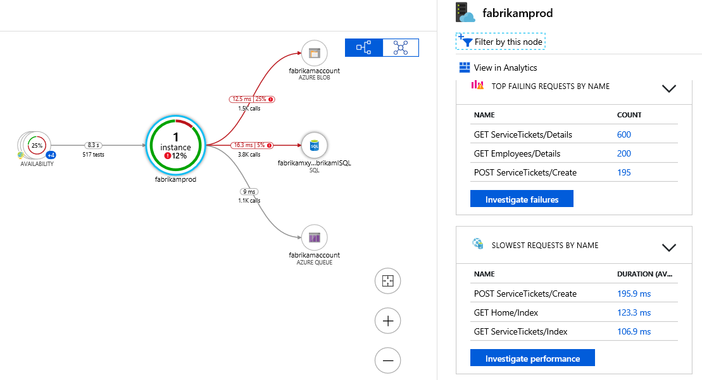

# Recap

This document will be a small recap of the previous exams.

## Explore the Microsoft identity platform

There are several components that make up the Microsoft identity platform:

* **OAuth 2.0 and OpenID Connect standard-compliant authentication service** for your everyday use
* **Open-source libraries** like Microsoft Authentication Libraries (MSAL)
* **Application management portal** through the portal.
* **Application configuration API and PowerShell** to programmatically configure of your applications through the Microsoft Graph API and PowerShell so you can automate your DevOps tasks.

If you want to make an app that uses AD, you can choose:

* **Single tenant**: only accessible in your tenant
* **Multi-tenant**: accessible in other tenants

If you register an application in the portal, an **application object** (the globally unique instance of the app) as well as a **service principal object** are automatically created in your home tenant:

* An _application object_ is used as a template or blueprint to create one or more service principal objects. The application object describes three aspects of an application: how the service can issue tokens in order to access the application, resources that the application might need to access, and the actions that the application can take.
* The _security principal_ defines the access policy and permissions for the user/application in the Azure Active Directory tenant. This enables core features such as authentication of the user/application during sign-in, and authorization during resource access. There are three types of service principals:
  * **Application:** This type of service principal is the local representation, or application instance, of a global application object in a single tenant or directory.
  * **Managed identity:** This type of service principal is used to represent a managed identity. Managed identities provide an identity for applications to use when connecting to resources that support Azure Active Directory authentication.
  * **Legacy:** This type of service principal represents a legacy app, which is an app created before app registrations were introduced or an app created through legacy experiences.

The _application object_ is the global representation of your application for use across all tenants, and the _service principal_ is the local representation for use in a specific tenant. The application object serves as the template from which common and default properties are derived for use in creating corresponding service principal objects. An application object has:

* A 1:1 relationship with the software application, and
* A 1:many relationship with its corresponding service principal object(s).

The Microsoft identity platform implements the **OAuth 2.0 authorization protocol**. Any web-hosted resource that integrates with the Microsoft identity platform has a resource identifier, or application ID URI. For example:

* Microsoft Graph: `https://graph.microsoft.com`
* Microsoft 365 Mail API: `https://outlook.office.com`
* Azure Key Vault: `https://vault.azure.net`

In OAuth 2.0, these types of permission sets are called _scopes_. They're also often referred to as _permissions_. In the Microsoft identity platform, a permission is represented as a string value. An app requests the permissions it needs by specifying the permission in the scope query parameter like `https://graph.microsoft.com/Calendars.Read`.

The Microsoft identity platform supports two types of permissions:

* **Delegated permissions** are used by apps that have a signed-in user present. For these apps, either the user or an administrator consents to the permissions that the app requests. The app is delegated with the permission to act as a signed-in user when it makes calls to the target resource.
* **Application permissions** are used by apps that run without a signed-in user present, for example, apps that run as background services or daemons. Only an administrator can consent to application permissions.

There are a number of kinds of **consent** that your app may need to know about in order to be successful. There are three types:

* In the **static user consent** scenario, you must specify all the permissions it needs in the app's configuration in the Azure portal. It presents some possible issues for developers:
  * The app needs to request all the permissions it would ever need upon the user's first sign-in. This can lead to a long list of permissions that discourages end users from approving the app's access on initial sign-in.
  * The app needs to know all of the resources it would ever access ahead of time. It is difficult to create apps that could access an arbitrary number of resources.
* You can ask for a minimum set of permissions upfront and request more over time as the customer uses additional app features. To do so, you can specify the scopes your app needs at any time by including the new scopes in the scope parameter when requesting an access token - without the need to pre-define them in the application registration information. If the user hasn't yet consented to new scopes added to the request, they'll be prompted to consent only to the new permissions. **Incremental, or dynamic consent**, only applies to delegated permissions and not to application permissions.
* **Admin consent** is required when your app needs access to certain high-privilege permissions. Admin consent ensures that administrators have some additional controls before authorizing apps or users to access highly privileged data from the organization.

A request for permissions looks something like this:

```URL
GET https://login.microsoftonline.com/common/oauth2/v2.0/authorize?
client_id=6731de76-14a6-49ae-97bc-6eba6914391e
&response_type=code
&redirect_uri=http%3A%2F%2Flocalhost%2Fmyapp%2F
&response_mode=query
&scope=https%3A%2F%2Fgraph.microsoft.com%2Fcalendars.read%20https%3A%2F%2Fgraph.microsoft.com%2Fmail.send
&state=12345
```

**Conditional Access** enables developers and enterprise customers to protect services in a multitude of ways including:

* Multifactor authentication
* Allowing only Intune enrolled devices to access specific services
* Restricting user locations and IP ranges

Most of the time, CA will not impact your app, only when you need someone to log in again. Specifically, the following scenarios require code to handle Conditional Access challenges:

* Apps performing the on-behalf-of flow
* Apps accessing multiple services/resources
* Single-page apps using MSAL.js
* Web apps calling a resource

## Implement authentication by using the Microsoft Authentication Library

The **Microsoft Authentication Library (MSAL)** can be used to provide secure access to Microsoft Graph, other Microsoft APIs, third-party web APIs, or your own web API. MSAL supports many different application architectures and platforms including .NET, JavaScript, Java, Python, Android, and iOS.

MSAL gives you many ways to get tokens, with a consistent API for a number of platforms. Using MSAL provides the following **benefits**:

* No need to directly use the OAuth libraries or code against the protocol in your application.
* Acquires tokens on behalf of a user or on behalf of an application (when applicable to the platform).
* Maintains a token cache and refreshes tokens for you when they are close to expire. You don't need to handle token expiration on your own.
* Helps you specify which audience you want your application to sign in.
* Helps you set up your application from configuration files.
* Helps you troubleshoot your app by exposing actionable exceptions, logging, and telemetry.

Here are some flows that can be used in a variety of different application scenarios:

* **Authorization code:** Native and web apps securely obtain tokens in the name of the user
* **Client credentials:** Service applications run without user interaction
* **On-behalf-of:** The application calls a service/web API, which in turns calls Microsoft Graph
* **Implicit:** Used in browser-based applications
* **Device code:** Enables sign-in to a device by using another device that has a browser
* **Integrated Windows:** Windows computers silently acquire an access token when they are domain joined
* **Interactive:** Mobile and desktops applications call Microsoft Graph in the name of a user
* **Username/password:** The application signs in a user by using their username and password

**Security tokens** can be acquired by multiple types of applications. These applications tend to be separated into the following two categories. Each is used with different libraries and objects:

* **Public client applications:** Are apps that run on devices or desktop computers or in a web browser. They're not trusted to safely keep application secrets, so they only access web APIs on behalf of the user.
* **Confidential client applications:** Are apps that run on servers (web apps, web API apps, or even service/daemon apps). They're considered difficult to access, and for that reason capable of keeping an application secret.

With MSAL.NET 3.x, the recommended way to instantiate an application is by using the application builders: _PublicClientApplicationBuilder_ and _ConfidentialClientApplicationBuilder_. They offer a powerful mechanism to configure the application either from the code, or from a configuration file, or even by mixing both approaches.

Signing-in users in the Microsoft Azure public cloud:

```C#
IPublicClientApplication app = PublicClientApplicationBuilder.Create(clientId).Build();
```

In the same way, the following code instantiates a confidential application handling tokens from users in the Microsoft Azure public cloud, with their work and school accounts, or their personal Microsoft accounts:

```C#
string redirectUri = "https://myapp.azurewebsites.net";
IConfidentialClientApplication app = ConfidentialClientApplicationBuilder.Create(clientId)
    .WithClientSecret(clientSecret)
    .WithRedirectUri(redirectUri)
    .Build();
```

Other `.With` methods are:

* `.WithAuthority()`: Sets the application default authority to an Azure Active Directory authority, with the possibility of choosing the Azure Cloud, the audience, the tenant (tenant ID or domain name), or providing directly the authority URI.
* `.WithTenantId(string tenantId)`: Overrides the tenant ID, or the tenant description.
* `.WithClientId(string)`: Overrides the client ID.
* `.WithRedirectUri(string redirectUri)`: Overrides the default redirect URI. In the case of public client applications, this will be useful for scenarios requiring a broker.
* `.WithComponent(string)`: Sets the name of the library using MSAL.NET (for telemetry reasons).
* `.WithDebugLoggingCallback()`: If called, the application will call Debug.Write simply enabling debugging traces.
* `.WithLogging()`: If called, the application will call a callback with debugging traces.
* `.WithTelemetry(TelemetryCallback telemetryCallback)`: Sets the delegate used to send telemetry.

Some specifically for confidential apps:

* `.WithCertificate(X509Certificate2 certificate)`: Sets the certificate identifying the application with Azure Active Directory.
* `.WithClientSecret(string clientSecret)`: Sets the client secret (app password) identifying the application with Azure Active Directory.

## Explore Microsoft Graph

Microsoft Graph is the gateway to data and intelligence in Microsoft 365. It provides a unified programmability model that you can use to access the tremendous amount of data in Microsoft 365, Windows 11, and Enterprise Mobility + Security.


In the Microsoft 365 platform, three main components facilitate the access and flow of data:

* The Microsoft Graph API **offers a single endpoint**, `https://graph.microsoft.com`. You can use REST APIs or SDKs to access the endpoint. Microsoft Graph also includes a powerful set of services that manage user and device identity, access, compliance, security, and help protect organizations from data leakage or loss.
* **Microsoft Graph connectors** work in the incoming direction, delivering data external to the Microsoft cloud into Microsoft Graph services and applications, to enhance Microsoft 365 experiences such as Microsoft Search. Connectors exist for many commonly used data sources such as Box, Google Drive, Jira, and Salesforce.
* **Microsoft Graph Data Connect** provides a set of tools to streamline secure and scalable delivery of Microsoft Graph data to popular Azure data stores. The cached data serves as data sources for Azure development tools that you can use to build intelligent applications.

Microsoft Graph is a **RESTful web API** that enables you to access Microsoft Cloud service resources. After you register your app and get authentication tokens for a user or service, you can make requests to the Microsoft Graph API.

```URL
{HTTP method} https://graph.microsoft.com/{version}/{resource}?{query-parameters}
```

* The _version_ can be either `v1.0` or `beta`. Use `v1.0` in production apps.
* A _resource_ can be an entity or complex type, commonly defined with properties. Entities differ from complex types by always including an id property. Your URL will include the resource you are interacting with in the request, such as `me`, `user`, `group`, `drive`, and `site`. Often, top-level resources also include relationships, which you can use to access other resources, like `me/messages` or `me/drive`. You can also interact with resources using methods; for example, to send an email, use `me/sendMail`.
* _Query parameters_ can be **OData system query options**, or other strings that a method accepts to customize its response. You can use optional OData system query options to include more or fewer properties than the default response, filter the response for items that match a custom query, or provide another parameters for a method: `GET https://graph.microsoft.com/v1.0/me/messages?filter=emailAddress eq 'jon@contoso.com'`

After you make a request, a response is returned that includes:

* **Status code**: An HTTP status code that indicates success or failure.
* **Response message**: The data that you requested or the result of the operation. The response message can be empty for some operations.
* `nextLink`: If your request returns a lot of data, you need to page through it by using the URL returned in `@odata.nextLink`.

The Microsoft Graph .NET SDK is included in the following NuGet packages:

* **Microsoft.Graph** - Contains the models and request builders for accessing the v1.0 endpoint with the fluent API. Microsoft.Graph has a dependency on Microsoft.Graph.Core.
* **Microsoft.Graph.Beta** - Contains the models and request builders for accessing the beta endpoint with the fluent API. Microsoft.Graph.Beta has a dependency on Microsoft.Graph.Core.
* **Microsoft.Graph.Core** - The core library for making calls to Microsoft Graph. Provides embedded support for retry handling, secure redirects, transparent authentication, and payload compression, improve the quality of your application's interactions with Microsoft Graph, with no added complexity, while leaving you completely in control.
* **Microsoft.Graph.Auth** - Provides an authentication scenario-based wrapper of the Microsoft Authentication Library for use with the Microsoft Graph SDK.

To access the data in Microsoft Graph, your application will need to **acquire an OAuth 2.0 access token**, and present it to Microsoft Graph in either of the following:

* The HTTP Authorization request header, as a Bearer token
* The graph client constructor, when using a Microsoft Graph client library

_Use the Microsoft Authentication Library API, MSAL to acquire the access token to Microsoft Graph._ In code, this looks something like this:

```C#
// Build a client application.
IPublicClientApplication publicClientApplication = PublicClientApplicationBuilder
            .Create("INSERT-CLIENT-APP-ID")
            .Build();
// Create an authentication provider by passing in a client application and graph scopes.
DeviceCodeProvider authProvider = new DeviceCodeProvider(publicClientApplication, graphScopes);
// Create a new instance of GraphServiceClient with the authentication provider.
GraphServiceClient graphClient = new GraphServiceClient(authProvider);
```

And then you can do some other cool things with it:

```C#
// GET https://graph.microsoft.com/v1.0/me
var user = await graphClient.Me
    .Request()
    .GetAsync();

// GET https://graph.microsoft.com/v1.0/me/messages?$select=subject,sender&$filter=<some condition>&orderBy=receivedDateTime
var messages = await graphClient.Me.Messages
    .Request()
    .Select(m => new { m.Subject, m.Sender })
    .Filter("<filter condition>")
    .OrderBy("receivedDateTime")
    .GetAsync();

// DELETE https://graph.microsoft.com/v1.0/me/messages/{message-id}
string messageId = "AQMkAGUy...";
var message = await graphClient.Me.Messages[messageId]
    .Request()
    .DeleteAsync();

// POST https://graph.microsoft.com/v1.0/me/calendars
var calendar = new Calendar { Name = "Volunteer" };
var newCalendar = await graphClient.Me.Calendars
    .Request()
    .AddAsync(calendar);
```

Some best practices:

* Use least privilege.
* Use the correct permission type (delegated or application permissions) based on scenarios.
* Consider the end user and admin experience.
* Consider multi-tenant applications. Sometimes stuff is restricted by another AD admin.
* Your application should always handle the possibility that the responses are paged in nature, and use the `@odata.nextLink` property to obtain the next paged set of results, until all pages of the result set have been read.
* Adding members to existing enumerations can break applications already using these enums. Evolvable enums is a mechanism that Microsoft Graph API uses to add new members to existing enumerations without causing a breaking change for applications.
* You should only cache or store data locally if necessary for a specific scenario, and if that use case is covered by your terms of use and privacy policy, and does not violate the Microsoft APIs Terms of Use.

## Implement Azure Key Vault

**Azure Key Vault** is a way to store secrets. It enforces _Transport Layer Security (TLS) protocol_ to protect data when it’s traveling between Azure Key Vault and clients. It also uses _Perfect Forward Secrecy (PFS)_ protects connections between customers’ client systems and Microsoft cloud services by unique keys. 

It has two service tiers: Standard, which encrypts with a software key, and a Premium tier, which includes hardware security module(HSM)-protected keys. It helps by the following problems:

* **Secrets Management**: Azure Key Vault can be used to Securely store and tightly control access to tokens, passwords, certificates, API keys, and other secrets
* **Key Management**: Azure Key Vault can also be used as a Key Management solution. Azure Key Vault makes it easy to create and control the encryption keys used to encrypt your data.
* **Certificate Management**: Azure Key Vault is also a service that lets you easily provision, manage, and deploy public and private Secure Sockets Layer/Transport Layer Security (SSL/TLS) certificates for use with Azure and your internal connected resources.

And it has the following benefits:

* Centralized application secrets.
* Securely store secrets and keys.
* Monitor access and use.
* Simplified administration of application secrets.

Azure Keyvault authentication can be done in three ways:

* **Managed identities for Azure resources**: When you deploy an app on a virtual machine in Azure, you can assign an identity to your virtual machine that has access to Key Vault. You can also assign identities to other Azure resources. The benefit of this approach is that the app or service isn't managing the rotation of the first secret. Azure automatically rotates the service principal client secret associated with the identity. This approach is recommended.
* **Service principal and certificate**: You can use a service principal and an associated certificate that has access to Key Vault. We don't recommend this approach because the application owner or developer must rotate the certificate.
* **Service principal and secret**: Although you can use a service principal and a secret to authenticate to Key Vault, we don't recommend it. It's hard to automatically rotate the bootstrap secret that's used to authenticate to Key Vault.

For applications, there are two ways to obtain a **service principal**:

* Enable a system-assigned managed identity for the application. With managed identity, Azure internally manages the application's service principal and automatically authenticates the application with other Azure services. Managed identity is available for applications deployed to a variety of services.
* If you cannot use managed identity, you instead register the application with your Azure AD tenant. Registration also creates a second application object that identifies the app across all tenants.

You can use the REST API as well:

```HTTP
PUT /keys/MYKEY?api-version=<api_version>  HTTP/1.1  
Authorization: Bearer <access_token>
```

And in case of an invalid request, you'll get:

```HTTP
401 Not Authorized  
WWW-Authenticate: Bearer authorization="…", resource="…"
```

Which has two parameters:

* _authorization_: The address of the OAuth2 authorization service that may be used to obtain an access token for the request.
* _resource_: The name of the resource (`https://vault.azure.net`) to use in the authorization request.

Best practices:

* **Use separate key vaults**: Recommended to use a vault per application per environment (Development, Pre-Production and Production). This helps you not share secrets across environments and also reduces the threat in case of a breach.
* **Control access to your vault**: Key Vault data is sensitive and business critical, you need to secure access to your key vaults by allowing only authorized applications and users.
* **Backup**: Create regular back ups of your vault on update/delete/create of objects within a Vault.
* **Logging**: Be sure to turn on logging and alerts.
* **Recovery options**: Turn on soft-delete and purge protection if you want to guard against force deletion of the secret.

## Implement Azure App Configuration

Use **App Configuration** to store all the settings for your application and secure their access in one place. It offers the following benefits:

* A fully managed service that can be set up in minutes
* Flexible key representations and mappings
* Tagging with labels
* Point-in-time replay of settings
* Dedicated UI for feature flag management
* Comparison of two sets of configurations on custom-defined dimensions
* Enhanced security through Azure-managed identities
* Complete data encryptions, at rest or in transit
* Native integration with popular frameworks

App Configuration complements Azure Key Vault, which is used to store application secrets. App Configuration makes it easier to implement the following scenarios:

* Centralize management and distribution of hierarchical configuration data for different environments and geographies
* Dynamically change application settings without the need to redeploy or restart an application
* Control feature availability in real-time

_Keys_ serve as the name for key-value pairs and are used to store and retrieve corresponding values. It's a common practice to organize keys into a hierarchical namespace by using a character delimiter, such as `/` or `:`. They are case-sensitive and can contain every unicode character except `*`, `,`, and `\`. These can be escaped by using `\{Reserved Character}`.

There are two general approaches to naming keys used for configuration data: **flat** or **hierarchical**. While flat is just flat, hierarchical offers some benefits:

* **Easier to read**. Instead of one long sequence of characters, delimiters in a hierarchical key name function as spaces in a sentence.
* **Easier to manage**. A key name hierarchy represents logical groups of configuration data.
* **Easier to use**. It's simpler to write a query that pattern-matches keys in a hierarchical structure and retrieves only a portion of configuration data.

It looks something like this `AppName:Service1:ApiEndpoint`.

Key values in App Configuration can optionally have a label attribute. Labels are used to differentiate key values with the same key. A common use of labels is to specify multiple environments for the same key:

```Configuration
Key = AppName:DbEndpoint & Label = Test
Key = AppName:DbEndpoint & Label = Staging
Key = AppName:DbEndpoint & Label = Production
```

Note: There is **no** automatic versioning for keys.

_Values_ assigned to keys are also unicode strings. You can use all unicode characters for values. There's an optional user-defined content type associated with each value. Use this attribute to store information, for example an encoding scheme, about a value that helps your application to process it properly.

Feature management is a modern software-development practice that decouples feature release from code deployment and enables quick changes to feature availability on demand. It uses a technique called **feature flags** (also known as feature toggles, feature switches, and so on) to dynamically administer a feature's lifecycle. This has some special terms:

* **Feature flag**: A feature flag is a variable with a binary state of on or off. The feature flag also has an associated code block. The state of the feature flag triggers whether the code block runs or not.
* **Feature manager**: A feature manager is an application package that handles the lifecycle of all the feature flags in an application. The feature manager typically provides additional functionality, such as caching feature flags and updating their states.
* **Filter**: A filter is a rule for evaluating the state of a feature flag. A user group, a device or browser type, a geographic location, and a time window are all examples of what a filter can represent.

Feature flags are just booleans:

```C#
if (featureFlag) {
    // Run the following code
}
```

Each feature flag has two parts: **a name** and **a list of one or more filters** that are used to evaluate if a feature's state is on (that is, when its value is True). A filter defines a use case for when a feature should be turned on. When a feature flag has multiple filters, the filter list is traversed in order until one of the filters determines the feature should be enabled. At that point, the feature flag is on, and any remaining filter results are skipped. If no filter indicates the feature should be enabled, the feature flag is off.

To use feature flags effectively, you need to **externalize all the feature flags used in an application**. This approach allows you to change feature flag states without modifying and redeploying the application itself.

The feature manager supports `appsettings.json` as a configuration source for feature flags. The following example shows how to set up feature flags in a JSON file:

```JSON
"FeatureManagement": {
    "FeatureA": true, // Feature flag set to on
    "FeatureB": false, // Feature flag set to off
    "FeatureC": {
        "EnabledFor": [
            {
                "Name": "Percentage",
                "Parameters": {
                    "Value": 50
                }
            }
        ]
    }
}
```

Normally, all values are encrypted at rest with 256-bit AES. When **customer-managed key capability** is enabled, App Configuration uses a managed identity assigned to the App Configuration instance to authenticate with Azure Active Directory. The managed identity then calls Azure Key Vault and wraps the App Configuration instance's encryption key. The wrapped encryption key is then stored and the unwrapped encryption key is cached within App Configuration for one hour. App Configuration refreshes the unwrapped version of the App Configuration instance's encryption key hourly. This ensures availability under normal operating conditions. You can enable this by having the following components:

* Standard tier Azure App Configuration instance
* Azure Key Vault with soft-delete and purge-protection features enabled
* An RSA or RSA-HSM key within the Key Vault: The key must not be expired, it must be enabled, and it must have both wrap and unwrap capabilities enabled

Once these resources are configured, two steps remain to allow Azure App Configuration to use the Key Vault key:

* Assign a managed identity to the Azure App Configuration instance
* Grant the identity `GET`, `WRAP`, and `UNWRAP` permissions in the target Key Vault's access policy.

You can also use **private endpoints** for Azure App Configuration to allow clients on a virtual network (VNet) to securely access data over a private link. The private endpoint uses an IP address from the VNet address space for your App Configuration store. Some notes:

* When creating a private endpoint, you must specify the App Configuration store to which it connects. If you have multiple App Configuration stores, you need a separate private endpoint for each store.
* When you create a private endpoint, the DNS CNAME resource record for the configuration store is updated to an alias in a subdomain with the prefix `privatelink`. Azure also creates a private DNS zone corresponding to the `privatelink` subdomain, with the DNS A resource records for the private endpoints.

A **managed identity** from Azure Active Directory (AAD) allows Azure App Configuration to easily access other AAD-protected resources, such as Azure Key Vault. The identity is managed by the Azure platform. It does not require you to provision or rotate any secrets. There are two of them:

* A **system-assigned** identity is tied to your configuration store. It's deleted if your configuration store is deleted. A configuration store can only have one system-assigned identity.
* A **user-assigned** identity is a standalone Azure resource that can be assigned to your configuration store. A configuration store can have multiple user-assigned identities.

To set up a managed identity using the Azure CLI, use the `az appconfig identity assign` command against an existing configuration store:

```Bash
az appconfig identity assign \ 
    --name myTestAppConfigStore \ 
    --resource-group myResourceGroup
```

Creating an App Configuration store with a user-assigned identity requires that you create the identity and then assign its resource identifier to your store.

```Bash
az identity create --resource-group myResourceGroup --name myUserAssignedIdentity

az appconfig identity assign --name myTestAppConfigStore \ 
    --resource-group myResourceGroup \ 
    --identities /subscriptions/[subscription id]/resourcegroups/myResourceGroup/providers/Microsoft.ManagedIdentity/userAssignedIdentities/myUserAssignedIdentity
```

## Monitor app performance

High level overview of Azure monitor:


* At the center of the diagram, you'll find the data stores for metrics and logs and changes. These data stores are the fundamental types of data used by Azure Monitor.
* On the left are the sources of monitoring data that populate the data stores.
* On the right are the different functions that Azure Monitor performs with this collected data. This diagram includes such actions as analysis, alerting, and integration such as streaming to external systems.

It collects the following data:

* **Metrics**: Metrics are numerical values that describe some aspect of a system at a particular point in time. They're collected at regular intervals and are identified with a timestamp, a name, a value, and one or more defining labels.
* **Logs**: Logs are events that occurred within the system. They can contain different kinds of data and may be structured or free-form text with a timestamp.
* **Distributed traces**: Traces are series of related events that follow a user request through a distributed system.
* **Changes**: Changes are a series of events that occur in your Azure application and resources. Change Analysis tracks changes and is a subscription-level observability tool that's built on the power of Azure Resource Graph.

**Application Insights** is an extension of Azure Monitor and provides Application Performance Monitoring (also known as “APM”) features. It includes:

* **Live Metrics**: Observe activity from your deployed application in real time with no effect on the host environment.
* **Availability**: Probe your applications external endpoint(s) to test the overall availability and responsiveness over time.
* **GitHub or Azure DevOps integration**: Create GitHub or Azure DevOps work items in context of Application Insights data.
* **Usage**: Reveals which features are popular with users and how users interact and use your application.
* **Smart Detection**: Provides automatic failure and anomaly detection through proactive telemetry analysis.
* **Application Map**: Allows a high level top-down view of the application architecture and at-a-glance visual references to component health and responsiveness.
* **Distributed Tracing**: Search and visualize an end-to-end flow of a given execution or transaction.

But what does it monitor:

* **Request rates, response times, and failure rates** - Find out which pages are most popular, at what times of day, and where your users are. See which pages perform best. If your response times and failure rates go high when there are more requests, then perhaps you have a resourcing problem.
* **Dependency rates, response times, and failure rates** - Find out whether external services are slowing you down.
* **Exceptions** - Analyze the aggregated statistics, or pick specific instances and drill into the stack trace and related requests. Both server and browser exceptions are reported.
* **Page views and load performance** - reported by your users' browsers.
* **AJAX calls from web pages** - rates, response times, and failure rates.
* **User and session counts**.
* **Performance counters** from your Windows or Linux server machines, such as CPU, memory, and network usage.
* **Host diagnostics** from Docker or Azure.
* **Diagnostic trace logs from your app** - so that you can correlate trace events with requests.
* **Custom events and metrics** that you write yourself in the client or server code, to track business events such as items sold or games won.

But how do I start with it?

* **At run time**: instrument your web app on the server. Ideal for applications already deployed. Avoids any update to the code.
* **At development time**: add Application Insights to your code. Allows you to customize telemetry collection and send more telemetry.
* **Instrument your web pages** for page view, AJAX, and other client-side telemetry.
* **Analyze mobile app usage** by integrating with Visual Studio App Center.
* **Availability tests** - ping your website regularly from our servers.

The **Application Insights log-based metrics** have two kinds of metrics:

* **Log-based metrics** behind the scene are translated into Kusto queries from stored events. They have more dimensions, which makes them the superior option for data analysis and ad-hoc diagnostics
* **Standard metrics** are stored as pre-aggregated time series. They are pre-aggregated during collection, they have better performance at query time. This makes them a better choice for dashboarding and in real-time alerting.

Collecting a complete set of events may be impractical (or even impossible) for applications that generate a **large volume of telemetry**. For situations when the volume of events is too high, Application Insights implements several telemetry volume reduction techniques, such as sampling and filtering that reduce the number of collected and stored events.

The **pre-aggregated metrics** are not stored as individual events with lots of properties. Instead, they are stored as pre-aggregated time series, and only with key dimensions. This makes the new metrics superior at query time: retrieving data happens much faster and requires less compute power. This consequently enables new scenarios such as near real-time alerting on dimensions of metrics, more responsive dashboards, and more.

Application Insights is _enabled_ through either:

* **Auto-instrumentation**: This is the preferred instrumentation method. It requires no developer investment and eliminates future overhead related to updating the SDK. It's also the only way to instrument an application in which you don't have access to the source code. In essence, all you have to do is enable and - in some cases - configure the agent, which will collect the telemetry automatically.
* **Application Insights SDK**: You only need to install the SDK in the following circumstances:
  * You require custom events and metrics
  * You require control over the flow of telemetry
  * Auto-Instrumentation isn't available (typically due to language or platform limitations, like you don't need to host the app on Azure)

Application Insights can create **availability tests** for any HTTP or HTTPS endpoint that's accessible from the public internet. You don't have to make any changes to the website you're testing. In fact, it doesn't even have to be a site that you own. It can hold up to 100 availability tests per resource, and there are four kinds of tests:

* **URL ping test (classic)**: You can create this simple test through the portal to validate whether an endpoint is responding and measure performance associated with that response. You can also set custom success criteria coupled with more advanced features, like parsing dependent requests and allowing for retries.
* **Standard test (Preview)**: This single request test is similar to the URL ping test. It includes SSL certificate validity, proactive lifetime check, HTTP request verb (for example GET, HEAD, or POST), custom headers, and custom data associated with your HTTP request.
* **Custom TrackAvailability test**: If you decide to create a custom application to run availability tests, you can use the `TrackAvailability()` method to send the results to Application Insights.
* **Multi-step test** is a fourth type of availability test, however that is only available through Visual Studio 2019.

**Application Map** helps you spot performance bottlenecks or failure hotspots across all components of your distributed application. Components are independently deployable parts of your distributed/microservices application. Developers and operations teams have code-level visibility or access to telemetry generated by these application components.

* Components are different from "observed" external dependencies such as SQL, Event Hubs, etc. which your team/organization may not have access to (code or telemetry).
* Components run on any number of server/role/container instances.
* Components can be separate Application Insights instrumentation keys (even if subscriptions are different) or different roles reporting to a single Application Insights instrumentation key. The preview map experience shows the components regardless of how they are set up.



Application Map uses the cloud role name property to identify the components on the map. You can manually set or override the cloud role name and change what gets displayed on the Application Map.

## Explore Azure Event Grid

**Azure Event Grid** is an eventing backplane that enables event-driven, reactive programming. It uses the publish-subscribe model. Publishers emit events, but have no expectation about how the events are handled. Subscribers decide on which events they want to handle.


There are five concepts in event grid:

* **Events** - What happened. It has specific information that is only relevant to the specific type of event, like the file that was created. An event of size up to 64 KB is covered by General Availability (GA) Service Level Agreement (SLA). The support for an event of size up to 1 MB is currently in preview. Events over 64 KB are charged in 64-KB increments.
* **Event sources** - Where the event took place. For example, Azure Storage is the event source for blob created events.
* **Topics** - The endpoint where publishers send events. It is used for a collection of related events. _System topics_ are built-in topics provided by Azure services. _Custom topics_ are application and third-party topics.
* **Event subscriptions** - The endpoint or built-in mechanism to route events, sometimes to more than one handler. Subscriptions are also used by handlers to intelligently filter incoming events.
* **Event handlers** - The app or service reacting to the event. For HTTP webhook event handlers, the event is retried until the handler returns a status code of 200 – OK. For Azure Storage Queue, the events are retried until the Queue service successfully processes the message push into the queue.

The following example shows the properties that are used by all event publishers:

```JSON
[
  {
    "topic": string,
    "subject": string,
    "id": string,
    "eventType": string,
    "eventTime": string,
    "data":{
      object-unique-to-each-publisher
    },
    "dataVersion": string,
    "metadataVersion": string
  }
]
```

Description of this:

* **topic**: Full resource path to the event source. This field isn't writeable. Event Grid provides this value.
* **subject**: Publisher-defined path to the event subject.
* **eventType**: One of the registered event types for this event source.
* **eventTime**: The time the event is generated based on the provider's UTC time.
* **id**: Unique identifier for the event.
* **data**: Event data specific to the resource provider.
* **dataVersion**: The schema version of the data object. The publisher defines the schema version.
* **metadataVersion**: The schema version of the event metadata. Event Grid defines the schema of the top-level properties. Event Grid provides this value.

When publishing events to custom topics, create subjects for your events that make it easy for subscribers to know whether they're interested in the event. For example, if you provide a three segment path like `/A/B/C` in the subject, subscribers can filter by the first segment `/A` to get a broad set of events. Those subscribers get events with subjects like `/A/B/C` or `/A/D/E`. Other subscribers can filter by `/A/B` to get a narrower set of events.

In addition to its default event schema, Azure Event Grid natively supports events in the JSON implementation of **CloudEvents v1.0** and HTTP protocol binding. CloudEvents is an open specification for describing event data. With a common schema, you can more easily integrate work across platforms:

```JSON
{
    "specversion": "1.0",
    "type": "Microsoft.Storage.BlobCreated",  
    "source": "/subscriptions/{subscription-id}/resourceGroups/{resource-group}/providers/Microsoft.Storage/storageAccounts/{storage-account}",
    "id": "9aeb0fdf-c01e-0131-0922-9eb54906e209",
    "time": "2019-11-18T15:13:39.4589254Z",
    "subject": "blobServices/default/containers/{storage-container}/blobs/{new-file}",
    "dataschema": "#",
    "data": {
        "api": "PutBlockList",
        "clientRequestId": "4c5dd7fb-2c48-4a27-bb30-5361b5de920a",
        "requestId": "9aeb0fdf-c01e-0131-0922-9eb549000000",
        "eTag": "0x8D76C39E4407333",
        "contentType": "image/png",
        "contentLength": 30699,
        "blobType": "BlockBlob",
        "url": "https://gridtesting.blob.core.windows.net/testcontainer/{new-file}",
        "sequencer": "000000000000000000000000000099240000000000c41c18",
        "storageDiagnostics": {
            "batchId": "681fe319-3006-00a8-0022-9e7cde000000"
        }
    }
}
```

When Event Grid receives an error for an event delivery attempt, Event Grid decides whether it should **retry** the delivery, **dead-letter** the event, or **drop** the event based on the type of the error. It will wait for 30 seconds for a response after delivering a message. After 30 seconds, if the endpoint hasn’t responded, the message is queued for retry. Event Grid uses an exponential backoff retry policy for event delivery. Retries _don't_ happen for:

* Azure Resources: 400 Bad Request, 413 Request Entity Too Large, 403 Forbidden
* Webhook: 400 Bad Request, 413 Request Entity Too Large, 403 Forbidden, 404 Not Found, 401 Unauthorized

There is some configuration for this:

* **Maximum number of attempts** - The value must be an integer between 1 and 30. The default value is 30.
* **Event time-to-live (TTL)** - The value must be an integer between 1 and 1440. The default value is 1440 minutes

Batching is also supported:

* **Max events per batch** - Maximum number of events Event Grid will deliver per batch. This number will never be exceeded, however fewer events may be delivered if no other events are available at the time of publish. Event Grid doesn't delay events to create a batch if fewer events are available. Must be between 1 and 5,000.
* **Preferred batch size in kilobytes** - Target ceiling for batch size in kilobytes.

When Event Grid can't deliver an event within a certain time period or after trying to deliver the event a certain number of times, it can send the undelivered event to a storage account. This process is known as **dead-lettering**. Event Grid dead-letters an event when one of the following conditions is met.

* Event isn't delivered within the time-to-live period.
* The number of tries to deliver the event exceeds the limit.
* A response is returned that can not be handled (see the 400 errors above)

To enable it, you must _specify a storage account_ to hold undelivered events when creating the event subscription. You pull events from this storage account to resolve deliveries.

Event subscriptions allow you to set up **HTTP headers** that are included in delivered events. You can set up to **10** headers when creating an event subscription. Each header value shouldn't be greater than **4,096 bytes**. You can set custom headers on the events that are delivered to the following destinations:

* Webhooks
* Azure Service Bus topics and queues
* Azure Event Hubs
* Relay Hybrid Connections

RBAC is also supported in this. Some pre-defined roles:

* **Event Grid Subscription Reader**: Lets you read Event Grid event subscriptions.
* **Event Grid Subscription Contributor**: Lets you manage Event Grid event subscription operations.
* **Event Grid Contributor**: Lets you create and manage Event Grid resources.
* **Event Grid Data Sender**: Lets you send events to Event Grid topics.

If you're using an event handler _that isn't a WebHook_ (such as an event hub or queue storage), you need write access to that resource (`Microsoft.EventGrid/EventSubscriptions/Write` permission). This permissions check prevents an unauthorized user from sending events to your resource. This differs from system and custom topics:

* System topics need permission to write a new event subscription at the scope of the resource publishing the event. The format of the resource is: `/subscriptions/{subscription-id}/resourceGroups/{resource-group-name}/providers/{resource-provider}/{resource-type}/{resource-name}`
* Custom topics need permission to write a new event subscription at the scope of the event grid topic. The format of the resource is: `/subscriptions/{subscription-id}/resourceGroups/{resource-group-name}/providers/Microsoft.EventGrid/topics/{topic-name}`

Event Grid requires you to _prove ownership_ of your Webhook endpoint before it starts delivering events to that endpoint. These apps automatically handle validation:

* Azure Logic Apps with Event Grid Connector
* Azure Automation via webhook
* Azure Functions with Event Grid Trigger

If you're using any other type of endpoint, such as an HTTP trigger based Azure function, your endpoint code needs to participate in a validation handshake with Event Grid. Event Grid supports two ways of validating the subscription.

* **Synchronous handshake**: At the time of event subscription creation, Event Grid sends a subscription validation event to your endpoint. The schema of this event is similar to any other Event Grid event. The data portion of this event includes a `validationCode` property. Your application verifies that the validation request is for an expected event subscription, and returns the validation code in the response synchronously. This handshake mechanism is supported in all Event Grid versions.
* **Asynchronous handshake**: In certain cases, you can't return the ValidationCode in response synchronously. For example, if you use a third-party service (like Zapier or IFTTT), you can't programmatically respond with the validation code.

Nowadays, Event Grid sends a `validationUrl` property in the data portion of the subscription validation event. To complete the handshake, find that URL in the event data and do a GET request to it. You can use either a REST client or your web browser. You have 5 minutes to find it.

By default, all event types for the event source are sent to the endpoint. You can **decide to send only certain event types** to your endpoint. For example, you can get notified of updates to your resources, but not notified for other operations like deletions. This looks like:

```JSON
"filter": {
  "includedEventTypes": [
    "Microsoft.Resources.ResourceWriteFailure",
    "Microsoft.Resources.ResourceWriteSuccess"
  ]
}
```

You can also filter on the subject:

```JSON
"filter": {
  "subjectBeginsWith": "/blobServices/default/containers/mycontainer/log",
  "subjectEndsWith": ".jpg"
}
```

To filter by values in the data fields and specify the comparison operator, use the advanced filtering option. In advanced filtering, you specify the:

* **operator type** - The type of comparison.
* **key** - The field in the event data that you're using for filtering. It can be a number, boolean, or string.
* **value or values** - The value or values to compare to the key.

```JSON
"filter": {
  "advancedFilters": [
    {
      "operatorType": "NumberGreaterThanOrEquals",
      "key": "Data.Key1",
      "value": 5
    },
    {
      "operatorType": "StringContains",
      "key": "Subject",
      "values": ["container1", "container2"]
    }
  ]
}
```

## Explore Azure Event Hubs

**Azure Event Hubs** represents the "front door" for an event pipeline, often called an _event ingestor_ in solution architectures. An event ingestor is a component or service that sits between event publishers and event consumers to decouple the production of an event stream from the consumption of those events. Event Hubs provides a unified streaming platform with time retention buffer, decoupling event producers from event consumers. Some cool stuff:

* **Fully managed PaaS**: Event Hubs is a fully managed Platform-as-a-Service (PaaS) with little configuration or management overhead, so you focus on your business solutions. Event Hubs for Apache Kafka ecosystems gives you the PaaS Kafka experience without having to manage, configure, or run your clusters.
* **Real-time and batch processing**: Event Hubs uses a partitioned consumer model, enabling multiple applications to process the stream concurrently and letting you control the speed of processing.
* **Scalable**: Scaling options, like Auto-inflate, scale the number of throughput units to meet your usage needs.
* **Rich ecosystem**: Event Hubs for Apache Kafka ecosystems enables Apache Kafka (1.0 and later) clients and applications to talk to Event Hubs. You do not need to set up, configure, and manage your own Kafka clusters.

Event Hubs contains the following key components:

* An **Event Hub client** is the primary interface for developers interacting with the Event Hubs client library. There are several different Event Hub clients, each dedicated to a specific use of Event Hubs, such as publishing or consuming events.
* An **Event Hub producer** is a type of client that serves as a source of telemetry data, diagnostics information, usage logs, or other log data, as part of an embedded device solution, a mobile device application, a game title running on a console or other device, some client or server based business solution, or a web site.
* An **Event Hub consumer** is a type of client which reads information from the Event Hub and allows processing of it. Processing may involve aggregation, complex computation and filtering. Processing may also involve distribution or storage of the information in a raw or transformed fashion. Event Hub consumers are often robust and high-scale platform infrastructure parts with built-in analytics capabilities, like Azure Stream Analytics, Apache Spark, or Apache Storm.
* A **partition** is an ordered sequence of events that is held in an Event Hub. Partitions are a means of data organization associated with the parallelism required by event consumers. Azure Event Hubs provides message streaming through a partitioned consumer pattern in which each consumer only reads a specific subset, or partition, of the message stream. As newer events arrive, they are added to the end of this sequence. The number of partitions is specified at the time an Event Hub is created and cannot be changed.
* A **consumer group** is a view of an entire Event Hub. Consumer groups enable multiple consuming applications to each have a separate view of the event stream, and to read the stream independently at their own pace and from their own position. There can be at most 5 concurrent readers on a partition per consumer group; however it is recommended that there is only one active consumer for a given partition and consumer group pairing. Each active reader receives all of the events from its partition; if there are multiple readers on the same partition, then they will receive duplicate events.
* **Event receivers**: Any entity that reads event data from an event hub. All Event Hubs consumers connect via the AMQP 1.0 session. The Event Hubs service delivers events through a session as they become available. All Kafka consumers connect via the Kafka protocol 1.0 and later.
* **Throughput units or processing units**: Pre-purchased units of capacity that control the throughput capacity of Event Hubs.


Azure Event Hubs enables you to automatically **capture** the streaming data in Event Hubs in an Azure Blob storage or Azure Data Lake Storage account of your choice, with the added flexibility of specifying a time or size interval. It enables you to process real-time and batch-based pipelines on the same stream.


Event Hubs is a **time-retention durable buffer** for telemetry ingress, similar to a distributed log. The key to scaling in Event Hubs is the partitioned consumer model. Each partition is an independent segment of data and is consumed independently. Over time this data ages off, based on the configurable retention period. As a result, a given event hub never gets "too full". Event Hubs Capture enables you to specify your own Azure Blob storage account and container, or Azure Data Lake Store account, which are used to store the captured data.

Event Hubs Capture enables you to set up a **window to control capturing**. This window is a minimum size and time configuration with a "first wins policy," meaning that the first trigger encountered causes a capture operation. Each partition captures independently and writes a completed block blob at the time of capture, named for the time at which the capture interval was encountered. The storage naming convention is as follows:

```Text
{Namespace}/{EventHub}/{PartitionId}/{Year}/{Month}/{Day}/{Hour}/{Minute}/{Second}
```

Event Hubs traffic is controlled by throughput units. A single throughput unit allows 1 MB per second or 1000 events per second of ingress and twice that amount of egress. Standard Event Hubs can be configured with 1-20 throughput units, and you can purchase more with a quota increase support request.

The key to **scale for Event Hubs** is the idea of partitioned consumers. In contrast to the competing consumers pattern, the partitioned consumer pattern enables high scale by removing the contention bottleneck and facilitating end to end parallelism.

An event processor instance typically owns and processes events from one or more partitions. **Ownership of partitions** is evenly distributed among all the active event processor instances associated with an event hub and consumer group combination. Each event processor is given a unique identifier and claims ownership of partitions by adding or updating an entry in a checkpoint store.

When you create an **event processor**, you specify the functions that will process events and errors. Each call to the function that processes events delivers a single event from a specific partition. It's your responsibility to handle this event. If you want to make sure the consumer processes every message at least once, you need to write your own code with retry logic.

**Checkpointing** is a process by which an event processor marks or commits the position of the last successfully processed event within a partition. Marking a checkpoint is typically done within the function that processes the events and occurs on a per-partition basis within a consumer group.

By default, the function that processes the events is called **sequentially** for a given partition. Subsequent events and calls to this function from the same partition queue up behind the scenes as the event pump continues to run in the background on other threads. Events from different partitions can be processed concurrently and any shared state that is accessed across partitions have to be synchronized.

Azure Event Hubs supports both Azure **Active Directory** and **shared access signatures (SAS)** to handle both authentication and authorization. Azure provides the following Azure built-in roles for authorizing access to Event Hubs data using Azure Active Directory and OAuth:

* **Azure Event Hubs Data Owner**: Use this role to give complete access to Event Hubs resources.
* **Azure Event Hubs Data Sender**: Use this role to give send access to Event Hubs resources.
* **Azure Event Hubs Data Receiver**: Use this role to give receiving access to Event Hubs resources.

To authorize a request to Event Hubs service from a managed identity in your application, you need to configure Azure role-based access control settings for that managed identity.

A key advantage of using Azure AD with Event Hubs is that your credentials no longer need to be stored in your code. Instead, you can request an OAuth 2.0 access token from Microsoft identity platform. Azure AD authenticates the security principal (a user, a group, or service principal) running the application. If authentication succeeds, Azure AD returns the access token to the application, and the application can then use the access token to authorize requests to Azure Event Hubs.

To authenticate back-end applications that consume from the data generated by Event Hubs producers, Event Hubs token authentication requires its clients to either have the manage rights or the listen privileges assigned to its Event Hubs namespace or event hub instance or topic.

Inspecting an event hub:

```C#
var connectionString = "<< CONNECTION STRING FOR THE EVENT HUBS NAMESPACE >>";
var eventHubName = "<< NAME OF THE EVENT HUB >>";

await using (var producer = new EventHubProducerClient(connectionString, eventHubName))
{
    string[] partitionIds = await producer.GetPartitionIdsAsync();
}
```

Publishing events:

```C#
var connectionString = "<< CONNECTION STRING FOR THE EVENT HUBS NAMESPACE >>";
var eventHubName = "<< NAME OF THE EVENT HUB >>";

await using (var producer = new EventHubProducerClient(connectionString, eventHubName))
{
    using EventDataBatch eventBatch = await producer.CreateBatchAsync();
    eventBatch.TryAdd(new EventData(new BinaryData("First")));
    eventBatch.TryAdd(new EventData(new BinaryData("Second")));

    await producer.SendAsync(eventBatch);
}
```

Read events:

```C#
var connectionString = "<< CONNECTION STRING FOR THE EVENT HUBS NAMESPACE >>";
var eventHubName = "<< NAME OF THE EVENT HUB >>";

string consumerGroup = EventHubConsumerClient.DefaultConsumerGroupName;

await using (var consumer = new EventHubConsumerClient(consumerGroup, connectionString, eventHubName))
{
    using var cancellationSource = new CancellationTokenSource();
    cancellationSource.CancelAfter(TimeSpan.FromSeconds(45));

    await foreach (PartitionEvent receivedEvent in consumer.ReadEventsAsync(cancellationSource.Token))
    {
        // At this point, the loop will wait for events to be available in the Event Hub.  When an event
        // is available, the loop will iterate with the event that was received.  Because we did not
        // specify a maximum wait time, the loop will wait forever unless cancellation is requested using
        // the cancellation token.
    }
}
```