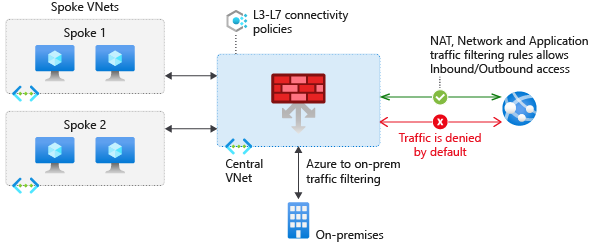

# Azure Fundamentals part 4: Describe general security and network security features

This is the fourth chapter of the online Microsoft Azure Fundamentals course.

## Protect against security threats on Azure

Security is a small word for a significant concept. There are so many factors to consider in order to protect your applications and your data. How does Azure help you protect workloads that you run in the cloud and in your on-premises datacenter?

### Protect against security threats by using Azure Security Center

Azure Security Center is a monitoring service that provides visibility of your security posture across all of your services, both on Azure and on-premises. The term *security posture* refers to cybersecurity policies and controls, as well as how well you can predict, prevent, and respond to security threats.

It can be used for:

- *Monitor* security settings across on-premises and cloud workloads.
- Automatically *apply required security settings* to new resources as they come online.
- Provide *security recommendations* that are based on your current configurations, resources, and networks.
- Continuously *monitor your resources* and perform automatic security assessments to identify potential vulnerabilities before those vulnerabilities can be exploited.
- Use *machine learning* to detect and block malware from being installed on your virtual machines (VMs) and other resources. You can also use adaptive application controls to define rules that list allowed applications to ensure that only applications you allow can run.
- *Detect and analyze potential inbound attacks* and investigate threats and any post-breach activity that might have occurred.
- Provide *just-in-time access control for network ports*.

Two other niece features are:

- Viewing its overall *regulatory compliance* from a security perspective all from one place.
- Viewing the *Resource security hygiene section*, the health of its resources from a security perspective can been seen.
- Viewing the *Secure Score* (based on security controls, or groups of related security recommendations) can also give you an security insight.

The Security Center has some threat protection:

- **Just-in-time VM access**: This access blocks traffic by default to specific network ports of VMs, but allows traffic for a specified time when an admin requests and approves it.
- **Adaptive application controls**: In the background, Security Center uses machine learning to look at the processes running on a VM. It creates exception rules for each resource group that holds the VMs and provides recommendations. This process provides alerts that inform the company about unauthorized applications that are running on its VMs.
- **Adaptive network hardening**: Security Center can monitor the internet traffic patterns of the VMs, and compare those patterns with the company's current network security group (NSG) settings. From there, Security Center can make recommendations about whether the NSG should be locked down further and provide remediation steps.
- **File integrity monitoring**: Monitor changes of important files on both Windows and Linux, registry settings, applications, and other aspects that might indicate a security attack.

But what if it goes wrong:

- You can manually review all alerts and investigate them further.
- Using *workflow automation* (see Azure Logic Apps), you can automate this process (like sending mails etc.).

### Detect and respond to security threats by using Azure Sentinel

Security management on a large scale can benefit from a dedicated **security information and event management** (SIEM) system. A SIEM system aggregates security data from many different sources (as long as those sources support an open-standard logging format). It also provides capabilities for threat detection and response. Azure Sentinel is a SIEM platform created by Microsoft.

The platform can do the following:

- Collect cloud data at scale across all users, devices, applications
- Detect previously undetected threats
- Investigate threats with artificial intelligence
- Respond to incidents rapidly with built-in orchestration and automation of common tasks.

You can connect it to multiple data sources to analyse security events. For example:

- Connectors provide real-time integration for *Microsoft services* like Microsoft Threat Protection solutions, Microsoft 365 sources (including Office 365), Azure Active Directory, and Windows Defender Firewall.
- Connectors are available for common *non-Microsoft services and solutions*, including AWS CloudTrail, Citrix Analytics (Security), Sophos XG Firewall, VMware Carbon Black Cloud, and Okta SSO.
- Azure Sentinel supports data from *other sources* that use the Common Event Format (CEF) messaging standard, Syslog, or REST API.

It can detect threats by using templates. There are two kinds of templates available:

- **Build in analytics**: Designed by Microsoft's team of security experts and analysts based on known threats, common attack vectors, and escalation chains for suspicious activity.
- **Custom analytics**: Rules that you create to search for specific criteria within your environment. You can preview the number of results that the query would generate (based on past log events) and set a schedule for the query to run. You can also set an alert threshold.

If a problem arises, you can investigate specific alerts or *incidents* (a group of related alerts) in a *investigation graph*. But instead of manually detecting all this, you can use the **Azure Monitor Workbook** to automate responses to threats. For example:

1. When the alert is triggered, open a ticket in the IT ticketing system.
2. Send a message to the security operations channel in Microsoft Teams or Slack to make sure the security analysts are aware of the incident.
3. Send all of the information in the alert to the senior network admin and to the security admin. The email message includes two user option buttons: Block or Ignore.

### Store and manage secrets by using Azure Key Vault

Azure Key Vault is a centralized cloud service for storing an application's secrets in a single, central location. It provides secure access to sensitive information by providing access control and logging capabilities.

With this service, you can do the following:

- **Manage secrets**: You can use Key Vault to securely store and tightly control access to tokens, passwords, certificates, API keys, and other secrets.
- **Manage encryption keys**: You can use Key Vault as a key management solution. Key Vault makes it easier to create and control the encryption keys that are used to encrypt your data.
- **Manage SSL/TLS certificates**: Key Vault enables you to provision, manage, and deploy your public and private Secure Sockets Layer/Transport Layer Security (SSL/TLS) certificates for both your Azure resources and your internal resources.
- **Store secrets backed by hardware security modules (HSMs)**: These secrets and keys can be protected either by software or by FIPS 140-2 Level 2 validated HSMs.

It has the following benefits:

- Centralized application secrets.
- Securely stored secrets and keys.
- Access monitoring and access control.
- Simplified administration of application secrets and to enroll and renew certificates from public certificate authorities (CAs).
- Integration with other Azure services like storage accounts, container registries and many more Azure services.

### Host your Azure virtual machines on dedicated physical servers by using Azure Dedicated Host

Some organizations must follow regulatory compliance that requires them to be the only customer using the physical machine that hosts their virtual machines (it's shared machinery otherwise). Azure Dedicated Host provides dedicated physical servers to host your Azure VMs for Windows and Linux.

A *dedicated host* is mapped to a physical server in an Azure datacenter. A *host group* is a collection of dedicated hosts. See the following picture:

But why should you use it?

- Gives you visibility into, and control over, the server infrastructure that's running your Azure VMs.
- Helps address compliance requirements by deploying your workloads on an isolated server.
- Lets you choose the number of processors, server capabilities, VM series, and VM sizes within the same host.

---

Extra notes on the dedicated host:

- For higher availability, you can provision multiple hosts in a host group, and deploy your VMs across this group.
- VMs on dedicated hosts can also take advantage of *maintenance control* (control when regular maintenance updates occur).
- It's more expensive than a normal vm.

## Secure network connectivity on Azure

Every application and service, whether on-premises or in the cloud, needs to be designed with security in mind.

### What is defense in depth?

The objective of *defense in depth* is to protect information and prevent it from being stolen by those who aren't authorized to access it. The strategy uses a series of mechanisms to slow the advance of an attack that aims at acquiring unauthorized access to data.

The layers are as follow:

- The **physical security** layer is the first line of defense to protect computing hardware in the datacenter.
- The **identity and access** layer controls access to infrastructure and change control. It's important to:
  - Control access to infrastructure and change control.
  - Use single sign-on (SSO) and multifactor authentication.
  - Audit events and changes.
- The network **perimeter** layer uses distributed denial of service (DDoS) protection to filter large-scale attacks before they can cause a denial of service for users. It's important to:
  - Use DDoS protection to filter large-scale attacks before they can affect the availability of a system for users.
  - Use perimeter firewalls to identify and alert on malicious attacks against your network.
- The **network** layer limits communication between resources through segmentation and access controls. It's important to:
  - Limit communication between resources.
  - Deny by default.
  - Restrict inbound internet access and limit outbound access where appropriate.
  - Implement secure connectivity to on-premises networks.
- The **compute** layer secures access to virtual machines. It's important to:
  - Secure access to virtual machines.
  - Implement endpoint protection on devices and keep systems patched and current.
- The **application** layer helps ensure that applications are secure and free of security vulnerabilities. It's important to:
  - Ensure that applications are secure and free of vulnerabilities.
  - Store sensitive application secrets in a secure storage medium.
  - Make security a design requirement for all application development.
- The **data** layer controls access to business and customer data that you need to protect.

Than there is the *security posture* of an organization thats also called CIA:

- **Confidentiality**: The principle of least privilege means restricting access to information only to individuals explicitly granted access, at only the level that they need to perform their work.
- **Integrity**: Prevent unauthorized changes to information:
  - At rest: when it's stored.
  - In transit: when it's being transferred from one place to another, including from a local computer to the cloud.
- **Availability**: Ensure that services are functioning (can be disabled with DDoS (Denial-of-service) attacks)and can be accessed only by authorized users.

### Protect virtual networks by using Azure Firewall

With a firewall, you can monitor incoming and outgoing network traffic and if needed, block specific traffic. It's also possible to include specific network protocol and port information.

**Azure Firewall** can be used to protect resources in your *Azure Virtual networks*. It's a fundamental building block for your private network to securely communicate with each other, the internet, and on-premises network. It's a central location to create, enforce and log application and network connectivity policies across subscriptions and virtual networks.

You can configure within Azure Firewall:

- Application rules that define fully qualified domain names (FQDNs) that can be accessed from a subnet.
- Network rules that define source address, protocol, destination port, and destination address.
- Network Address Translation (NAT) rules that define destination IP addresses and ports to translate inbound requests.

Some notes about Azure Firewall:

- It's stateful, meaning it will analyze the complete context of a network connection, not just an individual packet of network traffic.
- It has high availability and unrestricted cloud scalability.
- It has Inbound Destination Network Address Translation (DNAT) support.
- For monitoring, you can use Azure Monitor logging.

---

To defend your web applications against common exploits and vulnerabilities, you also can use a *web application firewall* (WAF). The following services include this:

- Azure Application Gateway
- Azure Front Door
- Azure Content Delivery Network

### Protect from DDoS attacks by using Azure DDoS Protection

A *distributed denial of service attack* attempts to overwhelm and exhaust an application's resources, making the application slow or unresponsive to legitimate users.

**Azure DDoS Protection** will help protect your Azure applications by analyzing and discarding DDoS traffic at the Azure network edge, before it can affect your service's availability. This in terms can for example can prevent your services from automatically scaling (elasticity) and helping you to reduce costs.

There are two tiers:

- **Basic**: Automatically enabled with a free subscription. It uses *Always-on traffic monitoring* and *real-time mitigation of common network-level attacks* to prevent that the Azure infrastructure itself is not harmed by DDoS attacks.
- **Standard**: Includes additional mitigation capabilities that are tuned specifically to Azure Virtual Network resources. Applying this requires no changes to your application. Protection policies are tuned through dedicated traffic monitoring and machine learning algorithms. Policies are applied to public IP addresses, which are associated with resources deployed in virtual networks such as Azure Load Balancer and Application Gateway.

But what does it defend you from:

- **Volumetric attacks**: The goal of this attack is to flood the network layer with a substantial amount of seemingly legitimate traffic.
- **Protocol attacks**: These attacks render a target inaccessible by exploiting a weakness in the layer 3 and layer 4 protocol stack.
- **Resource-layer (application-layer) attacks (only with web application firewall)**: These attacks target web application packets to disrupt the transmission of data between hosts. You need a web application firewall (WAF) to protect against L7 attacks. DDoS Protection Standard protects the WAF from volumetric and protocol attacks.

### Filter network traffic by using network security groups

Using a **network security group** (NSG), you can filter network traffic to and from Azure resources within an Azure virtual network (like an internal firewall).

Rules exists out of the following properties:

- **Name**: A unique name for the NSG.
- **Priority**: A number between 100 and 4096. Rules are processed in priority order, with lower numbers processed before higher numbers.
- **Source or Destination**: A single IP address or IP address range, service tag, or application security group.
- **Protocol**: TCP, UDP, or Any.
- **Direction**: Whether the rule applies to inbound or outbound traffic.
- **Port Range**: A single port or range of ports.
- **Action**: Allow or Deny.

### Combine Azure services to create a complete network security solution

Using services inside this chapter to make the ultimate defence strategy:

- When securing the perimeter layer, you try to defend for network-based attack:
  - Using *Azure DDoS protection* for filtering large-scale attacks.
  - Using *Azure Firewall* to identify and alert on malicious attacks.
- When securing the network layer, you try to limit network connectivity across all resources to allow only what's required. This is possible by using *network security groups*:
  - Limit communication between resources by segmenting your network and configuring access controls.
  - Deny by default.
  - Restrict inbound internet access and limit outbound where appropriate.
  - Implement secure connectivity to on-premises networks.

Combining Azure services, you can manage your network security and provide increased layered protection:

- *Network security groups* and *Azure Firewall*: Azure Firewall complements the functionality of network security groups. Together, they provide better defense-in-depth network security.
- *Azure Application Gateway web application firewall* and *Azure Firewall*: Web application firewall (WAF)that  provides your web applications with centralized, inbound protection against common exploits and vulnerabilities while Azure Firewall protects you from the big bad outside world.
