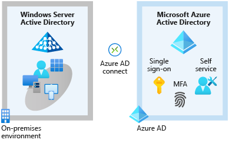

# Azure Fundamentals part 5: Describe identity, governance, privacy, and compliance features

This is the fifth chapter of the online Microsoft Azure Fundamentals course.

## Secure access to your applications by using Azure identity services

Identity has become the new primary security boundary. Accurately proving that someone is a valid user of your system, with an appropriate level of access, is critical to maintaining control of your data. This identity layer is now more often the target of attack than the network is.

### Compare authentication and authorization

What is the difference between both of them:

- **Authentication**: Process of establishing the identity of a person or service that wants to access a resource. It establishes whether the user is who they say they are.
- **Authorization**: Process of establishing what level of access an authenticated person or service has. It specifies what data they're allowed to access and what they can do with it.

### What is Azure Active Directory?

*Active Directory* gives organizations the ability to manage multiple on-premises infrastructure components and systems by using a single identity per user. **Azure AD** is the online version of **Active Directory**. This makes the service available globally. Also it has the advantage to monitor sign-in attempts which the local version doesn't have.

This service can be used for:

- **IT administrators**: Control access to applications and resources based on their business requirements.
- **App developers**: Using Azure AD to provide functionality for applications like SSO.
- **Users**: Managing their own identities like resetting passwords.
- **Online service subscribers**: Microsoft 365, Microsoft Office 365, Azure, and Microsoft Dynamics CRM Online subscribers are already using Azure AD.

And it provides the following services:

- **Authentication**: Verifying identity to access applications and resources.
- **Single sign-on**: Enables you to remember only one username and one password to access multiple applications.
- **Application management**: Manage your cloud and on-premises apps by using Azure AD like Application Proxy, SaaS apps, the My Apps portal (also called the access panel), etc.
- **Device management**: Enables devices to be managed through tools like Microsoft Intune. It also allows for device-based conditional access policies to restrict access attempts to only those coming from known devices, regardless of the requesting user account.

Supports the following kind of resources:

- *External resources* like Microsoft Office 365 and the Azure portal.
- *Internal resources* like corporate apps.

To extend your AD to Azure, you can use **Azure AD Connect**. This will synchronize user identities between on-premises AD and Azure AD so you can use features like SSO, 2FA and self-service password reset under both systems.

### What are multifactor authentication and Conditional Access?

**Multifactor authentication** is a process where a user is prompted during the sign-in process for an additional form of identification. It provides additional security for your identities by requiring two or more elements to fully authenticate.

These elements fall into three categories:

- Something the user knows (like a email/password).
- Something the user has (code sent to the user's phone).
- Something the user is (typically a biometric property).

Azure AD Multi-Factor Authentication is a Microsoft service that provides multifactor authentication capabilities. This can be used with the following services:

- **Azure Active Directory**: There are two tiers of MFA that can be used:
  - *Free edition*: Enables Azure AD Multi-Factor Authentication for administrators with the global admin level of access. This can be via a phone call, sms code, etc.
  - *Premium licence (P1 or P2)*: Enables *Conditional Access* policies.
- **Multifactor authentication for Office 365**: A subset of Azure AD Multi-Factor Authentication capabilities is part of your Office 365 subscription.

Above we mentioned **Conditional Access**. This is a tool that Azure Active Directory uses to allow (or deny) access to resources based on identity signals. These signals include who the user is, where the user is, and what device the user is requesting access from.

For example, a user might not be challenged for second authentication factor if they're at a known location. However, they might be challenged for a second authentication factor if their sign-in signals are unusual or they're at an unexpected location.

This tool is useful when you need to:

- Require multifactor authentication to access an application.
- Require access to services only through approved client applications.
- Require users to access your application only from managed devices.
- Block access from untrusted sources, such as access from unknown or unexpected locations.

If you are uncertain what to need when, you can use the *What If* tool. This allows running scenario's and seeing the impact of those.

## Build a cloud governance strategy on Azure

The term governance describes the general process of establishing rules and policies and ensuring that those rules and policies are enforced.

### Control access to cloud resources by using Azure role-based access control

Azure enables you to control access through **Azure role-based access control** (Azure RBAC).It provides built-in roles that describe common access rules for cloud resources where you can also define your own roles. Each role has an associated set of access permissions that relate to that role. By using the *allow model*, you are allowed to perform certain actions like read/write/delete.

Azure RBAC is enforced on any action that's initiated against an Azure resource that passes through **Azure Resource Manager**. Resource Manager is a management service that provides a way to organize and secure your cloud resources.

Role-based access control is applied to a scope, which is a resource or set of resources that this access applies to.

You should use Azure RBAC when you need to:

- Allow one user to manage VMs in a subscription and another user to manage virtual networks.
- Allow a database administrator group to manage SQL databases in a subscription.
- Allow a user to manage all resources in a resource group, such as virtual machines, websites, and subnets.
- Allow an application to access all resources in a resource group.

---

Note:

- Azure RBAC  doesn't enforce access permissions at the application or data level. Application security must be handled by your application.
- Azure RBAC can be accessed by the *Access control* (IAM) pane in the Azure portal. In the following example, the person is assigned to the Backup Operator role for this resource group.

### Prevent accidental changes by using resource locks

A **resource lock** prevents resources from being accidentally deleted or changed. To still modify/delete a resource with a lock, the lock first needs to be removed (like a two-step process) There are two kinds of locks available in Azure:

- **CanNotDelete**: Authorized people can still read and modify a resource, but they can't delete the resource without first removing the lock.
- **ReadOnly**: Authorized people can read a resource, but they can't delete or change the resource. Applying this lock is like restricting all authorized users to the permissions granted by the Reader role in Azure RBAC.

Combining resource locks with **Azure Blueprints** makes it that you can define a set of standard Azure resources that your organization requires. For example, you can define a blueprint that specifies that a certain resource lock must exist. Azure Blueprints can automatically replace the resource lock if that lock is removed.

### Organize your Azure resources by using tags

One way to organize related resources is to place them in their own subscriptions. You can also use *resource groups* to manage related resources. **Resource tags** are another way to organize resources. Tags provide extra information, or metadata, about your resources.

These tags can be managed by every Azure management tool (CLI, API, portal, etc.), but they can also be managed by **Azure Policy**. This way, you can make a resource inherit the same tags as its parent resource group and more.

This metadata is useful for:

- **Resource management**: Tags enable you to locate and act on resources that are associated with specific workloads, environments, business units, and owners.
- **Cost management and optimization**: Tags enable you to group resources so that you can report on costs, allocate internal cost centers, track budgets, and forecast estimated cost.
- **Operations management**: Tags enable you to group resources according to how critical their availability is to your business. This grouping helps you formulate service-level agreements (SLAs).
- **Security**: Tags enable you to classify data by its security level, such as public or confidential.
- **Governance and regulatory compliance**: Tags enable you to identify resources that align with governance or regulatory compliance requirements, such as ISO 27001.
- **Workload optimization and automation**: Tags can help you visualize all of the resources that participate in complex deployments.

### Control and audit your resources by using Azure Policy

**Azure Policy** is a service in Azure that enables you to create, assign, and manage policies that control or audit your resources. These policies enforce different rules and effects over your resource configurations so that those configurations stay compliant with corporate standards.
It can evaluate resources but it can also prevent noncompliant resources from being created. In some cases it can even automatically remediate noncompliant resources (like changing a tag name if incorrect).

You can apply Azure Policy on individual policies or *initiatives* (a group of related policies).

In total, there are three steps of implementing a policy inside Azure Policy:

- **Create a policy definition**: A *policy definition* expresses what to evaluate and what action to take. For example:
  - Allowed virtual machine SKUs.
  - Allowed locations.
  - MFA should be enabled on accounts with write permissions on your subscription.
  - CORS should not allow every resource to access your web applications.
  - System updates should be installed on your machines.
- **Assign the definition to resources**: A *policy assignment* is a policy definition that takes place within a specific scope. This scope can vary between a management group or a single subscription. Remember that all child resources within that scope will also have the policy applied to them.
- **Review the evaluation results**: Each resource will be marked as compliant or noncompliant, depending on the result. If noncompliant, you can review the policy and take any action that's needed. The *policy evaluation* will happen by the hour.

Using *initiatives* (mentioned above), you can create a group of related policies in one set. These can be manually created inside the Azure portal or you can select a pre-existing one). One of these is an example given by Microsoft called "Enabled Monitoring in Azure" that has the following policies:

- Monitor unencrypted SQL Database in Security Center.
- Monitor OS vulnerabilities in Security Center.
- Monitor missing Endpoint Protection in Security Center.

### Govern multiple subscriptions by using Azure Blueprints

Instead of having to configure features like Azure Policy for each new subscription, with **Azure Blueprints** you can define a repeatable set of governance tools and standard Azure resources that your organization requires. In this way, development teams can build and deploy new environments with the knowledge that they're building within organizational compliance.

When discussing blueprints, can think of:

- Role assignments
- Policy assignments
- Azure Resource Manager templates
- Resource groups

With blueprints, the relationship between the blueprint definition (what should be deployed) and the blueprint assignment (what was deployed) is preserved. Also, every blueprint is versioned so it's easy to track changes.

When using blueprints, each component in it is called an *artifact*. These can have additional parameters like a "SQL connection string" or "allowed locations".

### Accelerate your cloud adoption journey by using the Cloud Adoption Framework for Azure

The **Cloud Adoption Framework** for Azure provides you with proven guidance to help with your cloud adoption journey. The Cloud Adoption Framework helps you create and implement the business and technology strategies needed to succeed in the cloud.

The Framework comes in five stages:

1. **Define your strategy**: Why are you moving to the cloud and what you want to get out of cloud migration?
2. **Make a plan**: Build a plan that maps your aspirational goals to specific actions
3. **Ready your organization**: Create a *landing zone*, or an environment in the cloud to begin hosting your workloads.
4. **Adopt the cloud**: Consists of two parts: *Migrate* your applications to the cloud.
  Along the way, you might find ways to modernize your applications and build *innovative* solutions that use cloud services.
5. **Govern and manage your cloud environments**: Form your *cloud governance* and *cloud management* strategies.

### Create a subscription governance strategy

At the beginning of any cloud governance implementation, you identify a cloud organization structure that meets your business needs. This step often involves forming a **cloud center of excellence team** (also called a *cloud enablement team* or a *cloud custodian team*). This team is empowered to implement governance practices from a centralized location for the entire organization.

Teams often start their Azure governance strategy at the subscription level. There are three main aspects to consider when you create and manage subscriptions:

- **Billing**: This can be done multiple ways. You can create a billing report per subscription or organize it per department or project. You can also use *resource tags* to specify certain billing groups.
- **Access control**: A subscription is a deployment boundary for Azure resources. Every subscription is associated with an Azure Active Directory tenant. Each tenant provides administrators the ability to set granular access through defined roles by using Azure role-based access control.
- **Subscription limits**: Subscriptions also have some resource limitations. For example, the maximum number of network Azure ExpressRoute circuits per subscription is 10. Those limits should be considered during your design phase. If you'll need to exceed those limits, you might need to add more subscriptions. If you hit a hard limit maximum, there's no flexibility to increase it
