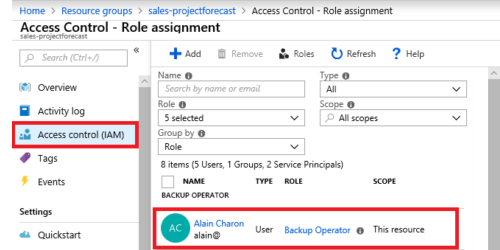

# Azure Fundamentals part 5: Describe identity, governance, privacy, and compliance features

This is the fifth chapter of the online Microsoft Azure Fundamentals course.

## Secure access to your applications by using Azure identity services

Identity has become the new primary security boundary. Accurately proving that someone is a valid user of your system, with an appropriate level of access, is critical to maintaining control of your data. This identity layer is now more often the target of attack than the network is.

### Compare authentication and authorization

What is the difference between both of them:

- **Authentication**: Process of establishing the identity of a person or service that wants to access a resource. It establishes whether the user is who they say they are.
- **Authorization**: Process of establishing what level of access an authenticated person or service has. It specifies what data they're allowed to access and what they can do with it.

### What is Azure Active Directory?

*Active Directory* gives organizations the ability to manage multiple on-premises infrastructure components and systems by using a single identity per user. **Azure AD** is the online version of **Active Directory**. This makes the service available globally. Also it has the advantage to monitor sign-in attempts which the local version doesn't have.

This service can be used for:

- **IT administrators**: Control access to applications and resources based on their business requirements.
- **App developers**: Using Azure AD to provide functionality for applications like SSO.
- **Users**: Managing their own identities like resetting passwords.
- **Online service subscribers**: Microsoft 365, Microsoft Office 365, Azure, and Microsoft Dynamics CRM Online subscribers are already using Azure AD.

And it provides the following services:

- **Authentication**: Verifying identity to access applications and resources.
- **Single sign-on**: Enables you to remember only one username and one password to access multiple applications.
- **Application management**: Manage your cloud and on-premises apps by using Azure AD like Application Proxy, SaaS apps, the My Apps portal (also called the access panel), etc.
- **Device management**: Enables devices to be managed through tools like Microsoft Intune. It also allows for device-based conditional access policies to restrict access attempts to only those coming from known devices, regardless of the requesting user account.

Supports the following kind of resources:

- *External resources* like Microsoft Office 365 and the Azure portal.
- *Internal resources* like corporate apps.

To extend your AD to Azure, you can use **Azure AD Connect**. This will synchronize user identities between on-premises AD and Azure AD so you can use features like SSO, 2FA and self-service password reset under both systems.

### What are multifactor authentication and Conditional Access?

**Multifactor authentication** is a process where a user is prompted during the sign-in process for an additional form of identification. It provides additional security for your identities by requiring two or more elements to fully authenticate.

These elements fall into three categories:

- Something the user knows (like a email/password).
- Something the user has (code sent to the user's phone).
- Something the user is (typically a biometric property).

Azure AD Multi-Factor Authentication is a Microsoft service that provides multifactor authentication capabilities. This can be used with the following services:

- **Azure Active Directory**: There are two tiers of MFA that can be used:
  - *Free edition*: Enables Azure AD Multi-Factor Authentication for administrators with the global admin level of access. This can be via a phone call, sms code, etc.
  - *Premium licence (P1 or P2)*: Enables *Conditional Access* policies.
- **Multifactor authentication for Office 365**: A subset of Azure AD Multi-Factor Authentication capabilities is part of your Office 365 subscription.

Above we mentioned **Conditional Access**. This is a tool that Azure Active Directory uses to allow (or deny) access to resources based on identity signals. These signals include who the user is, where the user is, and what device the user is requesting access from.

For example, a user might not be challenged for second authentication factor if they're at a known location. However, they might be challenged for a second authentication factor if their sign-in signals are unusual or they're at an unexpected location.

This tool is useful when you need to:

- Require multifactor authentication to access an application.
- Require access to services only through approved client applications.
- Require users to access your application only from managed devices.
- Block access from untrusted sources, such as access from unknown or unexpected locations.

If you are uncertain what to need when, you can use the *What If* tool. This allows running scenario's and seeing the impact of those.

## Build a cloud governance strategy on Azure

The term governance describes the general process of establishing rules and policies and ensuring that those rules and policies are enforced.

### Control access to cloud resources by using Azure role-based access control

Azure enables you to control access through **Azure role-based access control** (Azure RBAC).It provides built-in roles that describe common access rules for cloud resources where you can also define your own roles. Each role has an associated set of access permissions that relate to that role. By using the *allow model*, you are allowed to perform certain actions like read/write/delete.

Azure RBAC is enforced on any action that's initiated against an Azure resource that passes through **Azure Resource Manager**. Resource Manager is a management service that provides a way to organize and secure your cloud resources.

Role-based access control is applied to a scope, which is a resource or set of resources that this access applies to.

You should use Azure RBAC when you need to:

- Allow one user to manage VMs in a subscription and another user to manage virtual networks.
- Allow a database administrator group to manage SQL databases in a subscription.
- Allow a user to manage all resources in a resource group, such as virtual machines, websites, and subnets.
- Allow an application to access all resources in a resource group.

---

Note:

- Azure RBAC  doesn't enforce access permissions at the application or data level. Application security must be handled by your application.
- Azure RBAC can be accessed by the *Access control* (IAM) pane in the Azure portal. In the following example, the person is assigned to the Backup Operator role for this resource group.

### Prevent accidental changes by using resource locks