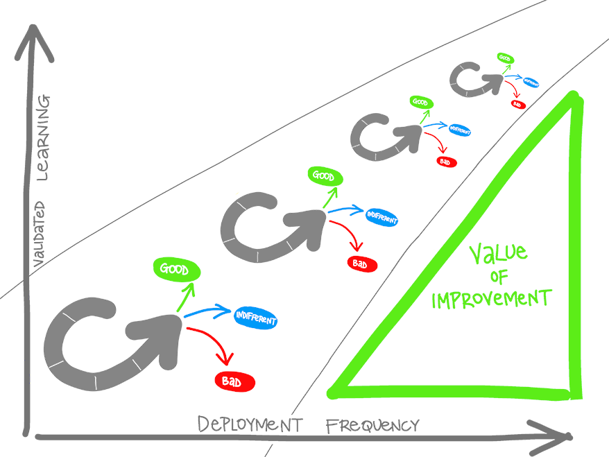
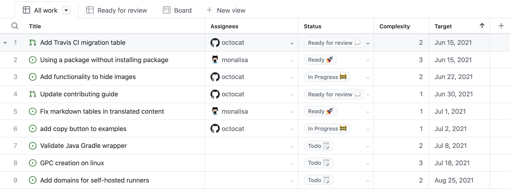

# Introduction to DevOps

DevOps is the union of people, process, and products to enable continuous delivery of value to our end users.

## What is DevOps?

The contraction of "Dev" and "Ops" refers to replacing siloed Development and Operations. It include agile planning, continuous integration, continuous delivery, and monitoring of applications.

### Understand your cycle time

The cycle time is described as **OODA** (Observe, Orient, Decide, Act). Every cycle has 33% of bringing some improvements, 33% will do nothing and 33% will fail (this is called called *pivot* or *persevere*). Your cycle time determines how quickly you can gather feedback to determine what happens in the next loop. The feedback that you collect with each cycle should be factual, actionable data. We call it **validated learning**.

Advantages of using DevOps practices:

* You shorten your cycle time by working in smaller batches.
* Using more automation.
* Hardening your release pipeline.
* Improving your telemetry.
* Deploying more frequently.

How frequenter you can deploy, how more you learn from each cycle (*validated learning*).

### Explore the DevOps journey

There are different areas existing from DevOps:

* **Continuous Integration** drives the ongoing merging and testing of code, leading to an early finding of defects. Other benefits include less time wasted fighting merge issues and rapid feedback for development teams.
* **Continuous Delivery** of software solutions to production and testing environments helps organizations quickly fix bugs and respond to ever-changing business requirements.
* **Version Control**, usually with a Git-based Repository, enables teams located anywhere in the world to communicate effectively during daily development activities. Also, integrate with software development tools for monitoring activities such as deployments.
* Use **Agile planning** and **lean project management techniques** to: - Plan and isolate work into sprints. - Manage team capacity and help teams quickly adapt to changing business needs. - A DevOps Definition of Done is working software collecting telemetry against the intended business goals.
* **Monitoring and Logging of running applications**. Including production environments for application health and customer usage. It helps organizations create a hypothesis and quickly validate or disprove strategies. Rich data is captured and stored in various logging formats.
* **Public, hybrid and private clouds** make infrastructure maintaining easier to manage.
* **Infrastructure as Code (IaC)**: Enables the automation and validation of the creation and teardown of environments to help deliver secure and stable application hosting platforms.
* Use **Microservices architecture** to isolate business use cases into small reusable services that communicate via interface contracts. This architecture enables scalability and efficiency.
* **Containers** are the next evolution in virtualization. They're much more lightweight than virtual machines, allow much faster hydration, and easily configure files.

### Explore shared goals and define timelines

These outcomes should include specific, measurable targets like:

* Reduce the time spent on fixing bugs by *60%*.
* Reduce the time spent on unplanned work by *70%*.
* Reduce the out-of-hours work required by staff to no more than 10% of total working time.
* Remove all direct patching of production systems.

It is essential to have an ongoing series of short-term goals. Overall, projects should have timelines that span anywhere from a few months to a year or two in any DevOps transformation project. Every few weeks, the improvements should be clear and measurable. Ideally, evident to the organization or its customers:

* It is easier to change plans or priorities when necessary.
* The reduced delay between doing work and getting feedback helps ensure that the learnings and feedback are incorporated quickly.
* It is easier to keep organizational support when positive outcomes are clear.

## Choose the right project

Are you interested in implementing DevOps practices but are not sure what it can do for you?

### Explore greenfield and brownfield projects

There are two kinds of projects:

* A **greenfield** project is one done on a green field, undeveloped land. In the software world, this can be seen as a fresh project that can easily integrate with DevOps.
* A **brownfield** project is done on the used ground for other purposes. In the software world, this can be seen as a older project, and while difficult to migrate, it is certainly possible to use DevOps.

### Decide when to use systems of record versus systems of engagement

When you want to transform a system, you can use a practice of managing two separate, coherent modes of IT delivery - one focused on stability and predictability and the other on agility:

* **Systems of record**: This are systems that provide the truth about data elements and are often-called systems of record. These systems have historically evolved slowly and carefully, like a crucial banking system.
* **Systems of engagement**: This are systems that are more exploratory. These often use experimentation to solve new problems. Systems of engagement are modified regularly. Usually, it is a priority to make quick changes over ensuring that the changes are correct.

While transforming a system of engagement is mostly easier then a system of record, both are possible.

### Identify groups to minimize initial resistance

In discussions around continuous delivery, we usually categorize users into three general buckets:

* **Canary** users voluntarily test bleeding edge features as soon as they're available.
* **Early adopters** who voluntarily preview releases, considered more refined than the code that exposes canary users.
* **Users** who consume the products after passing through canary and early adopters.

It's also important to roll out changes incrementally. When starting, it is essential to find an improvement goal that:

* It can be used to gain early wins.
* It is small enough to be achievable in a reasonable timeframe.
* Has benefits that are significant enough to be evident to the organization.

### Identify project metrics and key performance indicators (KPIs)

It is essential to establish (and agree upon) appropriate metrics and **Key Performance Indicators (KPIs)** to ensure these goals are measurable. While there is no specific list of metrics and KPIs that apply to all DevOps Projects, the following are commonly used:

Faster outcomes:

* **Deployment Frequency**. Increasing the frequency of deployments is often a critical driver in DevOps Projects.
* **Deployment Speed**. It is necessary to reduce the time that they take.
* **Deployment Size**. How many features, stories, and bug fixes are being deployed each time?
* **Lead Time**. How long does it take from the creation of a work item until it is completed?

Efficiency:

* **Server to Admin Ratio**. Are the projects reducing the number of administrators required for a given number of servers?
* **Staff Member to Customers Ratio**. Is it possible for fewer staff members to serve a given number of customers?
* **Application Usage**. How busy is the application?
* **Application Performance**. Is the application performance improving or dropping? (Based upon application metrics)?

Quality and security:

* **Deployment failure rates**. How often do deployments (or applications) fail?
* **Application failure rates**. How often do application failures occur, such as configuration failures, performance timeouts, and so on?
* **Mean time to recover**. How quickly can you recover from a failure?
* **Bug report rates**. You do not want customers finding bugs in your code. Is the amount they are seeing increasing or lowering?
* **Test pass rates**. How well is your automated testing working?
* **Defect escape rate**. What percentage of defects are being found in production?
* **Availability**. What percentage of time is the application truly available for customers?
* **Service level agreement achievement**. Are you meeting your service level agreements (SLAs)?
* **Mean time to detection**. If there is a failure, how long does it take for it to be detected?

Culture:

* **Employee morale**. Are employees happy with the transformation and where the organization is heading? Are they still willing to respond to further changes? This metric can be challenging to measure but is often done by periodic, anonymous employee surveys.
* **Retention rates**. Is the organization losing staff?

## Describe team structures

Starting to apply Agile practices in your company is not easy. It demands collaboration from your teams, stakeholder support, and training.

### Explore agile development practices

For traditional software development, you would use the **waterfall** method. This follows a sequential order where the team only moves to the next phase if the previous step is completed. Usually, the project takes a long time, and the outcome may no longer match the customer's needs.

On the other end, the **agile** method constantly emphasizes adaptive planning and early delivery with continual improvement. It is based on releases and iterations:

* One release might consist of several iterations.
* Each iteration is like a small independent project.
* After being estimated and prioritization:
  * Features, bug fixes, enhancements, and refactoring width are assigned to a release.
  * And then assigned again to a specific iteration within the release, generally on a priority basis.
* At the end of each iteration, there should be tested working code.
* In each iteration, the team must focus on the outcomes of the previous iteration and learn from them.

| Waterfall                                                                                  | Agile                                                                                      |
|--------------------------------------------------------------------------------------------|--------------------------------------------------------------------------------------------|
| Divided into distinct phases.                                                              | Separates the project development lifecycle into sprints.                                  |
| It can be rigid.                                                                           | Known for flexibility.                                                                     |
| All project development phases, such as design, development, and test, are completed once. | It follows an iterative development approach so that each phase may appear more than once. |
| Define requirements at the start of the project with little change expected.               | Requirements are expected to change and evolve.                                            |
| Focus on completing the project.                                                           | Focus on meeting customers' demands.                                                       |

### Explore principles of agile development

The agile principals are:

* Our highest priority is to satisfy the customer through early and continuous delivery of valuable software.
* Welcome changing requirements, even late in development. Agile processes harness change for the customer's competitive advantage.
* Deliver working software frequently, from a couple of weeks to a couple of months, with a preference to the shorter timescale.
* Business people and developers must work together daily throughout the project.
* Build projects around motivated individuals. Give them the environment and support they need and trust them to get the job done.
* The most efficient and effective method of conveying information to and within a development team is face-to-face conversation.
* Working software is the primary measure of progress.
* Agile processes promote sustainable development. The sponsors, developers, and users should be able to maintain a constant pace indefinitely.
* Continuous attention to technical excellence and good design enhances agility.
* Simplicity - the art of maximizing the amount of work not done - is essential.
* The best architectures, requirements, and designs emerge from self-organizing teams.
* At regular intervals, the team reflects on how to become more effective, then tunes and adjusts its behavior accordingly.

### Team stuff for agile development

You have **horizontal** and **vertical** teams. Vertical teams have been shown to provide more good outcomes in Agile projects and you can scale it by adding more vertial teams. Each product must have an identified owner.

Horizontal:

Vertical:

A good team requires both *cultural changes*, *cross-function team collaboration* and *tooling*.

## Choose the DevOps tools

Do you currently use tools to manage daily work and plan for the future? It is essential when implementing DevOps if you want to increase your maturity level.

### What is Azure DevOps?

This is a Software as a Service (SaaS) platform that provides the following:

* *Azure Boards*: agile planning, work item tracking, visualization, and reporting tool.
* *Azure Pipelines*: a language, platform, and cloud-agnostic CI/CD platform-supporting containers or Kubernetes.
* *Azure Repos*: provides cloud-hosted private git repos.
* *Azure Artifacts*: provides integrated package management with support for Maven, npm, Python, and NuGet package feeds from public or private sources.
* *Azure Test Plans*: provides an integrated planned and exploratory testing solution.

### What is GitHub?

This is also a Software as a Service (SaaS) platform and more code focused that Azure DevOps. It  provides the following:

* *Codespaces*: Provides a cloud-hosted development environment (based on Visual Studio Code) that can be operated from within a browser or external tools. Eases cross-platform development.
* *Repos*: Public and private repositories based upon industry-standard Git commands.
* *Actions*: Allows for the creation of automation workflows. These workflows can include environment variables and customized scripts.
* *Packages*: The majority of the world's open-source projects are already contained in GitHub repositories. GitHub makes it easy to integrate with this code and with other third-party offerings.
* *Security*: Provides detailed code scanning and review features, including automated code review assignment.

### Explore an authorization and access strategy

Microsoft products (like Azure DevOps), you can use your Microsoft, GitHub or Azure Active Directory account. But for services that don't directly support Microsoft accounts, you can use **Personal Access Tokens (PAT)**. This can be used for example in Git-based repositories, NuGet or Xcode.

Azure DevOps is pre-configured with **default security groups**. There you can configure different **access levels**, **access policies** and **Conditional Access policies**. Also conditional access policies can configure *Multi-factor authentication (MFA)*.

### Migrating existing stuff to Azure DevOps or GitHub

Before you start, check if your existing work and test tools can be imported to Azure DevOps.

### Design a license management strategy

It's important to consider the licensing strategy. Not everything is free and one of these examples is running parallel pipelines. You should consider:

* What phase are you in?
* How many people are using the feature?
* How long are you willing to wait if in the queue for pipelines? Is this urgent? Is this a validation only?
* Should all users access all features? Are they Stakeholders? Basic users? Do they already have a Visual Studio license?
* Do you have an advanced Package Management strategy? Maybe you need more space for Artifacts.

## Plan Agile with GitHub Projects and Azure Boards

Did you know you could combine GitHub and Azure?

### Introduction to GitHub Projects and Project boards

GitHub has a Project Board. It is made up of issues, pull requests, and notes categorized as cards that you can drag and drop into your chosen columns. The cards contain relevant metadata for issues and pull requests, like labels, assignees, the status, and who opened it.

There are three types of project boards:

* **User-owned project boards**: Can contain issues and pull requests from any personal repository.
* **Organization-wide project boards**: Can contain issues and pull requests from any repository that belongs to an organization.
* **Repository project boards**: Are scoped to issues and pull requests within a single repository.

There are also three different types of templates you can already chose from:

* **Basic kanban**: Track your tasks with: To do, In progress, and Done columns.
* **Automated kanban**: Cards automatically move between: To do, In progress, and Done columns.
* **Automated kanban with review**: Cards automatically moves between: To do, In progress, and Done columns, with extra triggers for pull request review status.
* **Bug triage**: Triage and prioritize bugs with: To do, High priority, Low priority, and Closed columns.

You'll also got GitHub projects. A project is a customizable spreadsheet that you can configure the layout by filtering, sorting, and grouping your issues and PRs, and adding custom fields to track metadata.

### Introduction to Azure Boards

Azure Boards is a customizable tool to manage software projects supporting Agile, Scrum, and Kanban processes by default. Track work, issues, and code defects associated with your project.

By using *queries*, you can create a list of custom work items. Queries contain the following tasks:

* Find groups of work items with something in common.
* Triage work to assign to a team member or sprint and set priorities.
* Perform bulk updates.
* View dependencies or relationships between work items.
* Create status and trend charts that you can optionally add to dashboards.

It's possible to create another view with deliverables and track dependencies across several teams in a calendar view using **Delivery Plans**.

They support the following tasks:

* View up to 15 team backlogs, including a mix of backlogs and teams from different projects.
* View custom portfolio backlogs and epics.
* View work that spans several iterations.
* Add backlog items from a plan.
* View rollup progress of features, epics, and other portfolio items.
* View dependencies that exist between work items.

### Link GitHub to Azure Boards

Connect Azure Boards with GitHub repositories, enabling linking GitHub commits, pull requests, and issues to work items in Boards. The integration is created using the **Azure Boards App**, acting as a bridge between Azure Boards and GitHub. You can connect by using:

* Username/Password
* Personal Access Token (PAT)

There are a couple of cool things you can do with it:

* Create links between work items and GitHub commits, pull requests, and issues based on GitHub mentions.
* Support state transition of work items to a Done or Completed state when using GitHub mention by using fix, fixes, or fixed.
* Support full traceability by posting a discussion comment to GitHub when linking from a work item to a GitHub commit, pull request, or issue.
* Show linked to GitHub code artifacts within the work item Development section.
* Show linked to GitHub artifacts as annotations on Kanban board cards.
* Support status badges of Kanban board columns added to GitHub repositories.

### Configure and manage GitHub Projects

A few important takeaways:

* You can create an iteration to:
  * Associate items with specific repeating blocks of time.
  * Set to any length of time.
  * Include breaks.
* Opening the project command palette by pressing Command + K (Mac) or Ctrl + K (Windows/Linux) to:
  * Switch layout: Table.
  * Show: Milestone.
  * Sort by: Assignees, asc.

### Collaborate using team discussions

GitHub discussions can help make your team plan together, update one another, or talk about any topic you'd like in discussion posts on your team's page in an organization. You can:

* Post on your team's page or participate in a public discussion.
* Link to any team discussion to reference it elsewhere.
* Pin important posts to your team's page.
* Receive email or web notifications.

## Introduction to source control

You can think of source control as an essential everyday practice. Versioning is a standard part of the developer's routine and, if used correctly, can save organizations enormous costs and resources.

### Explore DevOps foundational practices

Source control is important. See also the DevOps foundational practices and how often the source control is mentioned:

### What is source control?

A Source control system (or version control system) allows developers to collaborate on code and track changes. Use version control to save your work and coordinate code changes across your team. Source control is an essential tool for multi-developer projects.

It has some advantages as well:

* **Create workflows**. Version control workflows prevent the chaos of everyone using their development process with different and incompatible tools. Version control systems provide process enforcement and permissions, so everyone stays on the same page.
* **Work with versions**. Every version has a description in the form of a comment. These descriptions help you follow changes in your code by version instead of by individual file changes. Code stored in versions can be viewed and restored from version control at any time as needed. It makes it easy to base new work on any version of code.
* **Collaboration**. Version control synchronizes versions and makes sure that your changes do not conflict with other changes from your team. Your team relies on version control to help resolve and prevent conflicts, even when people make changes simultaneously.
* **Maintains history of changes**. Version control keeps a record of changes as your team saves new versions of your code. This history can be reviewed to find out who, why, and when changes were made. The history gives you the confidence to experiment since you can roll back to a previous good version at any time. The history lets your base work from any code version, such as fixing a bug in an earlier release.
* **Automate tasks**. Version control automation features save your team time and generate consistent results. Automate testing, code analysis, and deployment when new versions are saved to version control.

Some *software developments values* that are also specified:

* Reusability.
* Traceability.
* Manageability.
* Efficiency.
* Collaboration.
* Learning.

Remember to keep thinking about the following best practices:

* **Make small changes**. In other words, commit early and commit often. Be careful not to commit any unfinished work that could break the build.
* **Do not commit personal files**. It could include application settings or SSH keys. Often personal files are committed accidentally but cause problems later when other team members work on the same code.
* **Update often and right** before pushing to avoid merge conflicts.
* **Verify your code change before pushing it to a repository**; ensure it compiles and tests are passing.
* **Pay close attention to commit messages**, as it will tell you why a change was made. Consider committing messages as a mini form of documentation for the change.
* **Link code changes to work items**. It will concretely link what was created to why it was created—or modified by providing traceability across requirements and code changes.
* **No matter your background or preferences**, be a team player and follow agreed conventions and workflows. Consistency is essential and helps ensure quality, making it easier for team members to pick up where you left off, review your code, debug, and so on.

## Describe types of source control systems

Did you know there are multiple source control systems other than Git?

### Understand centralized and decentralized source control

The most common **centralized version control systems** you may have heard of or used are Team Foundation Version Control (TFVC), CVS, Subversion (or SVN), and Perforce.

On the other hand, the most common distributed version control systems are Git, Mercurial, and Bazaar.

Distributed systems have more advantages over centralized systems for several reasons:

* Doing actions other than pushing and pulling changesets is fast because the tool only needs to access the hard drive, not a remote server.
* Committing new changesets can be done locally without anyone else seeing them. Once you have a group of changesets ready, you can push all of them at once.
* Everything but pushing and pulling can be done without an internet connection. So, you can work on a plane, and you will not be forced to commit several bug fixes as one large changeset.
* Since each programmer has a full copy of the project repository, they can share changes with one or two other people to get some feedback before showing the changes to everyone.

Centralized systems have also some advantages:

* If your project contains many large, binary files that cannot be efficiently compressed, the space needed to store all versions of these files can accumulate quickly.
* If your project has a long history (50,000 changesets or more), downloading the entire history can take an impractical amount of time and disk space.

### Explore Git and Team Foundation Version Control

Git is a distributed version control system. Each developer has a copy of the source repository on their development system. Developers can commit each set of changes on their dev machine. Branches are lightweight and can also be local.

Typically, TFVC team members have only one version of each file on their dev machines. Historical data is maintained only on the server. Branches are path-based and created on the server. It has two workflows:

* **Server workspaces** Before making changes, team members publicly check out files. Most operations require developers to be connected to the server. This system helps lock workflows. Other software that works this way includes Visual Source Safe, Perforce, and CVS. You can scale up to huge codebases with millions of files per branch—also, large binary files with server workspaces.
* **Local workspaces** Each team member copies the latest codebase version with them and works offline as needed. Developers check in their changes and resolve conflicts as necessary.

Some points the documentation calls out on why you should use Git:

* Community is good.
* It uses distributed development.
* Trunk-based development (lightweight branches)
* Pull requests.
* Faster release cycle.

### Understand objections to using Git

There are three common objections often heard to migrating to Git:

* **I can overwrite history**. You should not do this. If you are synchronizing to Azure Repos, you can also add a security rule that prevents developers from overwriting history by using the explicit "Force Push" permissions.
* **I have large files**. Every time you (or your build machines) clone the repo, they get the entire repo with its history from the first commit. It is great for most situations but can be frustrating if you have large files. Binary files are even worse because Git cannot optimize how they are stored. That is why **Git LFS** was created. It lets you separate large files of your repos and still has all the benefits of versioning and comparing. Use **Azure Artifacts** or some other package management tool to store binaries for which you have source code.
* **There is a steep learning curve**. There is always a learning curve.

## Work with Azure Repos and GitHub

You can migrate from TFVC to Git and work with GitHub Codespaces for development.

### Migrate from TFVC to Git

Migrate from TFVC to Git with the following steps:

* Create an empty Git repo (or multiple empty repos).
* Get-latest from TFS.
* Copy/reorganize the code into the empty Git repos.
* Commit and push, and you are there!

You also have the option for **single branch import** within Azure DevOps. This process can be used for either existing Git repositories or TFVC stuff. There are some limitations here (that apply only when migrating source type TFVC): a single branch and only 180 days of history.

### Migrate from TFVC to Git with GIT-TFS

What if you need to migrate more than a single branch and keep branch relationships? Or are you going to drag all the history with you? In that case, you're going to have to use **GIT-TFS**. It's an open-source project built to synchronize Git and TFVC repositories. GIT-TFS has the advantage that it can migrate multiple branches and preserve the relationships to merge branches in Git after you migrate. Be warned that it can take a while to do this conversion - especially for large or long history repositories.

Use Chocolatey to install it on your PC by running `run choco install gittfs`. Then you need to add it to your windows path with `set PATH=%PATH%;%cd%\GitTfs\bin\Debug`. And tada, the conversion can take place with `git tfs clone http://tfs:8080/tfs/DefaultCollection $/some_project`.

### Develop online with GitHub Codespaces

Codespaces is a cloud-based development environment that GitHub hosts. It is essentially an online implementation of Visual Studio Code. Codespaces allows developers to work entirely in the cloud and even will enable developers to contribute from tablets and Chromebooks. Developers can create a codespace (or multiple codespaces) for a repository. Each of these codespaces is associated with a specific branch of a repository.
