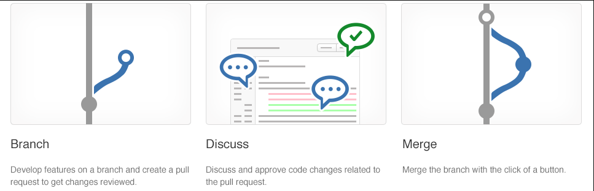

# Development for enterprise DevOps

Gotta use the cool Git features for enterprise stuff.

## Structure your Git Repo

While there's no one way to implement Git in the right way, many techniques can help you scale the implementation of Git across the organization.

### Explore monorepo versus multiple repos

There are two philosophies on organizing your repos: Monorepo or Multiple repos.

* **Monorepos** is a source control pattern where all the source code is kept in a single repository. It's super simple to give all your employee's access to everything in one shot. Just clone it down and done.
* **Multiple repositories** refer to organizing your projects each into their separate repository.

The *multiple repos view*, in extreme form, is that if you let every subteam live in its repo. They have the flexibility to work in their area however they want, using whatever libraries, tools, development workflow, and so on, **will maximize their productivity**. The drawbacks are also the same as the advantages, people use different languages, tools, workflows. Bugs need to be found in the appropriate repository etc. 

The *monorepo view* the friction, especially when dealing with more complicated dependency graphs, is much more costly than multiple repos advocates recognize. While some teams may find a locally optimal way of working, it may be the case. It's also likely that other teams will offset their gains by choosing a suboptimal way of working.

### Implement a change log

It's a file that has a list of changes made to a project, usually in date order. The typical breakdown is to separate a list of versions, and then within each version, show:

* Added features
* Modified/Improved features
* Deleted features

There are some commands/tools for this stuff:

* Using native GitHub commands. See also the command `git log [options] vX.X.X..vX.X.Y | helper-script > projectchangelogs/X.X.Y`
* [Git changelog](https://pypi.org/project/gitchangelog/). A tool based on Python.
* [GitHub changelog generator](https://github.com/github-changelog-generator/github-changelog-generator). A tool based on Gem (ruby). Running `github_changelog_generator -u github-changelog-generator -p TimerTrend-3.0` will generate some logs.

## Manage Git branches and workflows

Exploring Git branching types, concepts, and models for the continuous delivery process. It helps companies define their branching strategy and organization.

### Explore branch workflow types

You want the workflow to enhance your team's effectiveness and not be a burden that limits productivity. Some things to consider when evaluating a Git workflow are:

* Does this workflow scale with team size?
* Is it easy to undo mistakes and errors with this workflow?
* Does this workflow impose any new unnecessary cognitive overhead on the team?

### Explore feature branch workflow

The core idea behind the Feature Branch Workflow is that all feature development should take place in a dedicated branch instead of the main branch. It also means the main branch will never contain broken code, which is a huge advantage for continuous integration environments.

**Git Flow** is also know to keep a lot of branches alive at the same time. This includes features/releases/develop/etc. See also this picture:


The **trunk-based development Workflow** assumes a central repository, and the main represents the official project history. Changes you make on a branch don't affect the main branch, so you're free to experiment and commit changes, safe in the knowledge that your branch won't be merged until it's ready to be reviewed by someone you're collaborating with. There's only one rule: anything in the main branch is always deployable. Everything that you build on this trunk will be hidden behind **feature toggles** until it's fully ready.


While the learning material tries to give you an example of the **GitHub flow**. This is kinda like trunk based, only that it has feature branches:


*Above pictures used from [reviewpad.com](https://reviewpad.com/blog/github-flow-trunk-based-development-and-code-reviews/).*

### Explore Git branch model for continuous delivery

One thing: There's no right or wrong, a perfect branching strategy works for your team.

While this chapter explains how to use git and the branching strategy described above, I believe this is already fully explained. The only thing I want to discuss are Azure DevOps commands. See also [this link](https://learn.microsoft.com/en-us/azure/devops/repos/git/pull-requests?view=azure-devops&tabs=azure-devops-cli).

Configure your Azure DevOps CLI for your organization and project. Replace organization and project name

```CMD
az devops configure --defaults organization=https://dev.azure.com/organization project="project name"
```

Create a new pull request (using the Azure DevOps CLI) to review the changes in the feature-1 branch

```CMD
az repos pr create --title "Review Feature-1 before merging to main" --work-items 38 39 `
    --description "#Merge feature-1 to main" `
    --source-branch feature/myFeature-1 --target-branch main `
    --repository myWebApp --open
```

### Explore fork workflow

Instead of using a single server-side repository to act as the "central" codebase, the **fork workflow** gives every developer their server-side repository. It means that each contributor has two Git repositories:

* A private local.
* A public server-side.

A typical workflow looks something like this:

* A developer 'forks' an 'official' server-side repository. It creates their server-side copy.
* The new server-side copy is cloned to their local system.
* A Git remote path for the 'official' repository is added to the local clone.
* A new local feature branch is created.
* The developer makes changes to the new branch.
* New commits are created for the changes.
* The branch gets pushed to the developer's server-side copy.
* The developer opens a pull request from the new branch to the 'official' repository.
* The pull request gets approved for merge and is merged into the original server-side repository.

To integrate the feature into the official codebase:

* The maintainer pulls the contributor's changes into their local repository.
* Checks to make sure it doesn't break the project.
* Merges it into their local main branch.
* Pushes the main branch to the official repository on the server.

Note: Forked repositories are created using the standard *git clone* command. Forked repositories are generally "server-side clones" managed and hosted by a Git service provider such as Azure Repos.

## Collaborate with pull requests in Azure Repos

Let's describe pull requests for collaboration and code reviews using Azure DevOps and GitHub mobile for pull request approvals.

### Collaborate with pull requests

Pull requests let you tell others about changes you've pushed to a GitHub repository.



The keys to great feedback in a pull request are:

* Have the right people review the pull request.
* Make sure that reviewers know what the code does.
* Give actionable, constructive feedback.
* Reply to comments promptly.

There are a few critical branches in your repo that the team relies on always in suitable shapes, such as your main branch. Require pull requests to make any changes on these branches with **branch policies**. Developers pushing changes directly to the protected branches will have their pushes rejected.

### Examine GitHub mobile for pull request approvals

Using a mobile app in combination with Git is a convenient option, particularly when urgent pull request approvals are required.

* The app can render markdown, images, and PDF files directly on the mobile device.
* Pull requests can be managed within the app, along with marking files as viewed, collapsing files.
* Comments can be added.
* Emoji short codes are rendered.

## Identify technical debt

Exploring technical debt, complexity, quality metrics, and plans for effective code reviews and code quality validation.

### Examine code quality

There are five key traits to measure for higher quality:

* **Reliability** measures the probability that a system will run without failure over a specific period of operation. Several defects can be measured by running a static analysis tool.
* **Maintainability** measures how easily software can be maintained. It relates to the codebase's size, consistency, structure, and complexity. And ensuring maintainable source code relies on several factors, such as testability and understandability.
* **Testability** measures how well the software supports testing efforts. It relies on how well you can control, observe, isolate, and automate testing, among other factors.
* **Portability** measures how usable the same software is in different environments. It relates to platform independence.
* **Reusability** measures whether existing assets—such as code—can be used again.

### Examine complexity and quality metrics

Cyclomatic complexity measures the number of linearly independent paths through a program's source code. Another way to understand quality is through calculating *Halstead complexity measures*. This measures:

* Program vocabulary.
* Program length.
* Calculated program length.
* Volume.
* Difficulty.
* Effort.

Using DevOps, you can use the following list of metrics that directly relate to the quality of the code being produced and the build and deployment processes.

* **Failed builds percentage** - Overall, what percentage of builds are failing?
* **Failed deployments percentage** - Overall, what percentage of deployments are failing?
* **Ticket volume** - What is the overall volume of customer or bug tickets?
* **Bug bounce percentage** - What percentage of customer or bug tickets are reopened?
* **Unplanned work percentage** - What percentage of the overall work is unplanned?

### Introduction to technical debt

**Technical debt** is a term that describes the future cost that will be incurred by choosing an easy solution today instead of using better practices because they would take longer to complete. The more interest that accumulates, the harder it is for them in the future and the more minor options available to them later. Common sources of technical debt are:

* Lack of coding style and standards.
* Lack of or poor design of unit test cases.
* Ignoring or not-understanding object orient design principles.
* Monolithic classes and code libraries.
* Poorly envisioned the use of technology, architecture, and approach. (Forgetting that all system attributes, affecting maintenance, user experience, scalability, and others, need to be considered).
* Over-engineering code (adding or creating code that isn't required, adding custom code when existing libraries are sufficient, or creating layers or components that aren't needed).
* Insufficient comments and documentation.
* Not writing self-documenting code (including class, method, and variable names that are descriptive or indicate intent).
* Taking shortcuts to meet deadlines.
* Leaving dead code in place.

One of the tools that you can use to identify technical dept in your Azure DevOps pipeline is `SonarCube/SonarCloud`. Other tools to integrate in your IDE are:

* NDepend
* Visual Studio marketplace
* Resharper Code Quality Analysis

## Explore Git hooks

Cool stuff with Git hooks and their usage during the development process, implementation, and behavior.

### Introduction to Git hooks

*Git hooks* are a mechanism that allows code to be run before or after certain Git lifecycle events. For example, one could hook into the *commit-msg* event to validate that the commit message structure follows the recommended format. The hooks can be any executable code, including shell, PowerShell, Python, or other scripts. Or they may be a binary executable. The only criteria are that hooks must be stored in the **.git/hooks** folder in the repo root. Also, they must be named to match the related events (Git 2.x).

### Implement Git hooks

In the .git\hooks directory, you'll find hooks, but they are all disabled. For example, you'll find a file called precommit.sample. To enable it, rename it to pre-commit by removing the .sample extension and making the script executable.

One thing to note, this will work out of the box for  Linux with `#!/bin/sh`, but not on Windows without any modifications. On Unix-like OSs, the `#!` Tells the program loader that it's a script to be interpreted, and `/bin/sh` is the path to the interpreter you want to use, `sh` in this case. For Windows, you should use `#!C:/Program\ Files/Git/usr/bin/sh.exe` instead.

How could Git hooks stop you from accidentally leaking Amazon AWS access keys to GitHub? Well, this pre-commit bash code will do the job. The Git diff-index identifies the code increment committed in the script. This increment is then compared against the list of specified keywords. If any matches are found, an error is raised to block the commit; the script returns an error message with the list of matches.:

```Bash
#!C:/Program\ Files/Git/usr/bin/sh.exe
matches=$(git diff-index --patch HEAD | grep '^+' | grep -Pi 'password|keyword2|keyword3')
if [ ! -z "$matches" ]
then
    cat <<\EOT
Error: Words from the blocked list were present in the diff:
EOT
    echo $matches
    exit 1
fi
```

But how do you share this code with the rest of your team? From Git version 2.9, you can now map Git hooks to a folder that can be committed into source control. You could do that by updating the global settings configuration for your Git repository:

```Cmd
Git config --global core.hooksPath '~/.githooks'
```

If you ever need to overwrite the Git hooks you have set up on the client-side, you can do so by using the no-verify switch:

```Cmd
Git commit --no-verify
```