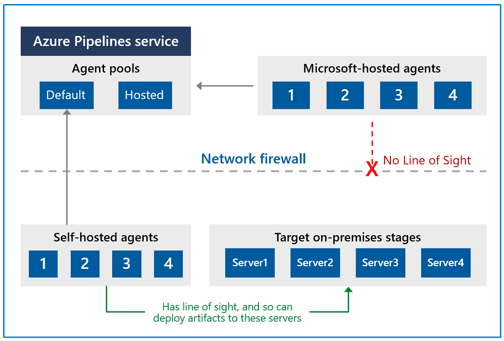
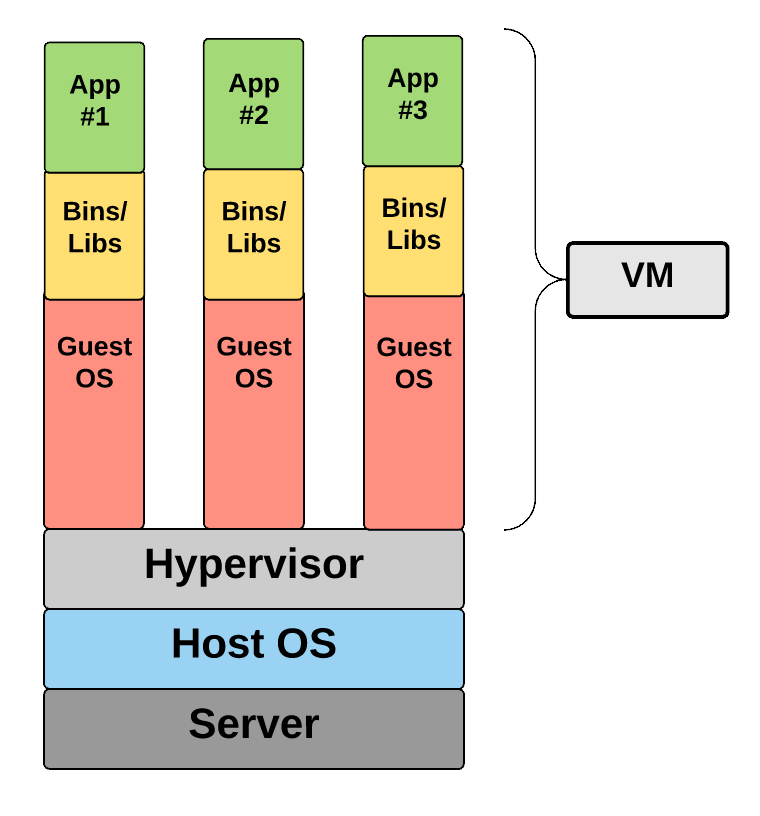

# Implement CI with Azure Pipelines and GitHub Actions

Pipelines.

## Explore Azure Pipelines

Azure Pipelines is a fully featured service used to create cross-platform CI (Continuous Integration) and CD (Continuous Deployment). It works with your preferred Git provider and can deploy to most major cloud services, including Azure. Azure DevOps offers a comprehensive Pipelines offering.

### Explore the concept of pipelines in DevOps

The goal is to enable a constant flow of changes into production via an automated software production line. Think of it as a pipeline. The pipeline breaks down the software delivery process into stages. Each stage aims to verify the quality of new features from a different angle to validate the new functionality and prevent errors from affecting your users. The pipeline should provide feedback to the team. A delivery pipeline enables the flow of more minor changes more frequently, with a focus on flow. A typical pipeline will include the following stages:

* Build automation and continuous integration.
* Test automation.
* Deployment automation.

### Describe Azure Pipelines

Azure Pipelines combines continuous integration (CI) and continuous delivery (CD) to test and build your code and ship it to any target constantly and consistently. Things to consider:

* Many languages are supported with Azure Pipelines, such as Python, Java, PHP, Ruby, C#, and Go.
* Azure Pipelines can integrate with GitHub, GitLab, Azure Repos, Bitbucket, and Subversion.
* Azure Pipelines is compilable with most application types, such as Java, JavaScript, Python, .NET, PHP, Go, XCode, and C++.
* Can deploy to multiple targets like *containers*, *virtual machines*, *azure services*, etc.
* Can publish NuGet, npm, or Maven packages to the built-in package management repository in Azure Pipelines.

The difference between CI and CD is:

| Continuous integration (CI)                      | Continuous delivery (CD)                        |
|--------------------------------------------------|-------------------------------------------------|
| Increase code coverage.                          | Automatically deploy code to production.        |
| Build faster by splitting test and build runs.   | Ensure deployment targets have the latest code. |
| Automatically ensure you don't ship broken code. | Use tested code from the CI process.            |
| Run tests continually.                           |                                                 |

### Understand Azure Pipelines key terms

A typical pipeline looks like this:


And the most important terms are:

* **Agent**: When your build or deployment runs, the system begins one or more jobs. An agent is an installable software that runs a build or deployment job.
* **Artifact**: An artifact is a collection of files or packages published by a build. Artifacts are made available for next tasks, such as distribution or deployment.
* **Build**: A build represents one execution of a pipeline. It collects the logs associated with running the steps and the results of running tests.
* **Continuous delivery**: This is a process by which code is built, tested, and deployed to one or more test and production stages.
* **Continuous integration**: This is the practice used by development teams to simplify the testing and building of code.
* **Deployment target**: This is a virtual machine, container, web app, or any service used to host the application being developed.
* **Job**: A build contains one or more jobs. Most jobs run on an agent. A job represents an execution boundary of a set of steps. All the steps run together on the same agent. For example, you might build two configurations - x86 and x64. In this case, you have one build and two jobs.
* **Pipeline**: This defines the continuous integration and deployment process for your app. It's made up of steps called tasks.
* **Release**: This is a term used to describe one execution of a release pipeline. It's made up of deployments to multiple stages.
* **Stage**: They are the primary divisions in a pipeline: "build the app," "run integration tests," and "deploy to user acceptance testing" are good examples of stages.
* **Task**: A building block of a pipeline.
* **Trigger**: Something that's set up to tell the pipeline when to run.

## Manage Azure Pipeline agents and pools

There are differences between Microsoft-hosted and self-hosted agents, detail job types, and introduces agent pools configuration.

### Choose between Microsoft-hosted versus self-hosted agents

To build your code or deploy your software, you generally need at least one agent. There are two types:

* **Microsoft-hosted agent**: If your pipelines are in Azure Pipelines, then you've got a convenient option to build and deploy using a Microsoft-hosted agent. Each time a pipeline is run, a new virtual machine (instance) is provided. The virtual machine is discarded after one use. While maintenance and upgrades are done automatically, this type of job has time limits.
* **Self-hosted agent**: An agent that you set up and manage on your own to run build and deployment jobs is a self-hosted agent. You can use a self-hosted agent in Azure Pipelines. A self-hosted agent gives you more control to install dependent software needed for your builds and deployments. This type of job doesn't have a time limit.

### Explore job types

There are four types of jobs:

* **Agent pool jobs**: The most common types of jobs. The jobs run on an agent that is part of an agent pool.
* **Container jobs**: Similar jobs to Agent Pool Jobs run in a container on an agent part of an agent pool.
* **Deployment group jobs**: Jobs that run on systems in a deployment group.
* **Agentless jobs**: Jobs that run directly on the Azure DevOps. They don't require an agent for execution. It's also-often-called Server Jobs.

### Introduction to agent pools

Instead of managing each agent individually, you organize agents into **agent pools**. An agent pool defines the sharing boundary for all agents in that pool. In Azure Pipelines, pools are scoped to the entire organization so that you can share the agent machines across projects. If you create an Agent pool for a specific project, only that project can use the pool until you add the project pool into another project.

There is also a **pre-defined agent pool** named Azure Pipelines with Microsoft-hosted agents. It will often be an easy way to run jobs without configuring build infrastructure. By default, all contributors in a project are members of the User role on each hosted pool. It allows every contributor to the author and runs build and release pipelines using a Microsoft-hosted pool.

### Understand typical situations for agent pools

If you've got many agents intended for different teams or purposes, you might want to create more pools (the following steps are so good that I wanted to include them here):

* You're a project member, and you want to use a set of machines your team owns for running build and deployment jobs.
  * First, make sure you're a member of a group in *All Pools* with the *Administrator role*.
  * Next, create a *New project agent pool* in your project settings and select the option to *Create a new organization agent pool*. As a result, both an organization and project-level agent pool will be created.
  * Finally, install and configure agents to be part of that agent pool.
* You're a member of the infrastructure team and would like to set up a pool of agents for use in all projects.
  * First, make sure you're a member of a group in *All Pools* with the *Administrator role*.
  * Next, create a New organization agent pool in your admin settings and select Autoprovision corresponding project agent pools in all projects while creating the pool. This setting ensures all projects have a pool pointing to the organization agent pool. The system creates a pool for existing projects, and in the future, it will do so whenever a new project is created.
  * Finally, install and configure agents to be part of that agent pool.
* You want to share a set of agent machines with multiple projects, but not all of them.
  * First, create a project agent pool in one of the projects and select the option to *Create a new organization agent pool* while creating that pool.
  * Next, go to each of the other projects, and create a pool in each of them while selecting the option to Use an existing organization agent pool.
  * Finally, install and configure agents to be part of the shared agent pool.

### Communicate with Azure Pipelines

The agent communicates with Azure Pipelines to determine which job it needs to run and report the logs and job status. It always starts this communication. All the messages from the agent to Azure Pipelines over HTTPS, depending on how you configure the agent.


Here's a standard communication pattern between the agent and Azure Pipelines:

* The user registers an agent with Azure Pipelines by adding it to an agent pool. You've to be an **agent pool administrator** to register an agent in that pool. The identity of the agent pool administrator is needed only at the time of registration. Consider generating and using a **PAT** to connect an agent with Azure Pipelines. PAT is the only scheme that works with Azure Pipelines. This PAT is used only when registering the agent and not for succeeding communication.
* Once the registration is complete, the agent downloads a **listener OAuth token** and uses it to listen to the job queue.
* Periodically, the agent checks to see if a new job request has been posted in the job queue in Azure Pipelines. The agent downloads the job and a **job-specific OAuth token** when a job is available. This token is generated by Azure Pipelines for the scoped identity specified in the pipeline. That token is short-lived and is used by the agent to access resources (for example, source code) or modify resources (for example, upload test results) on Azure Pipelines within that job.
* Once the job is completed, the agent **discards the job-specific OAuth token** and checks if there's a new job request using the listener OAuth token.
* The payload of the messages exchanged between the agent, and Azure Pipelines are secured using **asymmetric encryption**. Each agent has a public-private key pair, and the public key is exchanged with the server during registration. The server uses the public key to encrypt the job's payload before sending it to the agent. The agent decrypts the job content using its private key. *Secrets stored in build pipelines, release pipelines, or variable groups are secured when exchanged with the agent*.

### Communicate to deploy to target servers

When you use the agent to deploy artifacts to a set of servers, it must-have "line of sight" connectivity to those servers. The agents must have connectivity to the target on-premises environments and access to the Internet to connect to Azure Pipelines or Azure DevOps Server:



### Examine other considerations

You can run your agent as either a **service** or an **interactive process**. Whether you run an agent as a service or interactively, you can choose which account you use to run the agent. It's *different from your credentials when registering the agent with Azure Pipelines*. The choice of agent account depends solely on the needs of the tasks running in your build and deployment jobs. For example, to run tasks that use Windows authentication to access an external service, you must run the agent using an account with access to that service. As an *interactive process with autologon enabled*, in some cases, you might need to run the agent interactively for production use, such as UI tests. When the agent is configured to run in this mode, the **screen saver is also disabled**.

Microsoft updates the agent software every few weeks in Azure Pipelines. If you run the agent interactively or a newer major version of the agent is available, you must **manually upgrade** the agents. Also, you can do it from the agent pools tab under your project collection or organization. The version of the agent can be viewed with `Azure Pipelines: [https://dev.azure.com/{your_organization}/_admin/_AgentPool](https://dev.azure.com/{your_organization}/_admin/_AgentPool)`.

Self-hosted agents have performance advantages over Microsoft-hosted agents. Specifically on:

* CI build pipelines that don't clean the repo or do a clean build. Microsoft-hosted agents are destroyed after the build or if a release pipeline completes.
* It can sometimes take several minutes for an Microsoft-hosted agent to be allocated, depending on the load on our system.

You can also install multiple self-hosted agents on the same machine. This approach can work well for agents who run jobs that don't consume many shared resources. For example, you could try it for agents that run releases that mostly orchestrate deployments and don't do much work on the agent itself. But it's not always beneficial, for example if you build consumes many disk and I/O resources.

### Describe security of agent pools

In Azure Pipelines, roles are defined on each agent pool. Membership in these roles governs what operations you can do on an agent pool. You have **organization** agent pools and **project agent pools**:

| Role on an organization agent pool | Purpose                                                                                                                                                                                                                                                                                                                                                                                                                                    |
|------------------------------------|--------------------------------------------------------------------------------------------------------------------------------------------------------------------------------------------------------------------------------------------------------------------------------------------------------------------------------------------------------------------------------------------------------------------------------------------|
| Reader                             | Members of this role can view the organization's agent pool and agents. You typically use it to add operators that are responsible for monitoring the agents and their health.                                                                                                                                                                                                                                                             |
| Service Account                    | Members of this role can use the organization agent pool to create a project agent pool in a project. If you follow the guidelines above for creating new project agent pools, you typically don't have to add any members here.                                                                                                                                                                                                           |
| Administrator                      | Also, with all the above permissions, members of this role can register or unregister agents from the organization's agent pool. They can also refer to the organization agent pool when creating a project agent pool in a project. Finally, they can also manage membership for all roles of the organization agent pool. The user that made the organization agent pool is automatically added to the Administrator role for that pool. |

| Role on an project agent pool | Purpose                                                                                                                                                                                                               |
|------------------------------------|-----------------------------------------------------------------------------------------------------------------------------------------------------------------------------------------------------------------------|
| Reader                             | Members of this role can view the project agent pool. You typically use it to add operators responsible for monitoring the build and deployment jobs in that project agent pool.                                      |
| User                               | Members of this role can use the project agent pool when authoring build or release pipelines.                                                                                                                        |
| Administrator                      | Also, to all the above operations, members of this role can manage membership for all roles of the project agent pool. The user that created the pool is automatically added to the Administrator role for that pool. |

## Describe pipelines and concurrency

Describing parallel jobs and how to estimate their usage.

### Understand parallel jobs

Imagine having one Microsoft-hosted parallel job. When more jobs are triggered, they're queued and will wait for the previous job to finish.


In this above example, a few cool points are made:

* While the release branch is running, the feature branch is queued.
* When the release branch needs approval, the feature branch will be picked up.
* When approved, the feature branch will first complete before the release branch can continue.

### Estimate parallel jobs

The first limitation is that you only have 1800 free minutes per month. A better rule of thumb is: Estimate that you'll need one parallel job for every four to five users in your organization:

* If you have multiple teams, and if each of them requires a CI build, you'll likely need a parallel job for each team.
* If your CI build trigger applies to multiple branches, you'll likely need a parallel job for each active branch.
* If you develop multiple applications by using one organization or server, you'll likely need more parallel jobs: one to deploy each application simultaneously.

Parallel jobs are purchased at the organization level, and *they're shared by all projects in an organization*. Currently, there isn't a way to partition or dedicate parallel job capacity to a specific project or agent pool. You can check your current organization pipelines under `Organization settings > Pipelines > Parallel jobs` or `https://{your_organization}/_settings/buildqueue?_a=concurrentJobs`.

### Describe Azure Pipelines and open-source projects

You can make your project public so other people can view the contents of that project. They can:

* Browse the code base, download code, view commits, branches, and pull requests.
* View and filter work items.
* View a project page or dashboard.
* View the project Wiki.
* Do a semantic search of the code or work items.

Some other notes:

* Microsoft will automatically apply the free tier limits for public projects if your pipeline is part of an Azure Pipelines public project and your pipeline builds a public repository from GitHub or the same public project in your Azure DevOps organization.
* You can have as many users as you want when you're using Azure Pipelines. There's **no per-user charge** for using Azure Pipelines.
* You can create hundreds or even thousands of definitions for no charge. You can register any number of self-hosted agents for no cost.
* **Visual Studio Enterprise subscriber**s get one self-hosted parallel job in each Azure DevOps Services organization where they're a member.
* If you run builds for more than 14 paid hours in a month, the **per-minute plan** might be less cost-effective than the parallel jobs model.

### Explore Azure Pipelines and Visual Designer

You can create and configure your build and release pipelines in the Azure DevOps web portal with the visual designer. (Often referred to as "Classic Pipelines").


This is a good way for new users in continuous integration (CI) and continuous delivery (CD).

### Describe Azure Pipelines and YAML

You can configure your pipelines in a YAML file that exists alongside your code.


It has some benefits over the visual designer:

* The pipeline is versioned with your code and follows the same branching structure. You get validation of your changes through code reviews in pull requests and branch build policies.
* Every branch you use can modify the build policy by adjusting the **azure-pipelines.yml** file.
* A change to the build process might cause a break or result in an unexpected outcome. Because the change is in version control with the rest of your codebase, you can more easily identify the issue.

## Explore continuous integration

**Continuous integration (CI)** is the process of automating the build and testing of code every time a team member commits changes to version control. The idea is to minimize the cost of integration by making it an early consideration.

### Learn the four pillars of continuous integration

Continuous integration relies on four key elements for successful implementation: 

* **Version Control** manages changes to your source code over time:
  * Git
  * Apache Subversion
  * Team Foundation Version Control
* **Package Management** is used to install, uninstall, and manage software packages:
  * NuGet
  * Node Package Manager (NPM)
  * Chocolatey
  * HomeBrew
  * RPM
* **Continuous Integration** merges all developer working copies to shared mainline several times a day:
  * Azure DevOps
  * TeamCity
  * Jenkins
* **Automated Build Process** creates a software build, including compiling, packaging, and running automated tests:
  * Apache Ant
  * NAnt
  * Gradle

### Explore benefits of continuous integration

Possibly the most essential benefit of continuous integration is **rapid feedback to the developer**. If the developer commits something and breaks the code, they'll know that immediately from the build, unit tests, and other metrics. Other benefits are:

* Improving code quality based on rapid feedback
* Triggering automated testing for every code change
* Reducing build times for quick feedback and early detection of problems (risk reduction)
* Better managing technical debt and conducting code analysis
* Reducing long, complex, and bug-inducing merges
* Increasing confidence in codebase health long before production deployment

### Describe build properties

There are certain build properties that should be known:

* **Build number formatting**: In this case, the date has been retrieved as a system variable, then formatted via yyyyMMdd, and the revision is then appended.

    

* **Build status**: Sometimes, we don't want builds to run. So we can pause/disable them.

    

* **Authorization and timeouts**: The authorization scope determines whether the build job is limited to accessing resources in the current project. Or accessing resources in other projects in the project collection.

    

* **Badges**: Cool pictures.

    

## Implement a pipeline strategy

Describing pipeline strategies, configuration, implementation of multi-agent builds, and what source controls Azure Pipelines supports.

### Configure agent demands

Every agent has a set of capabilities configured as name-value pairs. The capabilities such as machine name and operating system type that are automatically discovered are referred to as **System capabilities**. The ones that you define are called **User-defined capabilities**.

In Azure DevOps, there's a tab for Capabilities on the Agent Pools page (at the Organization level) when you select an agent:


When you configure a build pipeline and the agent pool to use, you can specify specific demands that the agent must meet on the Options tab. In the following build job image, the HasPaymentService is required in the collection of capabilities. This is most likely **an external program**. And an **exists** condition, you can choose that a capability **equals** a specific value.


### Implement multi-agent builds

Adding multiple jobs to a pipeline lets you:

* Break your pipeline into sections that need different agent pools or self-hosted agents.
* Publish artifacts in one job and consume them in one or more subsequent jobs.
* Build faster by running multiple jobs in parallel.
* Enable conditional execution of tasks.


### Explore source control types supported by Azure Pipelines

Remember that not everything is supported by everything:

| Repository type          | Azure Pipelines (YAML) | Azure Pipelines (classic editor) |
|--------------------------|------------------------|----------------------------------|
| Azure Repos Git          | Yes                    | Yes                              |
| Azure Repos TFVC         | No                     | Yes                              |
| Bitbucket Cloud          | Yes                    | Yes                              |
| Other Git (generic)      | No                     | Yes                              |
| GitHub                   | Yes                    | Yes                              |
| GitHub Enterprise Server | Yes                    | Yes                              |
| Subversion               | No                     | Yes                              |

## Integrate with Azure Pipelines

Azure Pipelines anatomy and structure, templates, YAML resources, and how to use multiple repositories in your pipeline.

### Describe the anatomy of a pipeline

So let's start with a *Hello world!* pipeline:

```YAML
name: 1.0$(Rev:.r)

# simplified trigger (implied branch)
trigger:

- main

# equivalents trigger
# trigger:
#  branches:
#    include:
#    - main

variables:
  name: martin

pool:
  vmImage: ubuntu-latest

jobs:

- job: helloworld
  steps:

    - script: echo "Hello, $(name)"
```

The **name** is basically the name of the pipeline. You'll get an integer number if you don't explicitly set a name format. It's a monotonically increasing number for run triggered off this pipeline, starting at 1. You can refer to it with `$(Rev)`. Other suggestion is a date based format with `$(Date:yyyy-mm-dd-HH-mm)`.

If there is no explicit **triggers** section, every commit to every path will trigger the pipeline. But by specifying this section, you can control which branch will trigger this pipeline. This can be done with *include*:

```YAML
trigger:
  branches:
    include:
    - main
```

Or use *exclude*:

```YAML
trigger:
  branches:
    exclude:
    - main
```

Or for any branch with a name that starts with topic/ and only if the change is in the webapp folder?

```YAML
trigger:
  branches:
    include:
    - feature/*
  paths:
    include:
    - webapp/**
```

Other mentions are:

* Using *none* and only triggering the pipeline manually.
* Pull Requests (PRs) can also filter branches and paths.
* Schedules allow you to specify **cron expressions** for scheduling pipeline runs.
* Pipelines will enable you to trigger pipelines when other pipelines are complete, allowing **pipeline chaining**.

A **job** is a set of steps executed by an agent in a queue (or pool). Jobs are atomic – they're performed wholly on a single agent. Jobs have a few attributes:

* **displayName**: a friendly name.
* **dependsOn**: a way to specify dependencies and ordering of multiple jobs.
* **condition**: a binary expression: if it evaluates to true, the job runs; if false, the job is skipped.
* **strategy**: used to control how jobs are parallelized.
* **continueOnError**: to specify if the rest of the pipeline should continue or not if this job fails.
* **pool**: the name of the pool (queue) to run this job on.
* **workspace**: managing the source workspace.
* **container**: for specifying a container image to execute the job later.
* **variables**: variables scoped to this job.
* **steps**: the set of steps to execute.
* **timeoutInMinutes and cancelTimeoutInMinutes**: controlling timeouts.
* **services**: sidecar services that you can spin up.

You can also define **dependencies** between the jobs by specifying the `dependsOn` property. If you want a parallel job, use the `dependsOn: none`. See the following example:

```YAML
jobs:
- job: A
  steps:
  - script: echo' job A.'

- job: B
  dependsOn: A
  steps:
  - script: echo' job B.'

- job: C
  dependsOn: A
  steps:
  - script: echo' job C.'

- job: D
  dependsOn:
  - B
  - C
  steps:
  - script: echo' job D.'

- job: E
  dependsOn:
  - B
  - D
  steps:
  - script: echo' job E.'
```

This above results in:


Classic builds implicitly **checkout** any repository artifacts, but pipelines require you to be more explicit using the checkout keyword:

* Jobs check out the repo they're contained in automatically unless you specify `checkout: none`.
* Deployment jobs don't automatically check out the repo, so you'll need to specify checkout: self for deployment jobs if you want access to files in the YAML file's repo.

Downloading artifacts requires you to use the **download** keyword. Downloads also work the opposite way for jobs and deployment jobs:

* Jobs don't download anything unless you explicitly define a download.
* Deployment jobs implicitly do a download: current, which downloads any pipeline artifacts that have been created in the existing pipeline. To prevent it, you must specify `download: none`.

What if your job requires source code in another repository? You'll need to use **resources**. Resources let you reference:

* other repositories
* pipelines
* builds (classic builds)
* containers (for container jobs)
* packages

```YAML
resources:
  repositories:
  - repository: appcode
    type: git
    name: otherRepo

steps:
- checkout: appcode
```

**Steps** are the actual "things" that execute in the order specified in the job. *Each step is a task: out-of-the-box (OOB) tasks come with Azure DevOps*. Many of which have aliases and tasks installed to your Azure DevOps organization via the marketplace.

Every **variable** is a key: value pair. The key is the variable's name, and it has a value. To dereference a variable, wrap the key in $(). Let's consider this example:

```YAML
variables:
  name: martin

steps:
- script: echo "Hello, $(name)!"
```

### Understand the pipeline structure

**The schema for a pipeline** looks like this:

```YAML
name: string  # build numbering format
resources:
  pipelines: [ pipelineResource ]
  containers: [ containerResource ]
  repositories: [ repositoryResource ]
variables: # several syntaxes
trigger: trigger
pr: pr
stages: [ stage | templateReference ]
```

If you have a **single-stage**, you can omit the stages keyword and directly specify the jobs keyword:

```YAML
# ... other pipeline-level keywords
jobs: [ job | templateReference ]
```

If you've a **single-stage and a single job**, you can omit the stages and jobs keywords and directly specify the steps keyword:

```YAML
# ... other pipeline-level keywords
steps: [ script | bash | pwsh | powershell | checkout | task | templateReference ]
```

A pipeline is one or more stages that describe a CI/CD process. **Stages** are the primary divisions in a pipeline. The stages "Build this app," "Run these tests," and "Deploy to preproduction" are good examples. A stage is one or more jobs, units of work assignable to the same machine. It's kinda like this:

* Pipeline
  * Stage A
    * Job 1
      * Step 1.1
      * ...
    * Job 2
      * Step 2.1
      * ...
  * Stage B
    * ...

A stage is a collection of related jobs. By default, stages run sequentially. Each stage starts only after the preceding stage is complete. Use **approval checks** to control when a stage should run manually. These checks are commonly used to control deployments to production environments. See here an example of three stages, one after another. The middle stage runs two jobs in parallel.

```YAML
stages:
- stage: Build
  jobs:
  - job: BuildJob
    steps:
    - script: echo Building!

- stage: Test
  jobs:
  - job: TestOnWindows
    steps:
    - script: echo Testing on Windows!

  - job: TestOnLinux
    steps:
    - script: echo Testing on Linux!

- stage: Deploy
  jobs:
  - job: Deploy
    steps:
    - script: echo Deploying the code!
```

A **job** on the other hand is a collection of steps run by an agent or on a server. Jobs can run conditionally and might depend on previous jobs:

```YAML
jobs:
- job: MyJob
  displayName: My First Job
  continueOnError: true
  workspace:
    clean: outputs
  steps:
  - script: echo My first job
```

**Deployment strategies** allow you to use specific techniques to deliver updates when deploying your application. Some examples are:

* Enable initialization.
* Deploy the update.
* Route traffic to the updated version.
* Test the updated version after routing traffic.
* If there's a failure, run steps to restore to the last known good version.

There are three strategies:

* **RunOnce**: Just run it.
* **Rolling**: A rolling deployment replaces instances of the previous version of an application with instances of the new version.
* **Canary**: Roll out the changes to a small subset of servers first. The canary deployment strategy is an advanced deployment strategy that helps mitigate the risk involved in rolling out new versions of applications.

They can all be defined with:

```YAML
strategy:
    runOnce:
    # Or
    rolling:
    # Or
    canary:
```

You can achieve the deployment strategies technique by using **lifecycle hooks**. Depending on the pool attribute, each resolves into an agent or server job. Lifecycle hooks inherit the pool specified by the deployment job. Deployment jobs use the `$(Pipeline.Workspace)` system variable.

Available lifecycle hooks:

* **preDeploy**: Used to run steps that initialize resources before application deployment starts.
* **deploy**: Used to run steps that deploy your application. Download artifact task will be auto injected only in the deploy hook for deployment jobs. To stop downloading artifacts, use - download: none or choose specific artifacts to download by specifying Download Pipeline Artifact task.
* **routeTraffic**: Used to run steps that serve the traffic to the updated version.
* **postRouteTraffic**: Used to run the steps after the traffic is routed. Typically, these tasks monitor the health of the updated version for a defined interval.
* **on: failure** or **on: success**: Used to run steps for rollback actions or clean-up.

For details and examples, see [Deployment jobs](https://learn.microsoft.com/en-us/azure/devops/pipelines/process/deployment-jobs?view=azure-devops).

A **step** is a linear sequence of operations that make up a job. Each step runs its process on an agent and accesses the pipeline workspace on a local hard drive. This behavior means environment variables aren't preserved between steps, but file system changes are.

```YAML
steps:

- script: echo This run in the default shell on any machine
- bash: |
    echo This multiline script always runs in Bash.
    echo Even on Windows machines!

- pwsh: |
    Write-Host "This multiline script always runs in PowerShell Core."
    Write-Host "Even on non-Windows machines!"
```

**Tasks** are the building blocks of a pipeline. There's a catalog of tasks available to choose from.

```YAML
steps:

- task: VSBuild@1
  displayName: Build
  timeoutInMinutes: 120
  inputs:
    solution: '**\*.sln'
```

### Detail templates

You can export reusable sections of your pipeline to a separate file. These individual files are known as templates. It's also possible to use *Parameter* for those templates. And while templates can include other templates, Azure Pipelines supports a maximum of 50 individual template files in a single pipeline. The following four kinds of templates are supported:

* Stage
* Job
* Step
* Variable

A *stage template*:

```YAML
# File: stages/test.yml

parameters:
  name: ''
  testFile: ''

stages:
- stage: Test_${{ parameters.name }}
  jobs:
  - job: ${{ parameters.name }}_Windows
    pool:
      vmImage: vs2017-win2016
    steps:
    - script: npm install
    - script: npm test -- --file=${{ parameters.testFile }}
```

A *job template*:

```YAML
# File: jobs/build.yml

parameters:
  name: ''
  pool: ''
  sign: false

jobs:
- job: ${{ parameters.name }}
  pool: ${{ parameters.pool }}
  steps:
  - script: npm install
  - script: npm test
  - ${{ if eq(parameters.sign, 'true') }}:
    - script: sign
```

A *step template*:

```YAML
# File: steps/build.yml

steps:

- script: npm install
- script: npm test
```

A *variable template*:

```YAML
# File: variables/build.yml
variables:
- name: vmImage
  value: vs2017-win2016
- name: arch
  value: x64
```

And now, all together:

```YAML
# File: azure-pipelines.yml

# Stage template usage
stages:
- template: stages/test.yml  # Template reference
  parameters:
    name: Mini
    testFile: tests/miniSuite.js

# Job template usage
jobs:
- template: jobs/build.yml  # Template reference
  parameters:
    name: Windows
    pool:
      vmImage: 'vs2017-win2016'
    sign: true  # Extra step on Windows only

# Step template usage
- job: Windows
  pool:
    vmImage: 'vs2017-win2016'
  steps:

  - template: steps/build.yml # Template reference
  - script: sign              # Extra step on Windows only

# Variable template usage
variables:
- template: variables/build.yml  # Template reference
pool:
  vmImage: ${{ variables.vmImage }}
steps:
- script: build x ${{ variables.arch }} ${{ variables.config }}
```

### Explore YAML resources

Resources in YAML represent sources of pipelines, repositories, and containers:

```YAML
resources:
  pipelines: [ pipeline ]
  repositories: [ repository ]
  containers: [ container ]
```

If you have an Azure pipeline that produces artifacts, your pipeline can consume the artifacts by using the pipeline keyword to define a **pipeline resource**:

```YAML
resources:
  pipelines:

  - pipeline: MyAppA
    source: MyCIPipelineA

  - pipeline: MyAppB
    source: MyCIPipelineB
    trigger: true

  - pipeline: MyAppC
    project:  DevOpsProject
    source: MyCIPipelineC
    branch: releases/M159
    version: 20190718.2
    trigger:
      branches:
        include:

        - master
        - releases/*
        exclude:

        - users/*
```

Container jobs let you isolate your tools and dependencies inside a container. The agent launches an instance of your specified container then runs steps inside it. The **container resource** keyword lets you specify your container images.

```YAML
resources:
  containers:

  - container: linux
    image: ubuntu:16.04

  - container: windows
    image: myprivate.azurecr.io/windowsservercore:1803
    endpoint: my_acr_connection

  - container: my_service
    image: my_service:tag
    ports:

    - 8080:80 # bind container port 80 to 8080 on the host machine
    - 6379 # bind container port 6379 to a random available port on the host machine
    volumes:

    - /src/dir:/dst/dir # mount /src/dir on the host into /dst/dir in the container
```

Let the system know about the repository if:

* If your pipeline has templates in another repository.
* If you want to use multi-repo checkout with a repository that requires a service connection.

The **repository resource** keyword lets you specify an external repository.

```YAML
resources:
  repositories:

  - repository: common
    type: github
    name: Contoso/CommonTools
    endpoint: MyContosoServiceConnection
```

### Use multiple repositories in your pipeline

Repositories can be specified as a repository resource or in line with the checkout step. Supported repositories are Azure Repos Git, GitHub, and BitBucket Cloud. The following combinations of checkout steps are supported.

* If there are **no checkout steps**, the default behavior is **checkout: self** is the first step.
* If there's a single **checkout: none** step, no repositories are synced or checked out.
* If there's a single **checkout: self** step, the current repository is checked out.
* If there's a single **checkout** step that isn't **self** or **none**, that repository is checked out instead of self.
* If there are **multiple checkout steps**, each named repository is checked out to a folder named after the repository. Unless a different path is specified in the checkout step, use **checkout: self** as one of the checkout steps.

See the following example for multiple checkouts with *service connections*:

```YAML
resources:
  repositories:

  - repository: MyGitHubRepo # The name used to reference this repository in the checkout step.
    type: github
    endpoint: MyGitHubServiceConnection
    name: MyGitHubOrgOrUser/MyGitHubRepo

  - repository: MyBitBucketRepo
    type: bitbucket
    endpoint: MyBitBucketServiceConnection
    name: MyBitBucketOrgOrUser/MyBitBucketRepo

  - repository: MyAzureReposGitRepository
    type: git
    name: MyProject/MyAzureReposGitRepo

trigger:

- main

pool:
  vmImage: 'ubuntu-latest'

steps:

- checkout: self
- checkout: MyGitHubRepo
- checkout: MyBitBucketRepo
- checkout: MyAzureReposGitRepository


- script: dir $(Build.SourcesDirectory)
```

If you don't need a service connection, you can make one-liners:

```YAML
steps:

- checkout: git://MyProject/MyRepo # Azure Repos Git repository in the same organization
- checkout: git://MyProject/MyRepo@features/tools # checks out the features/tools branch
- checkout: git://MyProject/MyRepo@refs/heads/features/tools # also checks out the features/tools branch.
- checkout: git://MyProject/MyRepo@refs/tags/MyTag # checks out the commit referenced by MyTag.
```

*Azure Pipelines can automatically build and validate every pull request and commit to your GitHub repository*. When creating your new pipeline, you can select a GitHub repository and then a YAML file in that repository (self repository). By default, this is the repository that your pipeline builds. Azure Pipelines must be granted access to your repositories to trigger their builds and fetch their code during builds, by using:

* GitHub App.
* OAuth.
* Personal access token (PAT).

Also, it's possible to configure pull request (PR) triggers to run whenever a pull request is opened with one of the specified target branches or when updates are made to such a pull request. You can specify the target branches when validating your pull requests:

```YAML
pr:
    - main
    - releases/*
```

## Introduction to GitHub Actions

GitHub Actions are the primary mechanism for automation within GitHub.

### What are Actions?

Actions are the mechanism used to provide workflow automation within the GitHub environment. They are written in YAML and are most often used for CI and CD, but can also be used for:

* Automated testing.
* Automatically responding to new issues, mentions.
* Triggering code reviews.
* Handling pull requests.
* Branch management.

### Explore Actions flow

GitHub tracks events that occur. Events can trigger the start of workflows. Workflows can be manually trigger, but also start on cron-based schedules and can be triggered by events outside of GitHub. Workflows are the unit of automation. They contain Jobs. Jobs use Actions to get work done.


### Understand workflows

Workflows are written in YAML and live within a GitHub repository at the place *.github/workflows*. A default workflow looks something like this:

```YAML
# .github/workflows/build.yml
name: Node Build.

on: [push]

jobs:
    mainbuild:
        runs-on: ${{ matrix.os }}
     
    strategy:
        matrix:
            node-version: [12.x]
            os: [windows-latest]
         
    steps:

    - uses: actions/checkout@v1
    - name: Run node.js on latest Windows.
      uses: actions/setup-node@v1
      with:
        node-version: ${{ matrix.node-version }}

    - name: Install NPM and build.
      run: |
        npm ci
        npm run build
```

### Describe standard workflow syntax elements

Workflows include several standard syntax elements.

* **Name**: is the name of the workflow. It's optional but is highly recommended. It appears in several places within the GitHub UI.
* **On**: is the event or list of events that will trigger the workflow.
* **Jobs**: is the list of jobs to be executed. Workflows can contain one or more jobs.
* **Runs-on**: tells Actions which runner to use.
* **Steps**: It's the list of steps for the job. Steps within a job execute on the same runner.
* **Uses**: tells Actions, which predefined action needs to be retrieved. For example, you might have an action that installs node.js.
* **Run**: tells the job to execute a command on the runner. For example, you might execute an NPM command.

### Explore events

Events are implemented by the **on** clause in a workflow definition. For example:

* **Scheduled events**: Using cron schedules:
  
    ```YAML
    on:
      schedule:
          - cron: '0 8-17 * * 1-5'
    ```

* **Code events**: When you do something in the repository:

    ```YAML
    on:
        pull_request

    on:
        [push, pull_request]

    on:
        pull_request:
            branches:
                - develop
    ```

* **Manual events**: There's a unique event that is used to trigger workflow runs manually. You should use the **workflow_dispatch** event.
* **Webhook events**: For example, a hook on when someone updates a wiki page:

    ```YAML
    on:
        gollum
    ```

* **External events**: Events can be on **repository_dispatch**. That allows events to fire from external systems.

See [here](https://docs.github.com/en/actions/using-workflows/events-that-trigger-workflows) for more options.

### Explore jobs

Workflows contain one or more jobs. A job is a set of steps that will be run in order on a runner. Steps within a job execute on the same runner and share the same filesystem. The logs produced by jobs are searchable, and artifacts produced can be saved. By default, if a workflow contains multiple jobs, they run in parallel. If you don't want that, you can also run them in sync:

```YAML
jobs:
  startup:
    runs-on: ubuntu-latest
    steps:

      - run: ./setup_server_configuration.sh
  build:
    needs: startup
    steps:

      - run: ./build_new_server.sh
```

### Explore runners

When you execute jobs, the steps execute on a Runner. The steps can be the *execution of a shell script* or the *execution of a predefined Action*. Some notes:

* The maximum duration of a job is 6 hours, and for a workflow is 72 hours.
* For JavaScript code, you have implementations of node.js on: Windows, macOS and Linux. Other languages can be used with a Linux-based docker image.
* JavaScript actions will be faster (no container needs to be used) and more versatile runtime. The GitHub UI is also better for working with JavaScript actions.

If you need different configurations to the ones provided, you can create a **self-hosted runner**. They can be added at different levels within an enterprise:

* Repository-level (single repository).
* Organizational-level (multiple repositories in an organization).
* Enterprise-level (multiple organizations across an enterprise).

**Note**: Don't use self-hosted runners in public repos! Doing it would be a significant security risk, as you would allow someone (potentially) to run code on your runner within your network.

### Examine release and test an action

Actions will often produce console output. You don't need to connect directly to the runners to retrieve that output.

If you want to have specific versions in your action, you can use the following:

* **Tags**:

    ```YAML
    steps:
        -uses: actions/install-timer@v2.0.1
    ```

* **SHA-based hashes**:

    ```YAML
    steps:
        -uses: actions/install-timer@327239021f7cc39fe7327647b213799853a9eb98
    ```

* **Branches**:

    ```YAML
    steps:
        -uses: actions/install-timer@develop
    ```

## Learn continuous integration with GitHub Actions

Continuous integration using GitHub Actions and describes environment variables, artifacts, best practices, and how to secure your pipeline using encrypted variables and secrets.

### Describe continuous integration with GitHub actions

A basic workflow for a GitHub action looks something like this:

```YAML
name: dotnet Build

on: [push]

jobs:
    build:
        runs-on: ubuntu-latest
        strategy:
            matrix:
                node-version: [10.x]
        steps:

        - uses: actions/checkout@main
        - uses: actions/setup-dotnet@v1
            with:
                dotnet-version: '3.1.x'

        - run: dotnet build awesomeproject
```

Where you have the following attributes:

* **On**: Specifies what will occur when code is pushed.
* **Jobs**: There's a single job called build.
* **Strategy**: It's being used to specify the Node.js version.
* **Steps**: Are doing a checkout of the code and setting up dotnet.
* **Run**: Is building the code.

### Examine environment variables

GitHub has some build in variables that you can use. Setting the GITHUB_ prefix for your variables will result in an error. Here are some examples:

* **GITHUB_WORKFLOW** is the name of the workflow.
* **GITHUB_ACTION** is the unique identifier for the action.
* **GITHUB_REPOSITORY** is the name of the repository (but also includes the name of the owner in owner/repo format)

You can define your own with:

```YAML
jobs:
    verify-connection:
        steps:
            - name: Verify Connection to SQL Server
            - run: node testconnection.js
        env:
            PROJECT_SERVER: PH202323V
            PROJECT_DATABASE: HAMaster
```

### Share artifacts between jobs

When using Actions to create CI or CD workflows, you'll often need to pass artifacts created by one job to another. The most common ways to do it are by using the **upload-artifact** and **download-artifact** actions.

**Uploading**:

```YAML
- uses: actions/upload-artifact
  with:
    name: harness-build-log
    path: |                             # Specify multiple paths to upload by file/folder/wildcards
        bin/output/logs/harness.log
        bin/output/logs/
        bin/output/logs/harness[ab]?/*
```

**Downloading** (If no path is specified, it's downloaded to the current directory):

```YAML
- uses: actions/download-artifact
  with:
    name: harness-build-log
```

**Artifact retention** (A default retention period can be set for the repository, organization, or enterprise. You can set a custom retention period when uploading, but it can't exceed the defaults for the repository, organization, or enterprise):

```YAML
- uses: actions/upload-artifact
  with:
    name: harness-build-log
    path: bin/output/logs/harness.log
    retention-days: 12
```

**Deleting artifacts**: Can be done directly in the GitHub UI.

### Examine Workflow badges

They show if a workflow is currently passing or failing. While they can appear in several locations, they typically get added to the README.md file for the repository. The url is the following: `https://github.com/<OWNER>/<REPOSITORY>/actions/workflows/<WORKFLOW_FILE>/badge.svg` where you can also append a query parameter for branches with: `?branch=BBBBB`.

### Describe best practices for creating actions

Some best practices:

* Create **chainable actions**. Don't create large monolithic actions. Instead, create smaller functional actions that can be chained together.
* **Version your actions** like other code. Others might take dependencies on various versions of your actions. Allow them to specify versions.
* Provide the **latest** label. If others are happy to use the latest version of your action, make sure you provide the latest label that they can specify to get it.
* Add appropriate **documentation**. As with other codes, documentation helps others use your actions and can help avoid surprises about how they function.
* Add details **action.yml metadata**. At the root of your action, you'll have an action.yml file. Ensure it has been populated with author, icon, expected inputs, and outputs.
* Consider contributing to the marketplace. It's easier for us to work with actions when we all contribute to the marketplace. Help to avoid people needing to relearn the same issues endlessly.

### Mark releases with Git tags

In Git, releases are based on Git tags. These tags mark a point in the history of the repository. Tags are commonly assigned as releases are created.


### Create and use encrypted secrets

Secrets are similar to environment variables but encrypted. A workflow can use up to 100 secrets and they're limited to 64KB in size. They can be created at two levels:

* Repository
* Organization. Here access policies can limit the repositories that can use them

To use them, do the following:

```YAML
steps:

  - name: Test Database Connectivity
    with:
      db_username: ${{ secrets.DBUserName }}
      db_password: ${{ secrets.DBPassword }}
```
And if you want them in the command line, you can use the following:

```YAML
steps:

  - shell: pwsh
    env:
      DB_PASSWORD: ${{ secrets.DBPassword }}
    run: |
      db_test "$env:DB_PASSWORD"
```

## Design a container build strategy

Containers > VM, because a VM provides hardware virtualization while a container provides operating system-level virtualization by abstracting the "user space," not the entire operating system.

### Examine structure of containers

**Containers** are a solution to the problem of how to get the software to run reliably when moved from one computing environment to another. It consists of your entire runtime environment. There are some benefits as well:

* Portable
* Consistent development environment
* Lightweight
* Efficient: fast to deploy, boot, patch and update

While Virtual Machines and Containers do the same thing in the end (*hardware virtualization*), the architecture is entirely different:



You can see that it uses a *Hypervisor*. This is responsible for tasks such as VM creation, management, monitoring, and resource allocation, ensuring that each virtual machine gets the required resources while maintaining isolation between them while running on the same hardware.


But in a container you'll see two differences:

* First, you don't have the entire Guest OS, which makes the container really lightweight.
* Secondly, we don't have the hypervisor, but Docker Engine that does the work for you.

### Work with Docker containers

The standard steps when working with containers are:

* **Docker build** - You create an image by executing a Dockerfile.
* **Docker pull** - You retrieve the image, likely from a container registry.
* **Docker run** - You execute the container. An instance is created of the image.

You can often execute the docker run without needing first to do the docker pull.

While working with Docker, you'll come across the **Dockerfile**. This is needed by the *docker build* to assemble an image:

```dockerfile
FROM ubuntu
LABEL maintainer="johndoe@contoso.com"
ADD appsetup /
RUN /bin/bash -c 'source $HOME/.bashrc; \
echo $HOME'
CMD ["echo", "Hello World from within the container"]
```

Some explanation:

* The first line refers to the parent image based on which this new image will be based. Generally, all images will be based on another existing image, otherwise this line can be omitted or `FROM scratch` can be used.
* The second line indicates the email address of the person who maintains this file.
* The third line adds a file to the root folder of the image. It can also add an executable.
* The fourth and fifth lines are part of a RUN command. The RUN command is run when the docker build creates the image. It's used to configure items within the image.
* The last line represents a command that will be executed when a new container is created from the image; it's run after container creation.

### Examine multi-stage Dockerfiles

Multi-stage builds give the benefits of the builder pattern without the hassle of maintaining three separate files:

```dockerfile
FROM mcr.microsoft.com/dotnet/core/aspnetcore:3.1 AS base
WORKDIR /app
EXPOSE 80
EXPOSE 443

FROM mcr.microsoft.com/dotnet/core/sdk:3.1 AS build
WORKDIR /src
COPY ["WebApplication1.csproj", ""]
RUN dotnet restore "./WebApplication1.csproj"
COPY . .
WORKDIR "/src/."
RUN dotnet build "WebApplication1.csproj" -c Release -o /app/build

FROM build AS publish
RUN dotnet publish "WebApplication1.csproj" -c Release -o /app/publish

FROM base AS final
WORKDIR /app
COPY --from=publish /app/publish .
ENTRYPOINT ["dotnet", "WebApplication1.dll"]
```

A step by step explanation:

* `FROM mcr.microsoft.com/dotnet/core/aspnetcore:3.1 AS base`: This line specifies the base image for this Dockerfile. The base image is an official .NET Core 3.1 ASP.NET Core runtime image from Microsoft's container registry. The image is given an alias "base" for later reference.
* `WORKDIR /app`: This sets the working directory for the subsequent commands inside the Docker container to `/app`.
* `EXPOSE 80`: This exposes port 80, which is the default HTTP port, to be accessible from outside the container.
* `EXPOSE 443`: This exposes port 443, which is the default HTTPS port, to be accessible from outside the container.
* `FROM mcr.microsoft.com/dotnet/core/sdk:3.1 AS build`: This specifies another base image, this time using the .NET Core 3.1 SDK, which contains tools necessary for building .NET Core applications. The image is given an alias "build" for later reference.
* `WORKDIR /src`: This sets the working directory for subsequent commands to `/src` in the "build" container.
* `COPY ["WebApplication1.csproj", ""]`: This copies the project file `WebApplication1.csproj` from the host machine into the current working directory of the "build" container.
* `RUN dotnet restore "./WebApplication1.csproj"`
This command restores the NuGet packages required by the project using the .NET Core CLI.
* `COPY . .`
This copies all files and directories from the host machine to the current working directory in the "build" container.
* `WORKDIR "/src/."`: This sets the working directory back to `/src` in the "build" container.
* `RUN dotnet build "WebApplication1.csproj" -c Release -o /app/build`: This builds the .NET Core project in Release mode and outputs the build artifacts to the `/app/build` directory in the "build" container.
* `FROM build AS publish`: This creates a new stage with the alias "publish" that starts from the previous "build" stage.
* `RUN dotnet publish "WebApplication1.csproj" -c Release -o /app/publish`: This publishes the .NET Core project, which compiles the application and its dependencies into a set of files that can be run on a runtime image, and outputs the result to the `/app/publish` directory in the "publish" container.
* `FROM base AS final`: This creates a new stage with the alias "final" that starts from the initial "base" stage.
* `WORKDIR /app`: This sets the working directory for subsequent commands to `/app` in the "final" container.
* `COPY --from=publish /app/publish .`: This copies the published files from the "publish" container's `/app/publish directory` to the current working directory in the "final" container.
* `ENTRYPOINT ["dotnet", "WebApplication1.dll"]`: This sets the entry point for the Docker container, which specifies the command to be executed when the container starts. In this case, it runs the `dotnet` command followed by the application's DLL file, `WebApplication1.dll`.

Some extra notes:

* *Why is base first?* While debugging your applications under Visual Studio Container Tools, VS will debug your code directly in the base image. When you hit F5, Visual Studio will compile the code on your dev machine. The first stage then volume mounts the output to the built runtime image.
* *Why is publish separate from the build?* You'll likely want to run unit tests to verify your compiled code. Or the aggregate of the compiled code from multiple developers being merged continues to function as expected.

Tips and tricks:

* *Adopt container modularity*: Use multiple containers and try to keep each container to a single purpose.
* *Avoid unnecessary packages*: Only include them when they're required.
* *Choose an appropriate base*: Start with an image that only contains packages that are required.
* *Avoid including application data*: It would be best to consider using **docker volume** support to maintain the isolation of your application and its data. Volumes are persistent storage mechanisms that exist outside the lifespan of a container.

### Explore Azure container-related services

There are a couple of essential Azure services related to containers:

* **Azure Container Instances (ACI)**: Allows you to create your applications rather than provisioning and managing the infrastructure that will run the applications. ACIs are simple and fast to deploy, and when you're using them, you gain the security of hypervisor isolation for each container group. It ensures that your containers aren't sharing an operating system kernel with other containers.
* **Azure Kubernetes Service (AKS)**: Lets you quickly deploy and manage Kubernetes, to scale and run applications while maintaining overall solid security.
* **Azure Container Registry (ACR)**: Lets you store and manage container images in a central registry. It provides you with a Docker private registry as a first-class Azure resource. All container deployments, including DC/OS, Docker Swarm, and Kubernetes, are supported.
* **Azure Container Apps**: Allows you to build and deploy modern apps and microservices using serverless containers. It deploys containerized apps without managing complex infrastructure.
* **Azure App Service**: Provides a managed service for both Windows and Linux-based web applications and provides the ability to deploy and run containerized applications for both platforms. It provides autoscaling and load balancing options and is easy to integrate with Azure DevOps.
