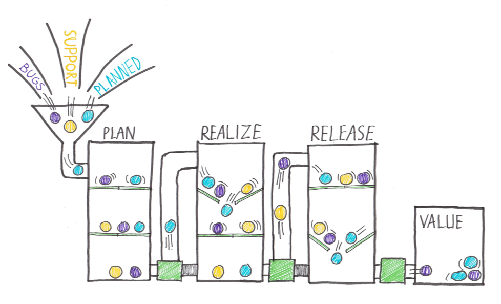
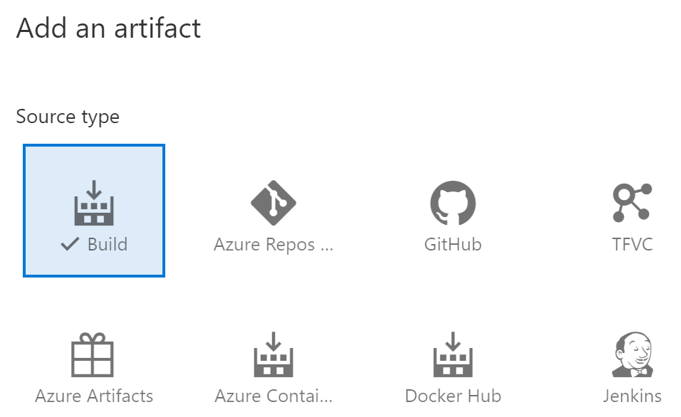
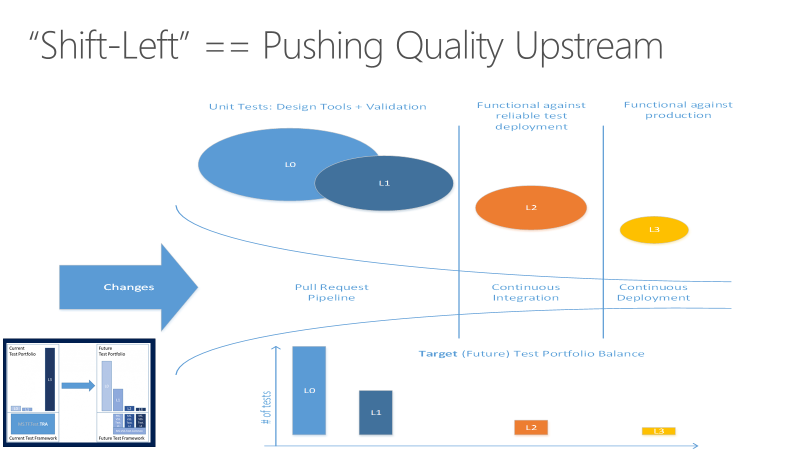
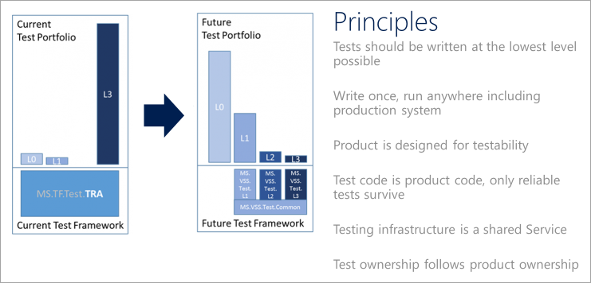
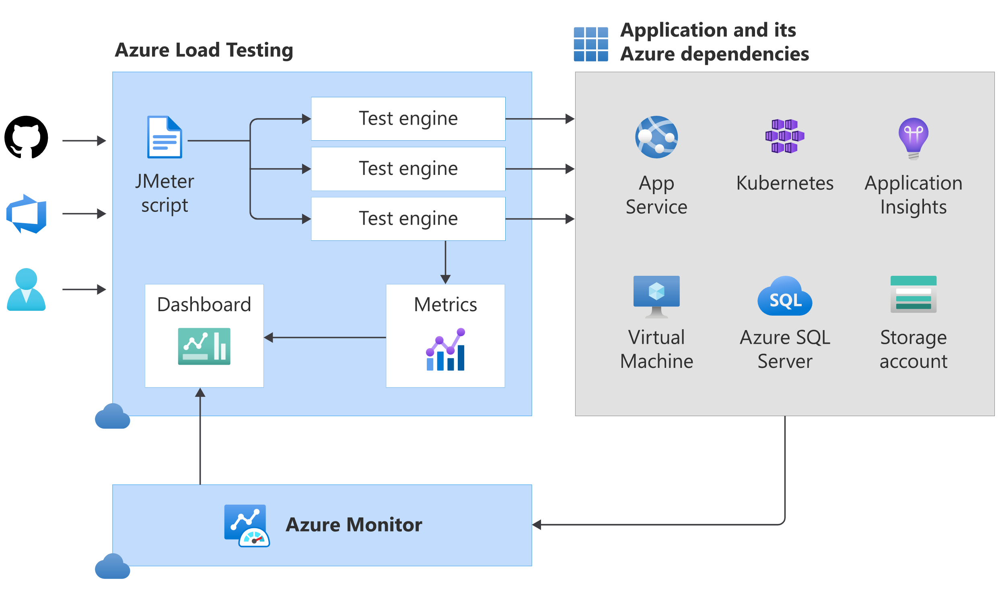
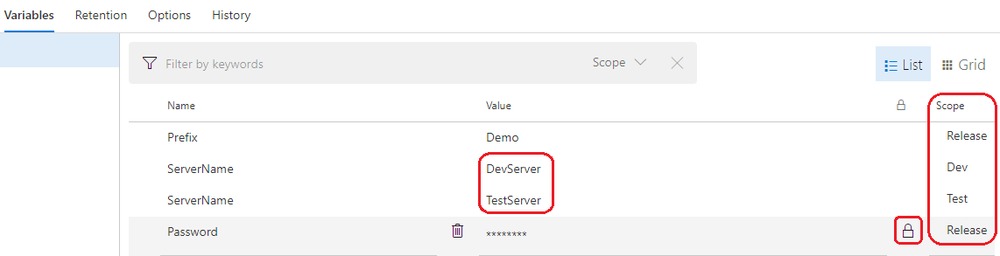

# Design and implement a release strategy

Probably some CI/CD stuff.

## Introduction to continuous delivery

First some CD stuff.

### Explore IT development cycle

The more we change, the more risk it leads to, and we're back at the beginning, on many occasions resulting in yet another document or process that should be followed. This is sometimes called *silo-based development*:

All the value is released at the same time. As a result, the release takes a long time.

That's why we want **Continuous Delivery (CD)**. It's a set of processes, tools, and techniques for rapid, reliable, and continuous software development and delivery. Below are *the eight principles of continuous delivery*:

* The process for releasing/deploying software must be repeatable and reliable.
* Automate everything!
* If something is difficult or painful, do it more often.
* Keep everything in source control.
* Done means "released."
* Build quality in!
* Everybody has responsibility for the release process.
* Improve continuously.

This isn't done only by making a cool automated pipeline, but you'll also need to consider the following:

* Software architecture (monoliths are hard to deploy).
* Testing strategy (manual tests don't scale well).
* Organization (separated business and IT departments don't work smoothly), and so forth.

Continuous delivery is an enabler for *DevOps*. DevOps focuses on organizations and bringing people together to build and run their software products.

### Move to continuous delivery

Instead of following the traditional software development, we can practice CD:

Compared to the previous picture, the value isn't piled up and released all at once but flows through a pipeline. Here, only one part of the work can flow through the pipeline at once.

Work must be prioritized in the right way. As you can see, the pipeline has green and red outlets. These are the feedback loops or quality gates that we want to have in place. A feedback loop can be different things:

* A unit test to validate the code.
* An automated build to validate the sources.
* An automated test on a Test environment.
* Some monitor on a server.
* Usage instrumentation in the code.

The more that is automated, the faster value flows through the pipeline.

### Understand releases and deployments

A **release** is a package or container containing a versioned set of artifacts specified in a release pipeline in your CI/CD process. It includes a snapshot of all the information required to carry out all the tasks and actions in the release pipeline, such as:

* The stages or environments.
* The tasks for each one.
* The values of task parameters and variables.
* The release policies such as triggers, approvers, and release queuing options.

There can be multiple releases from one release pipeline (or release process).

A **deployment** is the action of running the tasks for one stage, which results in a tested and deployed application and other activities specified for that stage. Starting a release starts each deployment based on the settings and policies defined in the original release pipeline.

### Separating technical releases from functional releases

When we want to separate the technical and functional release, we need to start with our software itself. The software needs to be built so that new functionality or features can be hidden from end users while it's running (mostly by using **feature toggles**).

The whole idea of separating deployment from release (exposing features with a switch) is compelling and something we want to incorporate in our Continuous Delivery practice. It helps us with more stable releases and better ways to roll back when we run into issues when we have a new feature that produces problems.

### Understand release process versus release

The *release process/pipeline* contains all the steps you walk through when you move your artifact from one of the artifact sources discussed earlier through the stages or environments. The stage can be a development stage, a test stage, a production stage, or a stage where a specific user can access the application.

The *release* itself is something different. The release is an instance of the release pipeline. Each release is unique and requires its own instance of the pipeline to ensure that it goes through the necessary stages and tasks to be successfully deployed to production.

## Create a release pipeline

Azure Pipelines capabilities, build and release tasks, and multi-configuration and multi-agent differences.

### Describe Azure DevOps release pipeline capabilities

There are three pipeline options. I'm only going to describe the differences between the two most used onces:

TODO: NEED TO CHECK WHAT I NEED HERE

### Explore release pipelines

A simple release pipeline looks like this:

The first component in a release pipeline is an **artifact**:

* The most common source is a package from a build pipeline.
* Another commonly seen artifact source is, for example, source control.

A release pipeline has a **trigger** which is the mechanism that starts a new release:

* A manual trigger, where people start to release by hand.
* A scheduled trigger, where a release is triggered based on a specific time.
* A continuous deployment trigger, where another event triggers a release. For example, a completed build.

Another vital component of a release pipeline is **stages** or sometimes called **environments**. It's where the artifact will be eventually installed.

Another component of a release pipeline is **approval**. People often want to sign a release before installing it in the environment, but you can also replace this by an automatic process.

Finally, we have the **tasks** within the various stages. The tasks are the steps that need to be executed to install, configure, and validate the installed artifact.

### Explore artifact sources

In general, the idea about build and release pipelines and Continuous Delivery is to build once and deploy many times. It means that an *artifact* will be deployed to multiple environments. The contents of the package should never change. It's what we call **immutability**. You identify an immutable package by giving it a version so that you can refer to it at a later stage (for example with [*Semantic Versioning*](https://semver.org/)).

The most common way to get an artifact within the release pipeline is to use a **build artifact**. The build pipeline compiles, tests, and eventually produces an immutable package stored in a secure place (storage account, database, and so on). The release pipeline then uses a secure connection to this secured place to get the build artifact and do extra actions to deploy it to an environment. The significant advantage of using a build artifact is that the build produces a *versioned artifact*.

The release is related to a specific commit in our **version control** system. With that, we can also see which version of a file or script is eventually installed. In this case, the version doesn't come from the build but from version control.

Another possibility of an artifact source can be a **network share** containing a set of files. However, you should be aware of the possible risk. The risk is that you aren't 100% sure that the package you're going to deploy is the same package that was put on the network share.

Finally, **container registries** are a rising star regarding artifact sources. Container registries are versioned repositories where container artifacts are stored. Pushing a versioned container to the content repository and consuming that same version within the release pipeline has more or less the same advantages as using a build artifact stored in a safe location.

## Explore release recommendations

Contains critical release strategy recommendations organizations must consider when designing automated deployments.

### Understand the delivery cadence and three types of triggers

Release and stages make use of triggers. There are three types of triggers we recognize:

* *Continuous deployment trigger*: can be used to trigger every time a build completes and creates a new release.
* *Scheduled triggers*: Allows you to set up a time-based manner to start a new release
* *Manual trigger*: a person or system triggers the release based on a specific event.

### Explore release gates

*Release gates* are a set of predefined criteria or checkpoints used in software development and deployment processes to ensure that a software product or feature meets specific quality standards before it is released to the end-users. These criteria often include successful completion of tests, code reviews, performance benchmarks, and security audits. Release gates help minimize the risk of shipping faulty software, improve overall product quality, and maintain a consistent user experience.

As an example:

* Pre-deployment gates ensure no active issues in the work item or problem management system before deploying a build to an environment.
* Post-deployment gates ensure no incidents from the app's monitoring or incident management system after being deployed before promoting the release to the following environment.

## Provision and test environments

Details about target environment provisioning, service connections creation process, and test infrastructure setup.

### Provision and configure target environments

There are a number of target environments to where we can deploy:

* On-Premises servers.
* Cloud servers or Infrastructure as a Service (IaaS). For example, Virtual machines or networks. It's where Infrastructure as Code (IaC) starts playing a significant role. Creating a script or template can make a server or other infrastructural components like a SQL server, a network, or an IP address.
* Platform as a Service (PaaS) and Functions as a Service (FaaS). For example, Azure SQL Database in both PaaS and serverless options.
* Clusters. This is a group of servers that work together to host high-scale applications.
* Service Connections. When a pipeline needs access to resources, you'll often need to create service connections.

### Configure automated integration and functional test automation

As Lisa Crispin describes in her book [Agile Testing](https://lisacrispin.com/2011/11/08/using-the-agile-testing-quadrants/), you can divide your tests into multiple categories:

We can make four quadrants where each side of the square defines our targets with our tests.

* *Business facing*: the tests are more functional and often executed by end users of the system or by specialized testers that know the problem domain well.
* *Supporting the Team*: it helps a development team get constant feedback on the product to find bugs fast and deliver a product with quality build-in.
* *Technology facing*: the tests are rather technical and non-meaningful to business people. They're typical tests written and executed by the developers in a development team.
* *Critique Product*: tests that are there to validate the workings of a product on its functional and non-functional requirements.

Looking at these quadrants, specific tests are easy to automate or automated by nature. These tests are in quadrants 1 and 4. Tests that are automatable but most of the time not automated by nature are the tests in quadrant 2. Tests that are the hardest to automate are in quadrant 3.

Moving the testing process towards the development cycle is called **shift-left**.

### Understand Shift-left

The goal for *shifting left* is to move quality upstream by performing tests early in the pipeline. It represents the phrase "fail fast, fail often" combining test and process improvements reduces the time it takes for tests to be run and the impact of failures later on.

There are several essential principles that DevOps teams should adhere to in implementing any quality vision.

Some notes:

* Unit tests: These tests need to be fast and reliable.
* Functional tests: Must be independent.
* Defining a **test taxonomy** is an essential aspect of DevOps. The developers should understand the suitable types of tests in different scenarios.
  * **L0** tests are a broad class of fast in-memory unit tests. It's a test that depends on code in the assembly under test and nothing else.
  * **L1** tests might require assembly plus SQL or the file system.
  * **L2** tests are functional tests run against testable service deployments. It's a functional test category that requires a service deployment but may have critical service dependencies stubbed out somehow.
  * **L3** tests are a restricted class of integration tests that run against production. They require a complete product deployment.

### Set up and run availability tests

To check if your connection is still working, you can set up some availability tests:

* With health endpoints.
* With ping tests (can be done with an external platform)
* With Azure. There are two types of availability tests:
  * URL ping test: a simple test that you can create in the Azure portal. You can check the URL and check the response and status code of the response.
  * Multi-step web test: Several HTTP calls that are executed in sequence.

### Explore Azure Load Testing

Azure Load Testing Preview simulates traffic for your applications, helping you to optimize application performance, scalability, or capacity. This can be done by  using existing test scripts based on Apache JMeter.

You can automate regression testing by running load tests as part of your continuous integration and continuous deployment (CI/CD) workflow by triggering Azure Load Testing from Azure Pipelines or GitHub Actions workflows.

## Manage and modularize tasks and templates

Summary of the creation of task and variable groups, creating custom build and release tasks, and using release variables and stage variables in your pipeline.

### Examine task groups

**Note: Task Groups aren't currently supported in YAML. Use templates instead.**

A **task group** allows you to encapsulate a sequence of tasks, already defined in a build or a release pipeline, into a single reusable task that can be added to a build or release pipeline, just like any other task. You can choose to extract the parameters from the encapsulated tasks as configuration variables and abstract the rest of the task information.

### Explore variables in release pipelines

**Variables** give you a convenient way to get critical bits of data into various parts of the pipeline. The *variable's scope* is the most important thing you need to think about when using variables in the release pipeline. Within the release pipeline, you can use variables in different scopes and different ways.

There are a few kind of variables:

* Predefined variables: Information like the agent directory where the sources are downloaded, the build number or build ID, the agent's name, or any other information.
* Release pipeline variables: Choose this when you need to use the same value across all the stages and tasks in the release pipeline, and you want to change the value in a single place.
* Stage variables: Use this for values that vary from stage to stage (and are the same for all the tasks in a stage).
* Variable groups: Stores values that you want to make available across multiple builds and release pipelines. For example: the username and password for a shared server or just all settings for a specific application.
* Normal and secret variables: You can mark a variable in the release pipeline as secret. This way, the secret is hidden from the log output. It's beneficial when writing a password or other sensitive information.

  

## Automate inspection of health

Automate the inspection of health events, configure notifications, and set up service hooks to monitor pipelines.
