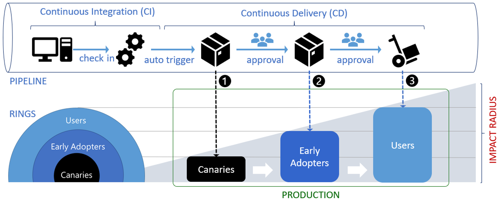
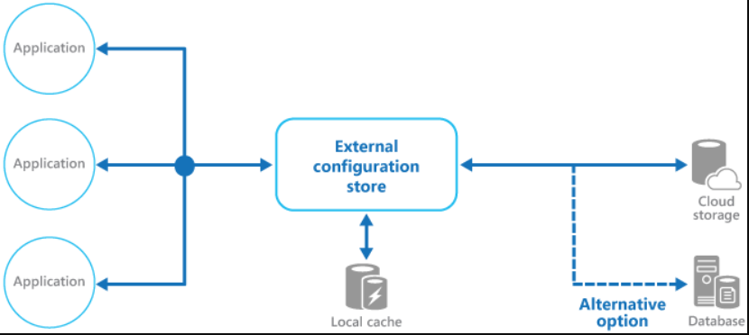
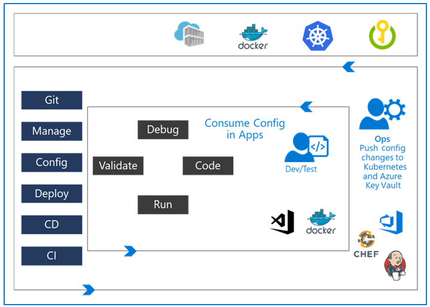

# Implement a secure continuous deployment using Azure Pipelines

Automated release gates, secrets, and secret management in your pipelines.

## Introduction to deployment patterns

Continuous Delivery is more than release management...

### Explore microservices architecture

A **microservice** is an autonomous, independently deployable, and scalable software component. The interaction between the microservices is done asynchronously. They don't call each other directly but use asynchronous mechanisms like queues or events.

Each microservice has its lifecycle and Continuous Delivery pipeline. If you built them correctly, you could deploy new microservice versions without impacting other system parts.

### Examine deployment patterns

In the early days we would follow this cycle: `develop` -> `test` -> `staging` -> `production`.

Now we have the concept of feature toggling and use it with our deployment patterns, we can test our software in production. Some examples:

* Blue-green deployments.
* Canary releases.
* Dark launching.
* A/B testing.
* Progressive exposure or ring-based deployment.
* Feature toggles.

## Implement blue-green deployment and feature toggles

Describes the blue-green deployment process and introduces feature toggle techniques to implement in the development process.

### What is blue-green deployment?

Blue-green deployment is a technique that reduces risk and downtime by running two identical environments. These environments are called blue and green. Only one of the environments is live, with the live environment serving all production traffic.


Once you've deployed and thoroughly tested the software in green, switch the router or load balancer so all incoming requests go to green instead of blue.

When it involves database schema changes, this process isn't straightforward. Your application and architecture should be built to handle both the old and the new database schema.

Azure has a feature called **Deployment slots**. You can create different slots for your application (for example, Dev, Test, or Stage). The production slot is the slot where your live app stays.

You can use a deployment slot to set up a new version of your application, and when ready, swap the production environment with the new staging environment. It's done by an internal *swapping of the IP addresses of both slots*.

### Introduction to feature toggles

**Feature toggles** are also known as feature flippers, feature flags, feature switches, conditional features, and so on. They allow you to change how our system works without making significant changes to the code. Only a small configuration change is required. In many cases, it will also only be for a few users.

The other type of Feature Flag is a **Release Flag**. You change the configuration so that the Canary users also have the Feature Flag set, and they'll start to test the new code as well. If problems occur, you can quickly disable the flag for them again.

Another release flag might be used for **AB testing**. Perhaps you want to find out if a new feature makes it faster for users to complete a task.

### Describe feature toggle maintenance

A feature toggle is just code. And to be more specific, conditional code. It adds complexity to the code and increases the technical debt. The most important thing is to remember that you need to remove the toggles from the software. It's essential to consider using tooling that tracks:

* Which flags exist.
* Which flags are enabled in which environments, situations, or target customer categories.
* The plan for when the flags will be used in production.
* The plan for when the flags will be removed.

Azure App Configuration offers a Feature Manager. See [**Azure App Configuration Feature Manager**](https://learn.microsoft.com/en-us/azure/azure-app-configuration/manage-feature-flags).

## Implement canary releases and dark launching
## Implement canary releases and dark launching

Describes deployment strategies around canary releases and dark launching and examines traffic managers.

### Explore canary releases

A canary release is a way to identify potential problems without exposing all your end users to the issue at once. They can be implemented using a combination of feature toggles, traffic routing, and deployment slots.

* You can route a percentage of traffic to a deployment slot with the new feature enabled.
* You can target a specific user segment by using feature toggles.


### Examine Traffic Manager

**Azure Traffic Manager** is a DNS-based traffic load balancer that enables you to distribute traffic optimally to services across global Azure regions while providing high availability and responsiveness. It uses DNS to direct client requests to the most appropriate service endpoint based on a traffic-routing method and the health of the endpoints.

It also provides a range of traffic-routing methods and endpoint monitoring options to suit different application needs and automatic failover models and is resilient to failure, including the breakdown of an entire Azure region.

While the available options can change over time, the Traffic Manager currently provides six options to distribute traffic:

* **Priority**: Select Priority when you want to use a primary service endpoint for all traffic and provide backups if the primary or the backup endpoints are unavailable.
* **Weighted (most used)**: Select Weighted when you want to distribute traffic across a set of endpoints, either evenly or according to weights, which you define.
* **Performance**: Select Performance when you have endpoints in different geographic locations, and you want end users to use the "closest" endpoint for the lowest network latency.
* **Geographic**: Select Geographic so that users are directed to specific endpoints (Azure, External, or Nested) based on which geographic location their DNS query originates from. It empowers Traffic Manager customers to enable scenarios where knowing a user's geographic region and routing them based on that is necessary. Examples include following data sovereignty mandates, localization of content & user experience, and measuring traffic from different regions.
* **Multivalue**: Select MultiValue for Traffic Manager profiles that can only have IPv4/IPv6 addresses as endpoints. When a query is received for this profile, all healthy endpoints are returned.
* **Subnet**: Select the Subnet traffic-routing method to map sets of end-user IP address ranges to a specific endpoint within a Traffic Manager profile. The endpoint returned will be mapped for that request's source IP address when a request is received.

### Understand dark launching

**Dark launching** is in many ways like canary releases. However, the difference here's that you're looking to assess users' responses to new features in your frontend rather than testing the performance of the backend. The idea is that rather than launch a new feature for all users, you instead release it to a small set of users. Usually, these users aren't aware they're being used as test users for the new feature, and often you don't even highlight the new feature to them, as such the term "Dark" launching.

## Implement A/B testing and progressive exposure deployment

Some stuff about A/B testing and progressive exposure deployment concepts and explores CI/CD with deployment rings--ring-based deployment.

### What is A/B testing?

**A/B testing** (also known as split testing or bucket testing) compares two versions of a web page or app against each other to determine which one does better. It is mainly an experiment where two or more page variants are shown to users at random. Also, statistical analysis is used to determine which variation works better for a given conversion goal.


### Explore CI-CD with deployment rings

**Progressive exposure deployment**, also called *ring-based deployment*, was first discussed in Jez Humble's Continuous Delivery book. Impact (also called blast radius) is evaluated through observation, testing, analysis of telemetry, and user feedback. In DevOps, rings are typically modeled as stages.



With a ring-based deployment, you first deploy your changes to risk-tolerant customers and progressively roll out to a more extensive set of customers. The Microsoft Windows team, for example, uses these rings.


When you have identified multiple groups of users and see value in investing in a ring-based deployment, you need to define your setup. Some organizations that use canary releasing have multiple deployment slots set up as rings. When a ring isn't healthy, you can halt the deployment to the following rings to reduce the impact.

## Integrate with identity management systems

Includes the integration with GitHub and single sign-on (SSO) for authentication, service principal, and managed service identities.

### Integrate GitHub with single sign-on (SSO)

To use SSO, you need to connect your identity provider to GitHub at the organization level.

GitHub offers both SAML and SCIM support:

| Provider                                    | Available Support |
| ------------------------------------------- | ----------------- |
| Active Directory Federation Services (ADFS) | SAML              |
| Azure Active Directory (Azure AD)           | SAML and SCIM     |
| Okta                                        | SAML and SCIM     |
| OneLogin                                    | SAML and SCIM     |
| PingOne                                     | SAML              |
| Shibboleth                                  | SAML              |

### Explore service principals

Azure AD offers different kinds of mechanisms for authentication:

* Azure AD applications: Applications are registered with an Azure AD tenant within Azure Active Directory. Registering an application creates an identity configuration. You also determine who can use it:
  * Accounts in the same organizational directory.
  * Accounts in any organizational directory.
  * Accounts in any organizational directory and Microsoft Accounts (personal).
  * Microsoft Accounts (Personal accounts only).
* Client secret: Once the application is created, you then should create at least one client secret for the application.
* Grant permissions: The application identity can then be granted permissions within services and resources that trust Azure Active Directory.
* Service principal: To access resources, an entity must be represented by a security principal. To connect, the entity must know:
  * TenantID.
  * ApplicationID.
  * Client Secret.

### Explore Managed Identity

There are two types of managed identities:

* System-assigned: Many Azure services expose their own identity. It isn't an identity that you need to manage. You can assign permissions to that identity, as with any other Azure AD identity.
* User-assigned: You can create a managed identity as an Azure resource. It can then be assigned to one or more instances of a service.

## Manage application configuration data

Rethink application configuration data and the separation of concerns method. It helps you understand configuration patterns and how to integrate Azure Key Vault with Azure Pipelines.

### Explore separation of concerns

One of the key reasons we would want to move the configuration away from source control is to outline responsibilities. Let's define some roles to elaborate on them. None of those are new concepts but rather a high-level summary:

* **Configuration custodian**: Responsible for generating and maintaining the life cycle of configuration values. These include CRUD on keys, ensuring the security of secrets, regeneration of keys and tokens, defining configuration settings such as Log levels for each environment. This role can be owned by operation engineers and security engineering while injecting configuration files through proper DevOps processes and CI/CD implementation. They do not define the actual configuration but are custodians of their management.
* **Configuration consumer**: Responsible for defining the schema (loose term) for the configuration that needs to be in place and then consuming the configuration values in the application or library code. It's the Dev. And Test teams shouldn't be concerned about the value of keys but rather what the key's capability is.
* **Configuration store**: The underlying store used to store the configuration, while it can be a simple file, but in a distributed application, it needs to be a reliable store that can work across environments.
* **Secret store**: While you can store configuration and secrets together, it violates our separation of concern principle, so the recommendation is to use a different store for persisting secrets. 

### Understand external configuration store patterns

Depending on the type of configuration backing store used and its latency, it might be helpful to implement a caching mechanism within the external configuration store. For more information, see [the Caching Guidance](https://learn.microsoft.com/en-us/azure/architecture/best-practices/caching).

The figure illustrates an overview of the External Configuration Store pattern with optional local cache:



This pattern is helpful for:

* Configuration settings are shared between multiple applications and application instances, or where a standard configuration must be enforced across various applications and application instances.
* A standard configuration system doesn't support all the required configuration settings, such as storing images or complex data types.
* As a complementary store for some application settings, they allow applications to override some or all the centrally stored settings.
* To simplify the administration of multiple applications and optionally monitor configuration settings by logging some or all types of access to the configuration store.

### Introduction to Azure App Configuration

**Azure App Configuration** is a service for central management of application settings and feature flags.

Azure App Configuration service provides the following features:

* A fully managed service that can be set up in minutes.
* Flexible key representations and mappings.
* Tagging with labels.
* A point-in-time replay of settings.
* Dedicated UI for feature flag management.
* Comparison of two sets of configurations on custom-defined dimensions.
* Enhanced security through Azure managed identities.
* Complete data encryptions, at rest or in transit.
* Native integration with popular frameworks.

App Configuration complements **Azure Key Vault**, which is used to store application secrets. App Configuration makes it easier to implement the following scenarios:

* Centralize management and distribution of hierarchical configuration data for different environments and geographies.
* Dynamically change application settings without the need to redeploy or restart an application.
* Control feature availability in real time.

### Examine Key-value pairs

**Keys** are cool. They serve as the name for key-value pairs and are used to store and retrieve corresponding values. Some notes:

* You can organize keys into a hierarchical namespace by using a character delimiter, such as `/` or `:`.
* Keys are case-sensitive, Unicode-based strings.
* You can use any Unicode character in key names entered except for `*`, `,`, and `\`. These characters are reserved. If you need to include a reserved character, you must escape it by using `\{Reserved Character}`.
* There's a combined size limit of 10,000 characters on a key-value pair.
* Use labels to version key values (like the Git commit ID).
* Each key value is uniquely identified by its key plus a label that can be `null`.

Below are some examples of how you can structure your key names into a *hierarchy*:

```text
AppName:Service1:ApiEndpoint
AppName:Service2:ApiEndpoint
```

A key `app1` with labels `A` and `B` forms two separate keys in an App Configuration store. By default, the label for a key value is empty or null. **Labels** provides a convenient way to create variants of a key. A common use of labels is to specify multiple environments for the same key:

```text
Key = AppName:DbEndpoint & Label = Test
Key = AppName:DbEndpoint & Label = Staging
Key = AppName:DbEndpoint & Label = Production
```

**Values** are the values of keys. Some notes:

* Values are also Unicode strings. You can use all Unicode characters for values.
* There's an optional user-defined content type associated with each value. Use this attribute to store information, for example, an encoding scheme.
* Values are encrypted at rest and in transit.
* Don't store application secrets in it.

### Examine App configuration feature management

Azure App Configuration Service can be used to store and manage feature flags. Some terms:

* **Feature flag**: A feature flag is a variable with a binary state of on or off. The feature flag also has an associated code block. The state of the feature flag triggers whether the code block runs or not.
* **Feature manager**: A feature manager is an application package that handles the lifecycle of all the feature flags in an application. The feature manager typically provides more functionality, such as caching feature flags and updating their states.
* **Filter**: A filter is a rule for evaluating the state of a feature flag. A user group, a device or browser type, a geographic location, and a time window are all examples of what a filter can represent.

Each feature flag has two parts: a name and a list of one or more filters used to evaluate if a feature's state is on (that is when its value is True). While working in .NET, you can use the *appsettings.json* for this:

```JSON
"FeatureManagement": {
    "FeatureA": true,
    "FeatureB": false,
    "FeatureC": {
        "EnabledFor": [
            {
                "Name": "Percentage",
                "Parameters": {
                    "Value": 50
                }
            }
        ]
    }
}
```

Note: `FeatureC` specifies a filter named `Percentage` with a `Parameters` property. `Percentage` is a configurable filter. In this example, `Percentage` specifies a 50-percent probability for the `FeatureC` flag to be on. Other features are `Targeting`, `TimeWindow` and custom. See [here](https://learn.microsoft.com/en-us/azure/azure-app-configuration/howto-feature-filters-aspnet-core) for more information.

To use feature flags effectively, you need to *externalize* all the feature flags used in an application. This approach allows you to change feature flag states without modifying and redeploying the application itself. Azure App Configuration is designed to be a **centralized repository for feature flags**.

### Manage secrets, tokens and certificates

**Azure Key Vault** helps solve the following problems:

* **Secrets management**: It can be used to store securely and tightly control access to tokens, passwords, certificates, API keys, and other secrets.
* **Key management**: It can also be used as a key management solution. Azure Key Vault makes it easy to create and control the encryption keys used to encrypt your data.
* **Certificate management**: It is also a service that lets you easily provision, manage, and deploy public and private Secure Sockets Layer/Transport Layer Security (SSL/TLS) certificates for use with Azure. And your internal connected resources.
* **Store secrets backed by hardware security modules**: The secrets and keys can be protected by software or FIPS 140-2 Level 2 validates HSMs.

**Authentication** is done via Azure Active Directory. **Authorization** may be done via role-based access control (RBAC) or Key Vault access policy. RBAC is used when dealing with the management of the vaults, and a key vault access policy is used when attempting to access data stored in a vault.

You can import or generate keys in **hardware security modules (HSMs)** that never leave the HSM boundary when you require added assurance.

Once you've created a couple of Key Vaults, you'll want to **monitor** how and when your keys and secrets are accessed. You can do it by enabling logging for Key Vault. You can configure Azure Key Vault to:

* Archive to a storage account.
* Stream to an Event Hubs.
* Send the logs to Log Analytics.

### Examine DevOps inner and outer loop

The following diagram shows how these roles play together in a **DevOps inner and outer loop**.

The inner loop is focused on the developer teams iterating over their solution development; they consume the configuration published by the Outer Loop.

The Ops Engineer governs the Configuration management. They push changes into Azure KeyVault and Kubernetes that are further isolated per environment.



### Using Azure Key Vault in DevOps Pipelines

There is no specific chapter for this information (a shame), but I found the documentation that states that it is possible. See [here](https://learn.microsoft.com/en-us/azure/devops/pipelines/release/azure-key-vault?view=azure-devops&tabs=yaml).
