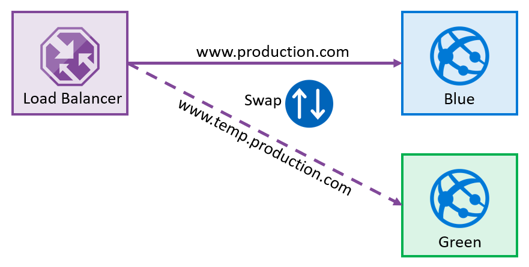

# Implement a secure continuous deployment using Azure Pipelines

Automated release gates, secrets, and secret management in your pipelines.

## Introduction to deployment patterns

Continuous Delivery is more than release management...

### Explore microservices architecture

A **microservice** is an autonomous, independently deployable, and scalable software component. The interaction between the microservices is done asynchronously. They don't call each other directly but use asynchronous mechanisms like queues or events.

Each microservice has its lifecycle and Continuous Delivery pipeline. If you built them correctly, you could deploy new microservice versions without impacting other system parts.

### Examine deployment patterns

In the early days we would follow this cycle: `develop` -> `test` -> `staging` -> `production`.

Now we have the concept of feature toggling and use it with our deployment patterns, we can test our software in production. Some examples:

* Blue-green deployments.
* Canary releases.
* Dark launching.
* A/B testing.
* Progressive exposure or ring-based deployment.
* Feature toggles.

## Implement blue-green deployment and feature toggles

Describes the blue-green deployment process and introduces feature toggle techniques to implement in the development process.

### What is blue-green deployment?

Blue-green deployment is a technique that reduces risk and downtime by running two identical environments. These environments are called blue and green. Only one of the environments is live, with the live environment serving all production traffic.

Once you've deployed and thoroughly tested the software in green, switch the router or load balancer so all incoming requests go to green instead of blue.

When it involves database schema changes, this process isn't straightforward. Your application and architecture should be built to handle both the old and the new database schema.

Azure has a feature called **Deployment slots**. You can create different slots for your application (for example, Dev, Test, or Stage). The production slot is the slot where your live app stays.

You can use a deployment slot to set up a new version of your application, and when ready, swap the production environment with the new staging environment. It's done by an internal *swapping of the IP addresses of both slots*.

### Introduction to feature toggles

**Feature toggles** are also known as feature flippers, feature flags, feature switches, conditional features, and so on. They allow you to change how our system works without making significant changes to the code. Only a small configuration change is required. In many cases, it will also only be for a few users.

The other type of Feature Flag is a **Release Flag**. You change the configuration so that the Canary users also have the Feature Flag set, and they'll start to test the new code as well. If problems occur, you can quickly disable the flag for them again.

Another release flag might be used for **AB testing**. Perhaps you want to find out if a new feature makes it faster for users to complete a task.

### Describe feature toggle maintenance

A feature toggle is just code. And to be more specific, conditional code. It adds complexity to the code and increases the technical debt. The most important thing is to remember that you need to remove the toggles from the software. It's essential to consider using tooling that tracks:

* Which flags exist.
* Which flags are enabled in which environments, situations, or target customer categories.
* The plan for when the flags will be used in production.
* The plan for when the flags will be removed.

Azure App Configuration offers a Feature Manager. See [**Azure App Configuration Feature Manager**](https://learn.microsoft.com/en-us/azure/azure-app-configuration/manage-feature-flags).

### Implement canary releases and dark launching

Describes deployment strategies around canary releases and dark launching and examines traffic managers.
