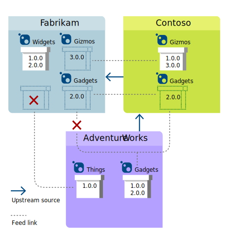
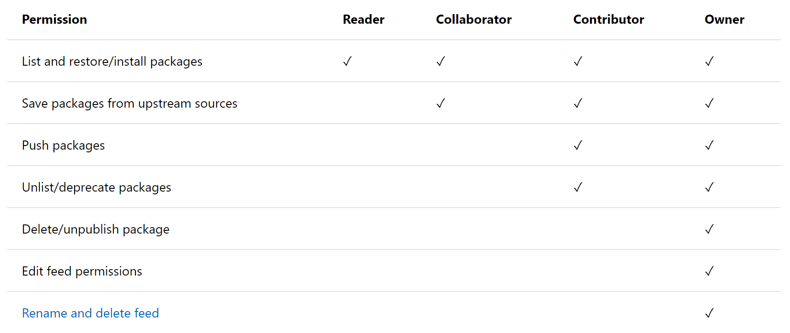
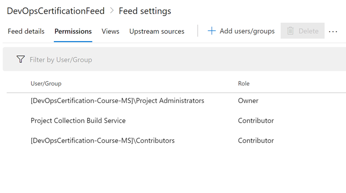
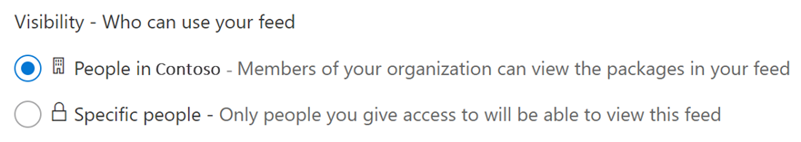

# Design and implement a dependency management strategy

Dependency management in software development

## Explore package dependencies

Dependencies, dependencies, dependencies...

### What is dependency management?

Projects have dependencies on other projects, and solutions aren't single pieces of software. Each component can have its maintainers, speed of change, and distribution, giving both the creators and consumers of the components autonomy.

With all dependencies being managed, it's also possible to control the consumed dependencies, enabling governance and security scanning to use known vulnerabilities or exploits packages.

### Describe elements of a dependency management strategy

There are many aspects of a dependency management strategy.

* **Standardization**: Managing dependencies benefit from a standardized way of declaring and resolving them in your codebase. Standardization allows a repeatable, predictable process and usage that can be automated as well.
* **Package formats and sources**: The distribution of dependencies can be performed by a packaging method suited for your solution's dependency type. Your dependency management strategy should include the selection of package formats and corresponding sources where to store and retrieve packages.
* **Versioning**: Just like your own code and components, the dependencies in your solution usually evolve. It requires a versioning mechanism for the dependencies to be selective of the version of a dependency you want to use.

### Understand source and package componentization

Current development practices already have the notion of componentization. There are two ways of componentization commonly used.

* **Source componentization**: The first way of componentization is focused on source code. It refers to splitting the source code in the codebase into separate parts and organizing it around the identified components.
* **Package componentization**: The second way uses packages. Distributing software components is performed utilizing packages as a formal way of wrapping and handling the components.

### Decompose your system

The goal of decomposing is to reduce the size of your codebase and system, making it more efficient to build and manageable in the end.

It may require some refactoring, such as creating new solution artifacts for code organization or code changes to cater for the unchanged code to take a dependency on an (external) component.

### Scan your codebase for dependencies

There are several ways to identify the dependencies in your codebase. These include scanning your code for patterns and reuse and analyzing how the solution is composed of individual modules and components:

* **Duplicate code**: Just keep in mind that code duplication isn't necessarily a bad practice.
* **High cohesion and low coupling**.
* **Individual lifecycle**.
* **Stable parts**.
* **Independent code and components**.

## Understand package management

Learn about package feeds, common public package sources, and how to create and publish packages.

### Explore packages

A package is a formalized way of creating a distributable unit of software artifacts that can be consumed from another software solution. The package describes the content it contains and usually provides extra metadata, and the information uniquely identifies the individual packages and is self-descriptive.

There are a couple of options nowadays:

* **NuGet packages**: Used for .NET environment. It includes .NET assemblies and related files, tooling, and sometimes only metadata. A NuGet package is essentially a compressed folder structure with files in ZIP format and has the .nupkg extension.
* **NPM**: Used for JavaScript development. It is a file or folder containing JavaScript files and a package.json file describing the package's metadata. For node.js, the package usually includes one or more modules that can be loaded once the package is consumed.
* **Maven** Used for Java-based projects. Each package has a Project Object Model file describing the project's metadata and is the basic unit for defining a package and working with it.
* **PyPi**: The Python Package Index, abbreviated as PyPI and known as the Cheese Shop, is the official third-party software repository for Python.
* **Docker**: Other kinds of packages.

### Understand package feeds

The centralized storage for packages is commonly called a **package feed**. There are other names in use, such as repository or registry. The feeds are centralized and available for many different consumers. Depending on the package, purpose, and origin, it might be generally available or to a select audience (public and private feeds).

Public feeds can be anonymously accessible and optionally authenticated while private feeds can be accessed only when authenticated.

There are two options for private feeds:

* **Self-hosting**: Some of the package managers are also able to host a feed. Using on-premises or private cloud resources, one can host the required solution to offer a private feed.
* **SaaS services**: A variety of third-party vendors and cloud providers offer software-as-a-service feeds that can be kept private. It typically requires a consumption fee or a cloud subscription.

See here some options for private hosting:

| Package type | Self-hosted private feed                | SaaS private feed                      |
|--------------|----------------------------------------|---------------------------------------|
| NuGet        | NuGet server, Azure Artifacts, MyGet   | NPMjs, MyGet, Azure Artifacts          |
| NPM          | Sinopia, CNPMjs, Verdaccio             | NPMjs, MyGet, Azure Artifacts          |
| Maven        | Nexus, Artifactory, Archivia           | Azure Artifacts, Bintray, JitPack      |
| Docker       | Portus, Quay, Harbor                   | Docker Hub, Azure Container Registry, Amazon Elastic Container Registry |
| Python       | PyPI Server                            | Gemfury                               |

### Upstream sources

It's possible to refer to multiple sources from a single software solution. However, when combining private and public sources, the order of resolution of the sources becomes essential. One way to specify multiple package sources is by choosing a primary source and an **upstream source**.

The package manager will evaluate the primary source first and switch to the upstream source when the package isn't found there. The upstream source might be one of the official public or private sources. The upstream source could refer to another upstream source, creating a chain of sources.

A source with an upstream source defined may download and cache the requested packages if the source doesn't contain those packages themselves. The source will include these downloaded packages and starts to act as a cache for the upstream source. It also offers the ability to keep track of any packages from the external upstream source.

The private feed uses the upstream source as a proxy for the external source. It will be your feed manager and private source that have the communication to the outside. Only privileged roles can add upstream sources to a private feed.

### Packages graph

A feed can have one or more upstream sources, which might be internal or external. Each of these can have additional upstream sources, creating a package graph of the source.

For example, let's have the Fabrikam feed add Contoso as an upstream source. A user connected to Fabrikam can install any version of Widgets, any version of Gizmos, but only saved versions (2.0.0) of Gadgets. The user will not be able to install version 1.0.0 of Gadgets or any version of Things, because those package versions haven't been saved to Contoso by a Contoso user.



### Introduction to Azure Artifacts

Microsoft Azure DevOps provides various features for application lifecycle management, including:

* Work item tracking.
* Source code repositories.
* Build and release pipelines.
* Artifact management.

The artifact management is called **Azure Artifacts** and was previously known as *Package management*. It offers public and private feeds for software packages of various types:

* NuGet packages
* NPM packages
* Maven
* Universal packages (an Azure Artifacts-specific package type. In essence, it's a versioned package containing multiple files and folders)
* Python

### Publish packages

In Azure Artifacts, you can have multiple feeds in your projects, and you can make them available to only users authorized in your project or for your entire organization.

Each feed can contain any packages, even mixed types, but it's recommended that you create one feed per type you want to support in your organization, this way, it's clear what the feed contains. Also, each feed can contain one or more upstream and can manage its own security.

If you're ready, you can push your package to a feed. This can be done when you've authenticated to Azure DevOps. Then you can pull and push packages to the package feed, provided you have permission to do so.

To manually push a NuGet package, you would use the NuGet.exe command-line tool. For a package called MyDemoPackage, the command would resemble:

```Bash
nuget.exe push -Source {NuGet package source URL} -ApiKey YourKey YourPackage\YourPackage.nupkg
```

Packages might need to be updated during their lifetime. Technically, updating a package is made by pushing a new version of the package to the feed. The package feed manager manages to properly store the updated package with the existing packages in the feed. Please note that updating packages requires a versioning strategy.

## Migrate consolidating and secure artifacts

Details about package migration, consolidation, and configuration to secure access to package feeds and artifact repositories

### Identify existing artifact repositories

An **artifact** is a deployable component of your application. Azure Pipelines can work with a wide variety of artifact sources and repositories.

When you're creating a release pipeline, you need to link the required artifact sources. And when you need to create a release, you must specify which version of the artifacts is required. By default, the release pipeline will choose the latest version of the artifacts. But you might want to use a specific branch/build/tag/etc.

Using Azure Artifacts can eliminate the need to manage file shares or host private package services. It lets you share code easily by allowing you to store Maven, npm, or NuGet packages together, cloud-hosted, indexed and matched.

Note that there's also no need to store your binaries in Git. You can keep them directly using **universal packages**. It's also a great way to protect your packages. Azure Artifacts provide universal artifact management from Maven, npm, and NuGet.

And sharing packages, you can easily access all of your artifacts in builds and releases because it integrates naturally with Azure Pipelines and its CI/CD tooling, along with versioning and testing.

### Secure access to package feeds

Package feeds are a **trusted source of packages**. The offered packages will be consumed by other codebases and used to build software that needs to be secure. Imagine what would happen if a package feed would offer malicious components in its packages. So they must be secured for access by authorized accounts, so only verified and trusted packages are stored there. None should push packages to a feed without the proper role and permissions.

A package feed should have secure access allowing:

* **Restricted access for consumption**: Whenever a particular audience should only consume a package feed and its packages, it's required to restrict its access. Only those allowed access will consume the packages from the feed.
* **Restricted access for publishing**: Secure access is required to restrict who can publish so feeds and unauthorized or untrusted persons and accounts can't modify their packages.

### Examine roles and permissions

Azure Artifacts has four different roles for package feeds. These are incremental in the permissions they give:

* **Reader**: Can list and restore (or install) packages from the feed.
* **Collaborator**: Can save packages from upstream sources.
* **Contributor**: Can push and unlist packages in the feed.
* **Owner**: has all available permissions for a package feed.

See also:



When creating an Azure Artifacts feed, the `Project Collection Build Service` is given contributor rights by default. This organization-wide build identity in Azure Pipelines can access the feeds it needs when running tasks. If you changed the build identity to be at the project level, you need to give that identity permissions to access the feed. Any contributors to the team project are also contributors to the feed.



`Project Collection Administrators` and administrators of the team project, plus the feed's creator, are automatically made owners of the feed.

Note that the roles for these users and groups can be changed or removed. You need to have the `Owner` role to do so. Once an account has access to the feed from the permission to list and restore packages, it's considered a `Feed` user.

When creating a feed, you can choose whether the feed is visible to people in your Azure DevOps organization or only specific people.



### Examine authentication

Azure DevOps users will authenticate against Azure Active Directory when accessing the Azure DevOps portal. After being successfully authenticated, they won't have to provide any credentials to Azure Artifacts itself. The roles for the user, based on its identity, or team and group membership, are for authorization.

## Implement a versioning strategy

Software changes over time. The requirements for the software don't stay the same. Use versioning.

### Immutable packages

Whenever a package is published to a feed, it shouldn't be allowed to change anymore. If changed, it would be at the risk of introducing potential breaking changes to the code. In essence, a published package is **immutable**. Replacing or updating an existing version of a package isn't allowed. Most package feeds don't allow operations that would change a current version. Regardless of the size of the change, a package can only be updated by introducing a new version.

### Understand versioning of artifacts

Every change requires a new version. The versioning scheme can differ per package type. Typically, it uses a scheme that can indicate the kind of change that is made:

* **Major change**: This indicates that the package and its contents have changed significantly. It often occurs at the introduction of a new version of the package. It can be a redesign of the component. Major changes aren't guaranteed to be compatible and usually have breaking changes from older versions. Major changes might require a large amount of work to adopt the consuming codebase to the new version.
* **Minor change**: This indicates that the package and its contents have extensive modifications but are smaller than a major change. These changes can be backward compatible with the previous version, although they aren't guaranteed to be.
* **Patch or revision**: This is used to indicate that a flaw, bug, or malfunctioning part of the component has been fixed. Usually, It's a backward-compatible version compared to the previous version.

### Explore semantic versioning

One of the predominant ways of versioning is the use of **semantic versioning**. It isn't a standard but does offer a consistent way of expressing the intent and semantics of a particular version.

It describes a version for its backward compatibility with previous versions. Semantic versioning uses a three-part version number: `Major.Minor.Patch`.

For prerelease versions, it's customary to use a label after the regular version number. A label is a textual suffix separated by a hyphen from the rest of the version number: `1.0.0-rc1`.

### Examine release views

Azure Artifacts recognizes the quality level of packages in its feeds and the difference between prerelease and release versions. It offers different views on the list of packages and their versions, separating these based on their quality level. This is done with extra metadata from the Azure Artifacts feed is called a `descriptor`.

Feeds can have three different views by default. These views are added when a new feed is created:

* **Local**: The `@Local` view contains all release and prerelease packages and the packages downloaded from upstream sources.
* **Prerelease**: The `@Prerelease` view contains all packages that have a label in their version number.
* **Release**: The `@Release` view contains all packages that are considered official releases.

By default, the `@Local` view is used to offer the list of available packages. The format for this URI is:

```URL
https://pkgs.dev.azure.com/{yourteamproject}/_packaging/{feedname}/nuget/v3/index.json
```

But if you want a specific view, you can use:

```URL
https://pkgs.dev.azure.com/{yourteamproject}/_packaging/{feedname}@{Viewname}/nuget/v3/index.json
```

### Promote packages

Azure Artifacts has the notion of promoting packages to views to indicate that a version is of a certain quality level. By selectively promoting packages, you can plan when packages have a certain quality and are ready to be released and supported by the consumers. You can **promote** packages to one of the available views as the quality indicator for example, a custom view `alpha` and `beta`.

This process can be automated by using an Azure Pipelines task as part of the build pipeline. Packages that have been promoted to a view won't be deleted based on the retention policies.

### Explore best practices for versioning

A couple of suggestions from the learning module:

* Have a documented versioning strategy.
* Adopt SemVer 2.0 for your versioning scheme.
* Each repository should only reference one feed.
* On package creation, automatically publish packages back to the feed.
