# Implement continuous feedback

Stuff regarding the continuous feedback concept.

## Implement tools to track usage and flow

Continuous feedback practices and tools to track usage and flow.

### Understand the inner loop

The easiest way to define **the inner loop** is the iterative process that a developer does when writing, building, and debugging code.

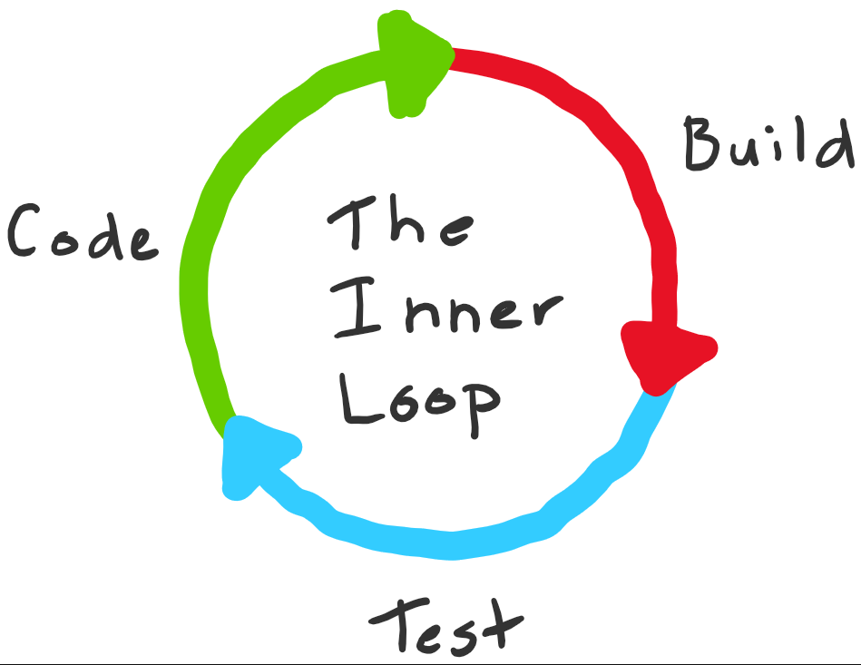

It differs per developer. C# developers have a different inner loop then web developers:

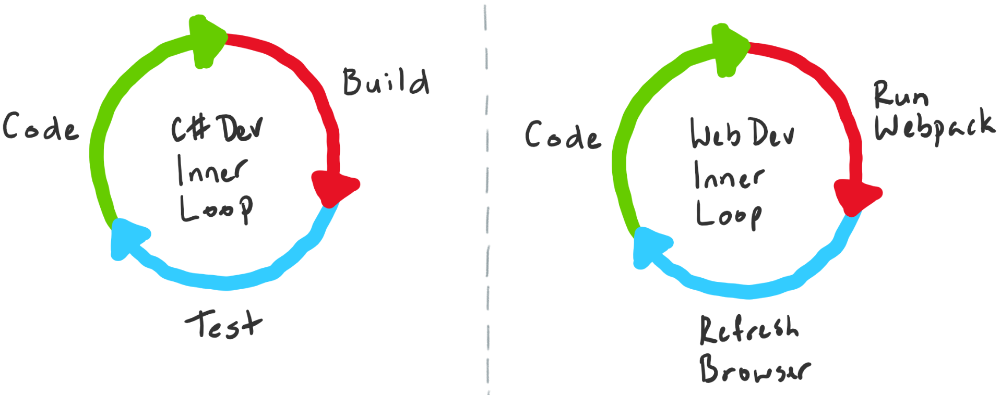

The steps within the inner loop can be grouped into three broad buckets of activity - *experimentation*, *feedback collection*, and *tax*.

C# developers have for example the following steps:

* Coding (Experimentation) -> only one that adds customer value.
* Building (Feedback Collection)
* Testing / Debugging (Feedback Collection)
* Committing (Tax) -> Necessary to work, but doesn't provide value nor feedback.

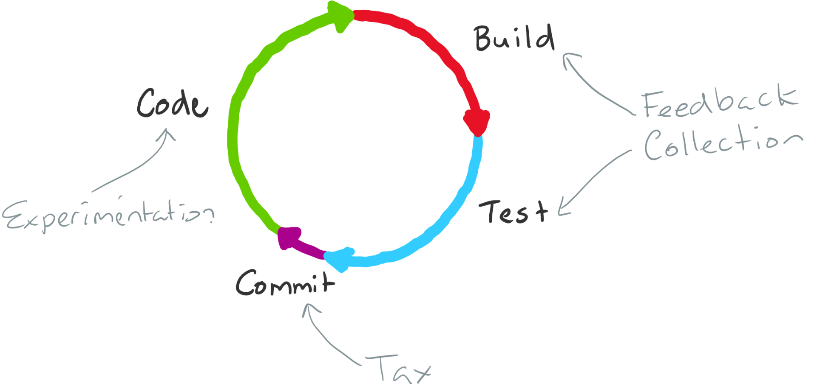

Some general statements:

* You want to execute the loop as fast as possible and for the total loop execution time to be proportional to the changes made.
* You want to minimize the time feedback collection takes but maximize the quality of the feedback that you get.
* You want to minimize the tax you pay by eliminating it where it's unnecessary to run through the loop (can you defer some operations until you commit, for example).
* As new code and more complexity are added to any codebase, the amount of outward pressure to increase the size of the inner loop also increases. More code means more tests, which means more execution time and slow execution of the inner loop.

There are several things that a team can do to optimize the inner loop for larger codebases:

* Only build and test what was changed.
* Cache intermediate build results to speed up to complete builds.
* Break up the codebase into small units and share binaries.

### Understand tangled loops

**Tangled loops** refer to the complications that arise when separating a monolithic codebase into different packages. While this approach can initially work well, issues can arise when developing new features that require extensive framework updates.

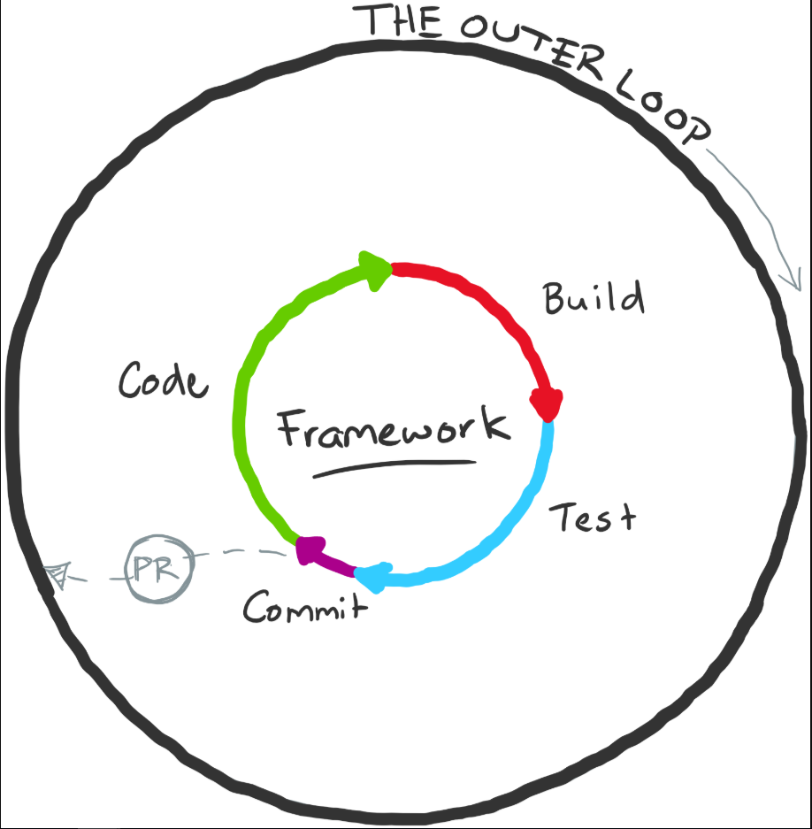

Coevolving code in separate repositories can lead to friction and force the inner loop to include the outer loop of the separated framework code. This results in added "tax" like code reviews, scanning passes, and release pipelines. Developers often resort to local hacks to move forward efficiently, but these can become messy and the outer loop tax must still be paid eventually. Breaking up code into separate packages can work well if done carefully.

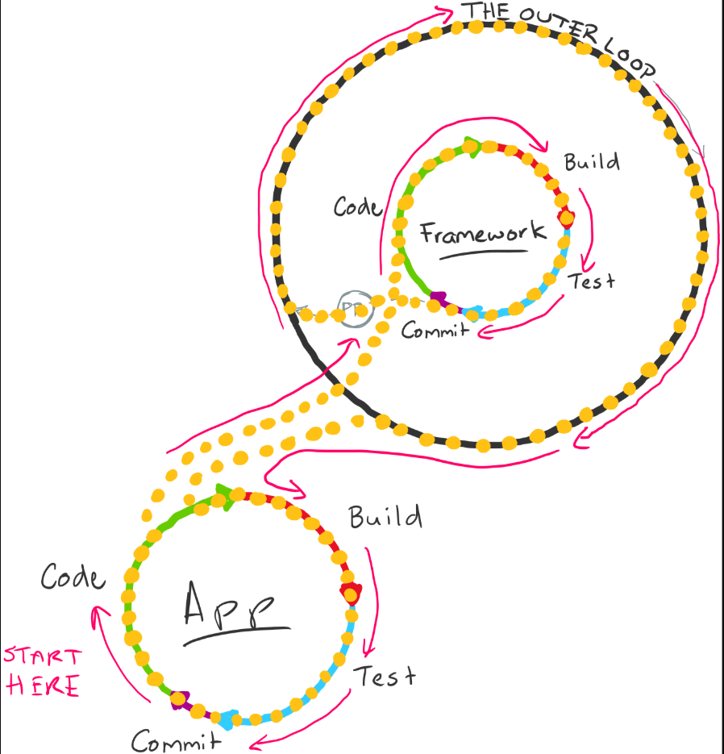

### Introduction to continuous monitoring

**Continuous monitoring** refers to the process and technology required to incorporate monitoring across each phase of your DevOps and IT operations lifecycles. It helps to continuously ensure your application's health, performance, reliability, and infrastructure as it moves from development to production.

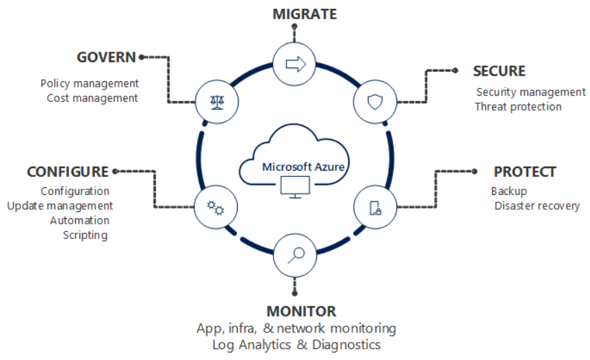

**Azure Monitor** is the unified monitoring solution in Azure that provides full-stack observability across applications and infrastructure in the cloud and on-premises. It works seamlessly with Visual Studio and Visual Studio Code during development and testing and integrates with Azure DevOps for release management and work item management during deployment and operations. It even integrates across your *ITSM* and *SIEM* tools to help track issues and incidents within your existing IT processes.

There are a notes for creating the best possible application:

* **Monitoring on all your web applications and services**
* **Monitoring for your entire infrastructure**
* **Combine resources in Azure Resource Groups**
* **Create actionable alerts with actions**
* **Prepare dashboards and workbooks**
* **Continuously optimize**

While it's too much to list all the available options in detail, I'll create a list of all the Azure services and what you can do with them to achieve the above:

* Azure Monitor is the main one here. You can combine it with Application Insights, monitoring of your infrastructure, resource groups, creating alerts, and more. It would be for the best to investigate it a little more then I write down here.
* Use Resource Manager templates to enable monitoring and configure alerts over a large set of resources.
* Use Azure Policy to enforce different rules over your resources.
* Use Azure Pipelines and Quality Gates.
* ... and much more.

### Explore Azure Monitor and Log Analytics

Azure Monitor is Microsoft's native cloud monitoring solution. Azure Monitor collects monitoring telemetry from different kinds of on-premises and Azure sources. It provides Management tools, such as those in Azure Security Center and Azure Automation, enabling ingestion of custom log data to Azure.


An interesting tutorial can be found [here](https://learn.microsoft.com/en-us/training/modules/implement-tools-track-usage-flow/4-explore-azure-monitor-log-analytics).

### Examine Kusto Query Language (KQL)

Kusto is the primary way to query Log Analytics. It provides both a query language and a set of control commands. It can be used directly within Azure Data Explorer.

Azure Data Studio also offers a Kusto query experience and supports the creation of Jupiter-style notebooks for Kusto queries.

Some examples:

```C#
// Last heartbeat of each computer
// Show the last heartbeat sent by each computer
Heartbeat
| summarize arg_max(TimeGenerated, *) by Computer
```

```C#
// What data is being collected?
// List the collected performance counters and object types (Process, Memory, Processor.)
Perf
| summarize by ObjectName, CounterName
```

```C#
Perf
| where ObjectName contains "process"
        and InstanceName !in ("_Total", "Idle")
        and CounterName == "% Processor Time"
| summarize avg(CounterValue) by InstanceName, CounterName, bin(TimeGenerated, 1m)
| render piechart
```

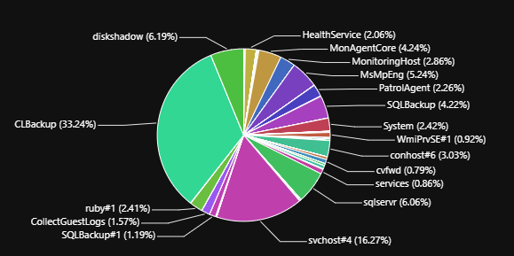

### Explore Application Insights

**Application performance management (APM)** is a discipline that includes all the tools and activities involved in observing how software and hardware are doing.These tools present performance information in the form product owners and software development teams can use to make decisions. Application Insights is a Microsoft Azure native APM Tool that is cross-platform. It's specialized in providing a rich & intelligent performance management toolset for Azure hosted web apps.

You install a small instrumentation package in your application and set up an Application Insights resource in the Microsoft Azure portal. The instrumentation monitors your app and sends telemetry data to the portal. (The application can run anywhere - it doesn't have to be hosted in Azure.)

The impact on your app's performance is minimal. Tracking calls are non-blocking and are batched and sent in a separate thread.

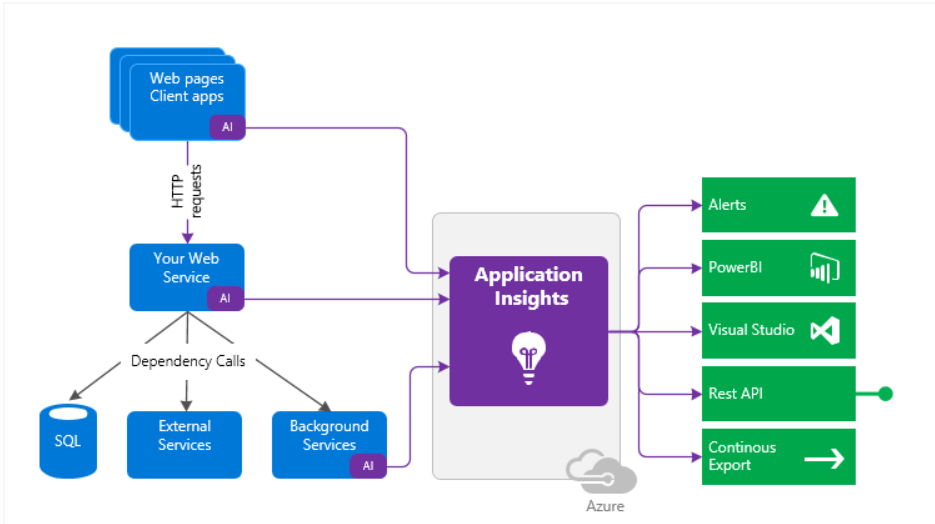

So you ask, what does it do? Here is a list:

* Request rates, response times, and failure rates.
* Dependency rates, response times, and failure rates - Find out whether external services are slowing you down.
* Exceptions - Both server and browser exceptions are reported.
* Pageviews and load performance - reported by your users' browsers.
* AJAX calls from web pages - rates, response times, and failure rates.
* User and session count.
* Performance counters from your Windows or Linux server machines include CPU, memory, and network usage.
* Host diagnostics from Docker or Azure.
* Diagnostic trace logs from your app - so that you can correlate trace events with requests.
* Custom events and metrics that you write yourself in the client or server code to track business events such as items sold or games won.

It works by configuring a unique key (called AppInsights Key) in your application. The Application Insights SDK uses this key to identify the Azure App Insights workspace the telemetry data needs to be uploaded. The SDK and the key are merely used to pump the telemetry data points out of your application. The heavy lifting of data correlation, analysis, and insights is done within Azure.

## Develop monitor and status dashboards

Develop monitoring with Azure Dashboards, work with View Designer and Azure Monitor, and create Azure Monitor Workbooks.

### Explore Azure Dashboards

Azure dashboards are the primary dashboarding technology for Azure. They should be used when you want to have:

* Deep integration into Azure. Visualizations can be pinned to dashboards from multiple Azure pages, including metrics analytics, log analytics, and Application Insights.
* Supports both metrics and logs.
* Combine data from multiple sources, including output from Metrics explorer, Log Analytics queries, and maps and availability in Application Insights.
* Option for personal or shared dashboards. It's integrated with Azure role-based authentication (RBAC).
* Automatic refresh. Metrics refresh depends on the time range with a minimum of five minutes. Logs refresh at one minute.
* Parametrized metrics dashboards with timestamp and custom parameters.
* Flexible layout options.
* Full-screen mode.

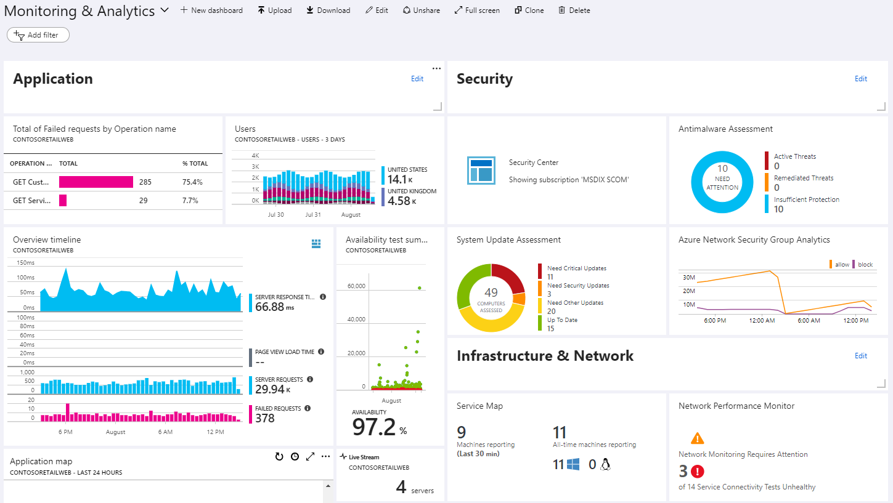

But there are some limitations:

* Limited control over log visualizations with no support for data tables. The total number of data series is limited to 10, with different data series grouped under another bucket.
* No custom parameters support for log charts.
* Log charts are limited to the last 30 days.
* Log charts can only be pinned to shared dashboards.
* No interactivity with dashboard data.
* Limited contextual drill-down.

### Examine view designer in Azure Monitor

View Designer in Azure Monitor allows you to create custom visualizations with log data. They're used by monitoring solutions to present the data they collect. They should be used when you want to have:

* Rich visualizations for log data.
* Export and import views to transfer them to other resource groups and subscriptions.
* Integrates into Log Analytic management model with workspaces and monitoring solutions.
* Filters for custom parameters.
* Interactive supports multi-level drill-in (a view that drills into another view).

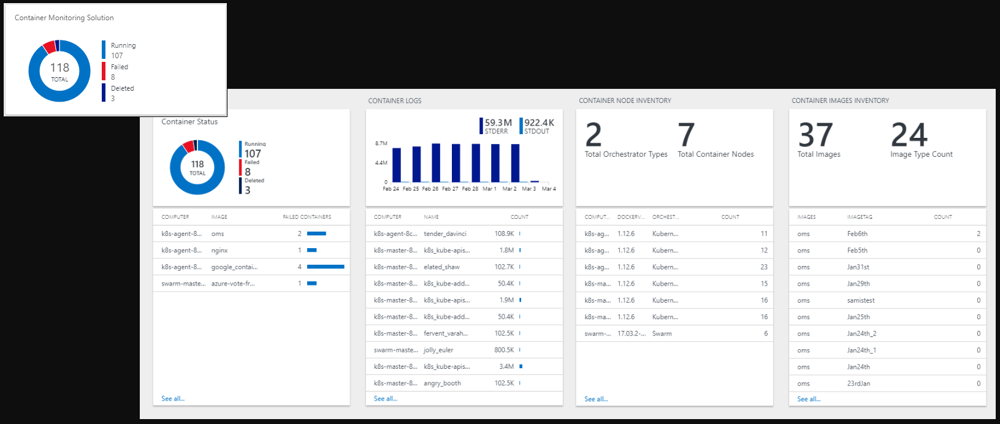

But there are some limitations:

* Supports logs but not metrics.
* No personal views. Available to all users with access to the workspace.
* No automatic refresh.
* Limited layout options.
* No support for querying across multiple workspaces or Application Insights applications.
* Queries are limited in response size to 8 MB and query execution time of 110 seconds.

### Explore Azure Monitor workbooks

Workbooks are interactive documents that provide deep insights into your data, investigation, and collaboration inside the team. Specific examples where workbooks are helpful are troubleshooting guides and incident postmortem. They should be used when you want to have:

* Supports both metrics and logs.
* Supports parameters enabling interactive reports selecting an element in a table will dynamically update associated charts and visualizations.
* Document-like flow.
* Option for personal or shared workbooks.
* Easy, collaborative-friendly authoring experience.
* Templates support the public GitHub-based template gallery.

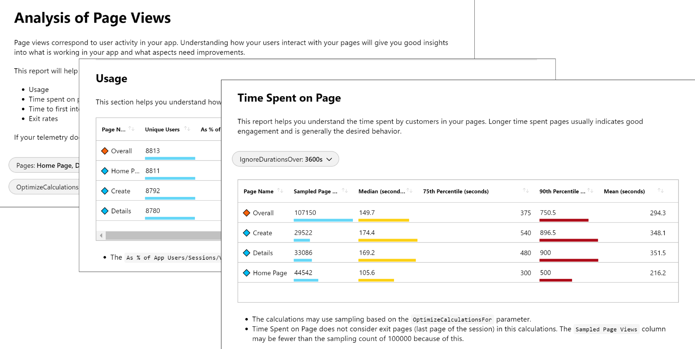

But there are some limitations:

* No automatic refresh.
* No dense layout like dashboards, which make workbooks less useful as a single pane of glass. It's intended more for providing more profound insights.

### Explore Power BI

Power BI is beneficial for creating business-centric dashboards and reports analyzing long-term KPI trends. You can import the results of a log query into a Power BI dataset to take advantage of its features, such as combining data from different sources and sharing reports on the web and mobile devices. It should be used when you want to have:

* Rich visualizations.
* Extensive interactivity, including zoom-in and cross-filtering.
* Easy to share throughout your organization.
* Integration with other data from multiple data sources.
* Better performance with results cached in a cube.

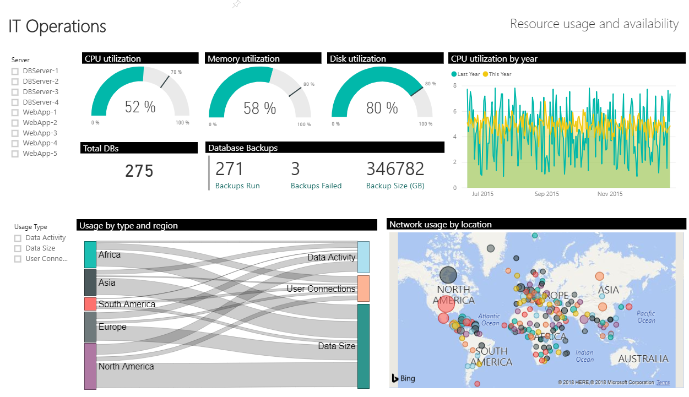

But there are some limitations:

* It supports logs but not metrics.
* No Azure RM integration. Can't manage dashboards and models through Azure Resource Manager.
* Need to import query results need into the Power BI model to configure. Limitation on result size and refresh.

### Explore your own custom application

You can access data in log and metric data in Azure Monitor through their API using any REST client. It allows you to build your custom websites and applications. It should be used when you want to have:

* Complete flexibility in UI, visualization, interactivity, and features.
* Combine metrics and log data with other data sources.

But like the documentation says, there is only one disadvantage:

* Significant engineering effort is required.
