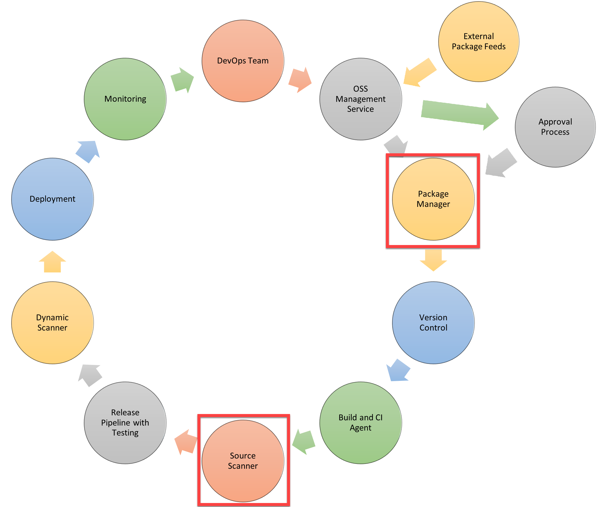

# Implement security and validate code bases for compliance

Infrastructure and configuration strategy and appropriate toolset for a release pipeline and application infrastructure. What do you want more?

## Introduction to Secure DevOps

DevSecOps incorporates the security team and their capabilities into your DevOps practices making security the responsibility of everyone on the team. Security needs to shift from an afterthought to being evaluated at every process step.

### Describe SQL injection attack

### Understand DevSecOps

Secure DevOps includes these traditional security methodologies and more. With Secure DevOps, security is about securing the pipeline. It involves determining where to add protection to the elements that plug into your build and release pipelines.

It also addresses broader questions, such as:

* Is my pipeline consuming third-party components, and are they secure?
* Are there known vulnerabilities within any of the third-party software we use?
* How quickly can I detect vulnerabilities (also called time to detect)?
* How quickly can I remediate identified vulnerabilities (also known as time to remediate)?

### Explore Secure DevOps Pipeline

Two essential features of Secure DevOps Pipelines that aren't found in standard DevOps Pipelines are:

* Package management and the approval process associated with it. The workflow diagram details other steps for adding software packages to the Pipeline and the approval processes that packages must go through before they're used. These steps should be enacted early in the Pipeline to identify issues sooner in the cycle.
* Source Scanner is also an extra step for scanning the source code. This step allows for security scanning and checking for vulnerabilities that aren't present in the application code. The scanning occurs after the app is built before release and pre-release testing. Source scanning can identify security vulnerabilities earlier in the cycle.

## Implement open-source software

Explores open-source software and corporate concerns with software components.

### What is open-source software

Wikipedia defines open-source software as follows:

*Open-source software is a type of computer software in which source code is released under a license in which the copyright holder grants users the rights to study, change, and distribute the software to anyone and for any purpose.*

Being responsible for the source code used in components used within a company means that you must accept its risks. The concerns are that source code component:

* ... are of low quality. It would impact the maintainability, reliability, and performance of the overall solution.
* ... have no active maintenance. The code wouldn't evolve or be alterable without copying the source code, effectively forking away from the origin.
* ... contain malicious code. The entire system that includes and uses the code will be compromised. Potentially the whole company's IT and infrastructure is affected.
* ... have security vulnerabilities. The security of a software system is as good as its weakest part. Using source code with vulnerabilities makes the entire system susceptible to attack by hackers and misuse.
* ... have unfavorable licensing restrictions. The effect of a license can affect the entire solution that uses the open-source software.

### Introduction to open-source licenses

A license describes how the source code and the components built from it can be used and how any software created with it should deal with it. According to the open-source definition of OpenSource.org, a license shouldn't:

* Discriminate against persons or groups.
* Discriminate against fields of endeavor.
* Be specific to a product.
* Restrict other software.
* And more - See the [Open Source Definition](https://opensource.org/osd/).

There are a couple of different types of licenses:

The following list describes the most common licenses shown in the diagram:

1. **BSD (Berkeley Software Distribution)**
   * *Description*: A permissive license with minimal restrictions on use, modification, and distribution. It allows for proprietary use and doesn't require disclosure of source code.
   * *When to use*: When you want to allow others to use your code with minimal restrictions and don't require sharing of modifications.
2. **MIT (Massachusetts Institute of Technology)**
   * *Description*: A permissive license similar to the BSD license, with fewer conditions. It allows for proprietary use and doesn't require disclosure of source code.
   * *When to use*: When you want a simple, permissive license that allows others to use, modify, and distribute your code with minimal restrictions.
3. **Apache License 2.0**
   * *Description*: A permissive license that allows for proprietary use, modification, and distribution of software. It includes explicit patent and trademark protection provisions.
   * *When to use*: When you want to allow others to use your code with minimal restrictions and provide patent and trademark protection.
4. **MPL (Mozilla Public License)**
   * *Description*: A weak copyleft license that requires modifications to the licensed code to be released under the same license, but allows for proprietary use of unmodified code.
   * *When to use*: When you want to encourage sharing of modifications to your code while allowing proprietary use of the unmodified code.
5. **EPL (Eclipse Public License)**
   * *Description*: A weak copyleft license similar to the MPL that requires modifications to the licensed code to be released under the same license, but allows for proprietary use of unmodified code.
   * *When to use*: When you want to encourage sharing of modifications to your code while allowing proprietary use of the unmodified code, and when working on projects related to the Eclipse ecosystem.
6. **MS-RL (Microsoft Reciprocal License)**
   * *Description*: A weak copyleft license that requires modifications to the licensed code to be released under the same license, but allows for proprietary use of unmodified code.
   * *When to use*: When you want to encourage sharing of modifications to your code while allowing proprietary use of the unmodified code, and when working on projects related to the Microsoft ecosystem.
7. **GPL (GNU General Public License)**
   * *Description*: A strong copyleft license that requires any derived works to be released under the same license, ensuring that modifications and improvements are also open source.
   * *When to use*: When you want to ensure that any modifications or improvements to your code are also open source and freely available.
8. **LGPL (GNU Lesser General Public License)**
   * *Description*: A weaker version of the GPL that allows for linking with proprietary software, while still requiring any changes to the LGPL-licensed code to be released under the same license.
   * *When to use*: When you want to allow your code to be used in proprietary software, but still require any modifications to the LGPL-licensed code to be open source.
9. **AGPL (GNU Affero General Public License)**
   * *Description*: A strong copyleft license similar to the GPL, with an additional requirement that if the software is used over a network, users must have access to the source code.
   * *When to use*: When you want to ensure that any modifications or improvements to your code are also open source, and when you want to require that users accessing the software over a network have access to the source code.

## Software Composition Analysis

Explains Composition Analysis, inspecting and validating code bases for compliance, integration with security tools, and integration with Azure Pipelines.

### Explore software composition analysis

Software Composition Analysis (SCA) is a set of tools that provides visibility into the open-source components used in your software. It helps you identify and remediate security and compliance issues in your code base. There are two SCA tools that are being described:

* [WhiteSource](https://www.whitesourcesoftware.com/):
  * It can be integrated into Azure Pipelines to provide visibility into the open-source components used in your software.
  * It can automatically generate an alert and provides targeted remediation guidance when a new security vulnerability is discovered.
  * If configured, it can automatically approves, rejects, or triggers a manual approval process every time a new open-source component is added to a build.
* [Github Dependabot](https://dependabot.com/):
  * It can create a notification for when:
    * A new vulnerability is added to the GitHub Advisory database.
    * A new vulnerability data from Mend is processed.
    * A dependency graph for a repository changes.
  * A key advantage of Dependabot security updates is that they can automatically create pull requests.

### Integrate software composition analysis checks into pipelines

Azure Marketplace extensions that help integrate software composition analysis checks during PRs include:

* **Mend**. Helps validate dependencies with its binary fingerprinting.
* **Checkmarx**. Provides an incremental scan of changes.
* **Veracode**. Implements the concept of a developer sandbox.
* **Black Duck by Synopsis**. An auditing tool for open-source code to help identify, fix, and manage compliance.

Here is a simple diagram of how the SCA tools can be integrated into the pipeline:

To correctly interpret the results of scanning tools, you need to be aware of some aspects:

* **False positives**: It's essential to verify the findings to be real positives in the scan results. The tooling is an automated way to scan and might be misinterpreting specific vulnerabilities. In the triaging of the finding in the scan results, you should be aware that some findings might not be correct. Such results are called false positives, established by human interpretation and expertise. One must not declare a result a false positive too quickly. On the other hand, scan results aren't guaranteed to be 100% accurate.
* **Security bug bar**: Most likely, many security vulnerabilities will be detected—some of these false positives, but still many findings. More findings can often be handled or mitigated, given a certain amount of time and money. In such cases, there must be a security bug bar indicating the level of vulnerabilities that must be fixed before the security risks are acceptable enough to take the software into production. The bug bar makes sure that it's clear what must be taken care of and what might be done if time and resources are left.
