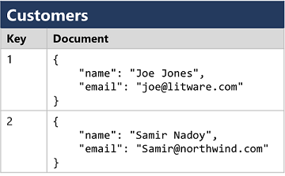
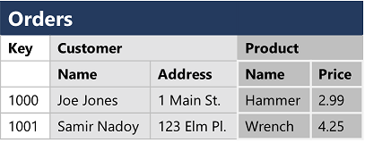

# Explore core data concepts

The first chapter in a this journey.

## Explore core data concepts (the chapter)

The capability to capture, store, and analyze data is a core requirement for every organization in the world. So better you learn about it.

### Identify data formats

Data comes in two forms:

- **Entities**: These are the names of data structures that are important for the organization (customers, products, etc.)
- **Attributes**: This is extra data that belongs to that entity (a customer his name, address, phone number, etc.)

You can also classify data. This comes in three types:

- **Structured data** adheres to a *fixed schema* (so all data has the same fields/properties). It's also *tabular* which means that an entity is represented over one or more tables with rows.
- **Semi-structured data** has some structure, but not every entity is the same (some customers have an email address, some don't). It's mostly written in JSON.
- **Unstructured data** is data that doesn't relate to each other at all (like documents, images, etc.).

### Explore file storage

While your basic computer also does file storage, data needs some more attention:

- What kind of data do we store (structure, semi-structured or unstructured).
- The applications and services that need to read, write and process the data.
- The need for the data files to be readable by humans or optimized for efficient storage and processing.

There are a couple data types that you should know of:

- **Delimited text files**. This is like storing data with specific field delimiters and row terminators. A couple examples of these are:
  - *CSV*, comma-separated values.
  - *TSV*, tab-separated values.
  - White space separated values.
- **JSON (JavaScript Object Notation)**. A ubiquitous format in which a hierarchical document schema is used to define data entities (objects) that have multiple attributes. Each attribute might be an object (or a collection of objects); making JSON a flexible format that's good for both structured and semi-structured data.
- **XML (Extensible Markup Language)**. The earlier version of JSON and human readable.
- **BLOB (Binary Large Object)**. While all files are eventually stored as binary data, but you can also save files directly to this. Mostly used for unstructured data.

There are also some special file formats, optimized for storing data (but not human readable):

- **Avro**. It is a good format for compressing data and minimizing storage and network bandwidth requirements. Each record contains a JSON header that describes the structure of the data in the record. The data is stored as binary information. An application uses the information in the header to parse the binary data and extract the fields it contains.
- **ORC (Optimized Row Columnar format)**. It contains stripes of data. Each stripe holds the data for a column or set of columns. A stripe contains an index into the rows in the stripe, the data for each row, and a footer that holds statistical information (count, sum, max, min, and so on) for each column.
- **Parquet**. It specializes in storing and processing nested data types efficiently. It supports very efficient compression and encoding schemes. Each row group contains one or more chunks of data. A Parquet file includes metadata that describes the set of rows found in each chunk. An application can use this metadata to quickly locate the correct chunk for a given set of rows, and retrieve the data in the specified columns for these rows.

### Explore databases

A database is a system in which data can be stored and queried. There are two kinds of databases:

- **Relational databases** are commonly used to store and query *structured data*. A table represents an entity and each instance has been given a *primary key* to identify the stored entity. The use of primary keys in other tables is called *foreign keys*. By using this keys, the database can be *normalized* which means the elimination of duplication.
- **Non-relational databases (NoSQL)** are used when data doesn't apply to a relation schema. There are actually for common types of these databases:
  - *Key-value databases*. Each record consists of a unique key and an associated value, which can be in any format.
  
  - *Document databases*. A specific form of key-value database in which the value is a JSON document (which the system is optimized to parse and query).
  
  - *Column family databases*. Stores tabular data comprising rows and columns, but you can divide the columns into groups known as column-families. Each column family holds a set of columns that are logically related together.
  
  - *Graph databases*. Store entities as nodes with links to define relationships between them.
  

### Explore transactional data processing

A transactional system records *transactions* that encapsulate specific events that the organization wants to track. The work performed by transactional systems is often referred to as *Online Transactional Processing (OLTP)*. Such a system is performing CRUD operation which should be applied within a transaction. They must support ACID to accomplish this:

- **Atomicity**: each transaction is treated as a single unit, which success completely or fails completely.
- **Consistency**: transactions can only take the data in the database from one valid state to another.
- **Isolation**: concurrent transactions cannot interfere with one another, and must result in a consistent database state.
- **Durability**: when a transaction has been committed, it will remain committed.

### Explore analytical data processing

Analytical data processing typically uses read-only (or read-mostly) systems that store vast volumes of historical data or business metrics. Analytics can be based on a snapshot of the data at a given point in time, or a series of snapshots. It kinda looks like this:

A brief explanation of the picture above:

1. Data files may be stored in a central data lake for analysis.
2. An *extract, transform, and load (ETL)* process copies data from files and OLTP databases into a data warehouse that is optimized for read activity. Commonly, a data warehouse schema is based on fact tables that contain numeric values you want to analyze (for example, sales amounts), with related dimension tables that represent the entities by which you want to measure them (for example, customer or product),
3. Data in the data warehouse may be aggregated and loaded into an online analytical processing (OLAP) model, or cube. Aggregated numeric values (measures) from fact tables are calculated for intersections of dimensions from dimension tables. For example, sales revenue might be totaled by date, customer, and product.
4. The data in the data lake, data warehouse, and analytical model can be queried to produce reports, visualizations, and dashboards.

Some terms to remember:

- *Data lakes*. Place where a large volume of file-based data must be collected and analyzed.
- *Data warehouses*. They are an established way to store data in a relational schema that is optimized for read operations – primarily queries to support reporting and data visualization. The data warehouse schema may require some denormalization of data in an OLTP data source (introducing some duplication to make queries perform faster).
- *OLAP models*. An aggregated type of data storage that is optimized for analytical workloads. Data aggregations are across dimensions at different levels, enabling you to drill up/down to view aggregations at multiple hierarchical levels; for example to find total sales by region, by city, or for an individual address. Because OLAP data is pre-aggregated, queries to return the summaries it contains can be run quickly.