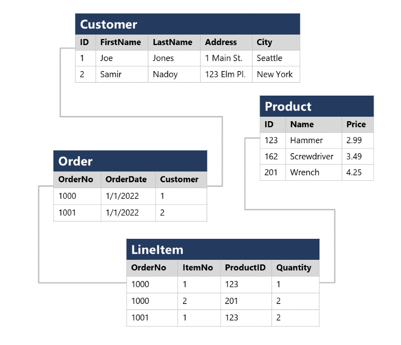

# Explore relational data in Azure

Let's see how that relation stuff works in the second chapter.

## Explore fundamental relational data concepts

This chapter will describe the key characteristics of relational databases, and explore relational data structures.

### Understand relational data

Relational tables are a format for structured data. You model collections of entities from the real world to those tables. Each row inside such a table represents a single instance of an entity and each column can store data of a specific datatype. For example, you can store strings, integers, decimals, date/time, etc.

### Understand normalization

**Normalization** is a term used by database professionals for a schema design process that minimizes data duplication and enforces data integrity. Keep the following practical definition in mind:

  1. Separate each *entity* into its own table.
  2. Separate each discrete *attribute* into its own column.
  3. Uniquely identify each entity instance (row) using a *primary key*.
  4. Use *foreign key* columns to link related entities.

See for example the following two structures of sales data:

This data **is not normalized**.


This data **is normalized**.


In the second picture, there is a good overview of all the entities with their *primary and foreign keys*. Even in the LineItem table there is a use case for a *composite key*, which means that a combination of two or more columns identify the line item.

### Explore SQL

SQL stands for Structured Query Language, and is the standard used to communicate with a relational database. There are some other dialects of this language provided by different vendors like:

- *Transact-SQL (T-SQL)*. Comes from Microsoft SQL server and Azure SQL services.
- *pgSQL*. Comes from PostgreSQL.
- *PL/SQL*. Comes from Oracle.

SQL statements are grouped into three main logical groups:

- **Data Definition Language (DDL)**. Used to create, modify, and remove tables and other objects in a database (table, stored procedures, views, and so on). The most common statements are:
  - *CREATE*: Create a new object in the database, such as a table or a view.
  - *ALTER*: Modify the structure of an object. For instance, altering a table to add a new column.
  - *DROP*: Remove an object from the database.
  - *RENAME*: Rename an existing object.
- **Data Control Language (DCL)**. Used to manage access to objects in a database by granting, denying, or revoking permissions to specific users or groups. The most common statements are:
  - *GRANT*: Grant permission to perform specific actions.
  - *DENY*: Deny permission to perform specific actions.
  - *REVOKE*: Remove a previously granted permission.
- **Data Manipulation Language (DML)**. Used to manipulate rows inside tables. The most common statements are:
  - *SELECT*: Read rows from a table.
  - *INSERT*: Insert new rows into a table.
  - *UPDATE*: Modify data in existing rows.
  - *DELETE*: Delete existing rows.

### Describe database objects

In addition to tables, a relational database can contains other structures that help to optimize data organization, encapsulate programmatic actions, and improve the speed of access. The structures are *views*, *stored procedures* and *indexes*.

A **view** is a virtual table based on the results of a SELECT query. You can think of a view as a window on specified rows in one or more underlying tables. For example, the following query will create a view that holds the combined data of two tables:

```SQL
CREATE VIEW Deliveries
AS
SELECT o.OrderNo, o.OrderDate,
       c.FirstName, c.LastName, c.Address, c.City
FROM Order AS o JOIN Customer AS c
ON o.CustomerID = c.ID;
```

And you can query that view:

```SQL
SELECT OrderNo, OrderDate, LastName, Address
FROM Deliveries
WHERE City = 'Seattle';
```

A **stored procedure** defines SQL statements that can be run on command. Stored procedures are used to encapsulate programmatic logic in a database for actions that applications need to perform when working with data. For example, this rename stored procedure:

```SQL
CREATE PROCEDURE RenameProduct
    @ProductID INT,
    @NewName VARCHAR(20)
AS
UPDATE Product
SET Name = @NewName
WHERE ID = @ProductID;
```

And you can execute it like this:

```SQL
EXEC RenameProduct 201, 'Spanner';
```

An **index** helps you search for data in a table. It creates a tree-based structure that the database system's query optimizer can use to quickly find rows. Think of this like a book, where an index in the back of the book can be used to quickly find the right page. But also with a book, it will take up space and if you have a few rows it can be quicker to just look into the table. Also operations like insert, update and delete can be somewhat slower because of the index.


## Explore relational database services in Azure

There are a couple of options when it comes to relational databases in Azure.

### Describe Azure SQL services and capabilities

**Azure SQL** os a collective name for the following services:

- *SQL Server on Azure Virtual Machines (VMs) (IaaS)*: A virtual machine running in Azure with an installation of SQL Server. Mostly used when you want some operating features not supported in a PaaS or if you are *lifting-and-shifting* from on-premise to the cloud.
  - Create rapid development and test scenarios when you don't want to buy on-premises non-production SQL Server hardware.
  - Become lift-and-shift ready for existing applications that require fast migration to the cloud with minimal changes or no changes.
  - Scale up the platform on which SQL Server is running, by allocating more memory, CPU power, and disk space to the virtual machine. You can quickly resize an Azure virtual machine without the requirement that you reinstall the software that is running on it.
- *Azure SQL Managed Instance (PaaS)*: Basically a SQL Server that provides compatibility with an on-premises SQL Server, but then without all the maintenance (because it's a PaaS). This can also be used for when you want to *lift-and-shift* from on-premise to the cloud.
  - It will use Azure services for backups (Azure storage), telemetry (Azure Event Hugs), authentication (Azure Active Directory) and so on.
  - It has more features than Azure SQL database, like linked servers, a Service Broker or a Database Mail.
- *Azure SQL Database (PaaS)*: Again, basically a SQL Server but this time designed for the cloud. This is the lowest cost and most minimal administration of them all. It is mostly used with new applications that require high availability and can be scaled up and down quickly. There are two types:
  - **Single Database**. A single SQL Server database.
  - **Elastic Pool**. Multiple databases that will use the same resources such as memory, data storage and processing power.
- *Azure SQL Edge*: A SQL engine that is optimized for Internet-of-things (IoT) scenarios that need to work with streaming time-series data.

### Describe Azure services for open-source databases

Azure supports a number of *open-source* databases:

- *Azure Databases for MySQL*: The leading open source relational database for Linux, Apache, MySQL, and PHP (LAMP) stack apps. Because it's offered as a PaaS solution, it will have features like a high availability and scalability. It comes in two versions:
  - *Azure Database for MySQL Flexible Server*: Provides more granular control and flexibility over database management functions and configuration settings. It's recommended for new developments or migrations.
  - *Azure Database for MySQL Single Server*: Just a single database server. Are the best for existing applications already using single server.
- *Azure Database for MariaDB*: Build by the developers of MySQL, MariaDB is rewritten and optimized to improve performance. This version is based on the MariaDB Community Edition.
- *Azure Database for PostgreSQL*: A PaaS solution for PostgreSQL that provides the same availability, performance, scaling, security, and administrative benefits as the MySQL service. Some features are not supported though. These features are mostly concerned with the extensions that users can add to a database to perform specialized tasks, such as writing stored procedures in various programming languages (other than pgsql, which is available), and interacting directly with the operating system. One special feature is that it saves queries in the *azure_sys* database. You can query the *query_store.qs_view* to view them. It also comes with multiple versions:
  - *Azure Database for PostgreSQL Single Server*: A single server that has three pricing tiers: Basic, General Purpose and Memory Optimized (all with different CPU's, memory and storage size).
  - *Azure Database for PostgreSQL Flexible Server*: It provides more control and server configuration customizations than the single server one, and has better cost optimization controls.
  - *Azure Database for PostgreSQL Hyperscale (Citus)*: This database scales queries across multiple server nodes to support large database loads. Your database is split across nodes. Data is split into chunks based on the value of a partition key or sharding key. Consider using this deployment option for the largest database PostgreSQL deployments in the Azure Cloud.

TODO: do the exersise: https://docs.microsoft.com/en-us/learn/modules/explore-provision-deploy-relational-database-offerings-azure/4-exercise-provision-relational-azure-data-services?pivots=azuresql
