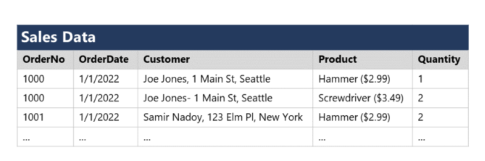

# Explore relational data in Azure

Let's see how that relation stuff works in the second chapter.

## Explore fundamental relational data concepts

This chapter will describe the key characteristics of relational databases, and explore relational data structures.

### Understand relational data

Relational tables are a format for structured data. You model collections of entities from the real world to those tables. Each row inside such a table represents a single instance of an entity and each column can store data of a specific datatype. For example, you can store strings, integers, decimals, date/time, etc.

### Understand normalization

**Normalization** is a term used by database professionals for a schema design process that minimizes data duplication and enforces data integrity. Keep the following practical definition in mind:

  1. Separate each *entity* into its own table.
  2. Separate each discrete *attribute* into its own column.
  3. Uniquely identify each entity instance (row) using a *primary key*.
  4. Use *foreign key* columns to link related entities.

See for example the following two structures of sales data:

This data **is not normalized**.


This data **is normalized**.


In the second picture, there is a good overview of all the entities with their *primary and foreign keys*. Even in the LineItem table there is a use case for a *composite key*, which means that a combination of two or more columns identify the line item.

### Explore SQL

SQL stands for Structured Query Language, and is the standard used to communicate with a relational database. There are some other dialects of this language provided by different vendors like:

- *Transact-SQL (T-SQL)*. Comes from Microsoft SQL server and Azure SQL services.
- *pgSQL*. Comes from PostgreSQL.
- *PL/SQL*. Comes from Oracle.

SQL statements are grouped into three main logical groups:

- **Data Definition Language (DDL)**. Used to create, modify, and remove tables and other objects in a database (table, stored procedures, views, and so on). The most common statements are:
  - *CREATE*: Create a new object in the database, such as a table or a view.
  - *ALTER*: Modify the structure of an object. For instance, altering a table to add a new column.
  - *DROP*: Remove an object from the database.
  - *RENAME*: Rename an existing object.
- **Data Control Language (DCL)**. Used to manage access to objects in a database by granting, denying, or revoking permissions to specific users or groups. The most common statements are:
  - *GRANT*: Grant permission to perform specific actions.
  - *DENY*: Deny permission to perform specific actions.
  - *REVOKE*: Remove a previously granted permission.
- **Data Manipulation Language (DML)**. Used to manipulate rows inside tables. The most common statements are:
  - *SELECT*: Read rows from a table.
  - *INSERT*: Insert new rows into a table.
  - *UPDATE*: Modify data in existing rows.
  - *DELETE*: Delete existing rows.

### Describe database objects

In addition to tables, a relational database can contains other structures that help to optimize data organization, encapsulate programmatic actions, and improve the speed of access. The structures are *views*, *stored procedures* and *indexes*.

A **view** is a virtual table based on the results of a SELECT query. You can think of a view as a window on specified rows in one or more underlying tables. For example, the following query will create a view that holds the combined data of two tables:

```SQL
CREATE VIEW Deliveries
AS
SELECT o.OrderNo, o.OrderDate,
       c.FirstName, c.LastName, c.Address, c.City
FROM Order AS o JOIN Customer AS c
ON o.CustomerID = c.ID;
```

And you can query that view:

```SQL
SELECT OrderNo, OrderDate, LastName, Address
FROM Deliveries
WHERE City = 'Seattle';
```

A **stored procedure** defines SQL statements that can be run on command. Stored procedures are used to encapsulate programmatic logic in a database for actions that applications need to perform when working with data. For example, this rename stored procedure:

```SQL
CREATE PROCEDURE RenameProduct
    @ProductID INT,
    @NewName VARCHAR(20)
AS
UPDATE Product
SET Name = @NewName
WHERE ID = @ProductID;
```

And you can execute it like this:

```SQL
EXEC RenameProduct 201, 'Spanner';
```

An **index** ...

TODO: Create stuff about the index.
