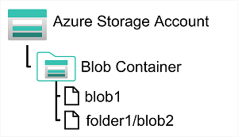
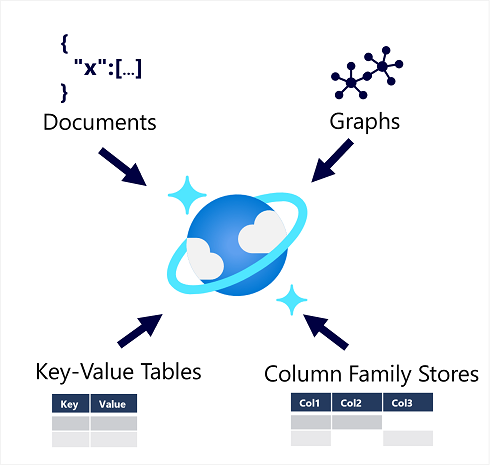

# Explore non-relational data in Azure

Let's see how that relation stuff works in the third chapter.

## Explore non-relational data in Azure the chapter

This chapter will describe the key characteristics of non-relational databases.

### Explore Azure blob storage

*Azure Blob Storage* is a service that enables you to store massive amounts of unstructured data as binary large objects, or blobs, in the cloud.



If you store a blob on Azure, you store it inside a **container**. This way, you can organize blobs and control who can access which container. Because they are virtual, you can't perform folder-level operations on it (like bulk operations).

There are three different blob types:

- **Block blobs**: Contains of a set of blocks that can vary in size (max. 100 MB). It can be as large as 50.000 blocks with a maximum size of 4.7 TB. The block is the smallest amount of data that can be read or written as an individual unit. Block blobs are best used to store discrete, large, binary objects that change infrequently.
- **Page blobs**: Organized as a collection of fixed size 512-byte pages. A page blob is optimized to support random read and write operations; you can fetch and store data for a single page if necessary. A page blob can hold up to 8 TB of data. Azure uses page blobs to implement virtual disk storage for virtual machines.
- **Append blobs**: Optimized to support append operations. You can only add blocks to the end of an append blob; updating or deleting existing blocks isn't supported. Each block can vary in size, up to 4 MB. The maximum size of an append blob is just over 195 GB.

It also has three access tiers that can be automatically modified by a **Lifecycle management policy**. These access tiers are as follows:

- **Hot**: Intended for blobs that are accessed frequently.
- **Cool**: Intended for blobs that are accessed infrequently.
- **Archive**: Intended for blobs that are accessed rarely. Blobs in the Archive tier are effectively stored in an offline state. To retrieve a blob from the Archive tier, you must change the access tier to Hot or Cool. The blob will then be rehydrated. You can read the blob only when the rehydration process is complete.

### Explore Azure DataLake Storage Gen2

**Azure Data Lake Store (Gen1) / Data Lake Storage Gen2** is a separate service for hierarchical data storage for analytical data lakes, often used by so-called *big data* analytical solutions that work with structured, semi-structured, and unstructured data stored in files. With Gen2, you can take advantage of the scalability of blob storage and the cost-control of storage tiers, combined with the hierarchical file system capabilities and compatibility with major analytics systems of Azure Data Lake Store.


Systems like Hadoop in *Azure HDInsight, Azure Databricks, and Azure Synapse Analytics* can mount a distributed file system hosted in Azure Data Lake Store Gen2 and use it to process huge volumes of data. You can enable this by turning on the **Hierarchical Namespace** option of an Azure Storage account. This is a one-way process and so it can't be reverted.

### Explore Azure Files

**Azure Files** is essentially a way to create cloud-based network shares, such as you typically find in on-premises organizations to make documents and other files available to multiple users.


It enables you to share up to 100 TB of data in a single storage account. This data can be distributed across any number of file shares in the account. The maximum size of a single file is 1 TB, but you can set quotas to limit the size of each share below this figure. Currently, it supports up to 2000 concurrent connections per shared file. 

By using *AzCopy* or *Azure File Sync*, you can upload and synchronize your files with Azure. It also offers two performance tiers, where the main difference is that *Standard* is using HDDs and *Premium* is using SSDs. It also supports the two most common network file sharing protocols: SMB (Server Message Block, used across multiple OS's) and NFS (Network File System, used by some Linux and MacOS versions).

### Explore Azure Tables

**Azure Table Storage** is a NoSQL storage solution that makes use of tables containing key/value data items. Each item is represented by a row that contains columns for the data fields that need to be stored.


All rows in a table must have a *unique key* (composed of a partition key and a row key), and when you modify data in a table, a *timestamp column* records the date and time the modification was made. It is usually denormalized and there is no such thing as foreign keys, relationships, etc. To ensure fast access, Azure Table Storage splits a table into partitions. Partitioning is a mechanism for grouping related rows, based on a common property or partition key. Rows that share the same partition key will be stored together. By including the partition key in the search criteria, it will narrow down the volume of data to be examined.

The key in an Azure Table Storage table comprises two elements; *the partition key* that identifies the partition containing the row, and *a row key* that is unique to each row in the same partition. Items in the same partition are stored in row key order. If an application adds a new row to a table, Azure ensures that the row is placed in the correct position in the table. This scheme enables an application to quickly perform point queries that identify a single row, and range queries that fetch a contiguous block of rows in a partition.

## Explore fundamentals of Azure Cosmos DB

Azure Cosmos DB is a highly scalable cloud database service for NoSQL data.

### Describe Azure Cosmos DB

Cosmos DB is a highly scalable database management system. It uses **indexes and partitioning** to provide fast read and write performance and can scale to massive volumes of data. You can enable **multi-region writes**, adding the Azure regions of your choice to your Cosmos DB account so that globally distributed users can each work with data in their local replica. Cosmos DB **automatically allocates space in a container for your partitions**, and each partition can grow up to 10 GB in size. **Indexes are created and maintained automatically**. There's virtually no administrative overhead.



### Identify Azure Cosmos DB APIs

There are multiple API's to work with when using Cosmos DB:

- **Core (SQL) API**: Uses SQL to query the data.

  ```SQL
  SELECT *
  FROM customers c
  WHERE c.id = "joe@litware.com"
  ```

  With as response:

  ```JSON
  {
   "id": "joe@litware.com",
   "name": "Joe Jones",
   "address": {
        "street": "1 Main St.",
        "city": "Seattle"
    }
  }
  ```

- **MongoDB API**: This enables developers to use MongoDB client libraries to and code to work with data in Azure Cosmos DB. It uses a compact, object-oriented syntax in which developers use objects to call methods:

  ```JavaScript
  db.products.find({id: 123})
  ```

  ```JSON
  {
   "id": 123,
   "name": "Hammer",
   "price": 2.99}
  }
  ```

- **Table API**: This is used to work with data in key-value tables, similar to Azure Table Storage (but it has greater scalability and performance).

  | PartitionKey | RowKey |     Name    |        Email        |
  |:------------:|:------:|:-----------:|:-------------------:|
  | 1            | 123    | Joe Jones   | joe@litware.com     |
  | 1            | 124    | Samir Nadoy | samir@northwind.com |
  
  One of the methods to retrieve this data is by using the Cosmos DB Table API:

  ```Text
  https://endpoint/Customers(PartitionKey='1',RowKey='124')
  ```

- **Cassandra API**: This uses a column-family storage structure. Column families are tables, similar to those in a relational database, with the exception that it's not mandatory for every row to have the same columns.

  | ID |    Name   |  Manager  |
  |:--:|:---------:|:---------:|
  | 1  | Sue Smith |           |
  | 2  | Ben Chan  | Sue Smith |

  It supports syntax based on SQL:

  ```SQL
  SELECT * FROM Employees WHERE ID = 2
  ```

- **Gremlin API**: It used with data in a graph structure; in which entities are defined as vertices that form nodes in connected graph. Nodes are connected by edges that represent relationships, like this:

  

  The syntax includes functions to operate on vertices and edges, enabling you to insert, update, delete, and query data in the graph. For example, you could use the following code to add a new employee named Alice that reports to the employee with ID 1 (Sue):

  ```Text
  g.addV('employee').property('id', '3').property('firstName', 'Alice')
  g.V('3').addE('reports to').to(g.V('1'))
  ```

  And with this query you can return all employee vertices:

  ```Text
  g.V().hasLabel('employee').order().by('id')
  ```
