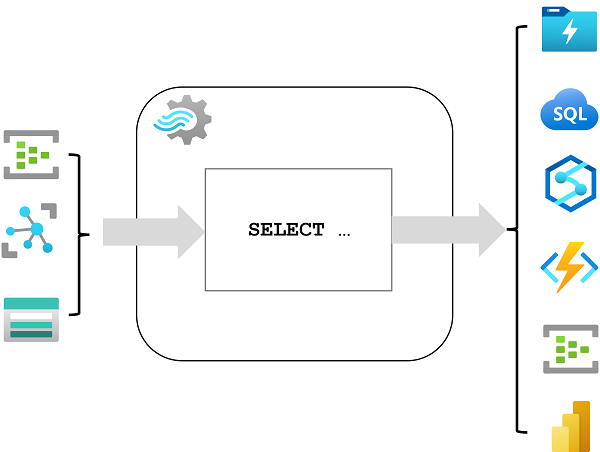
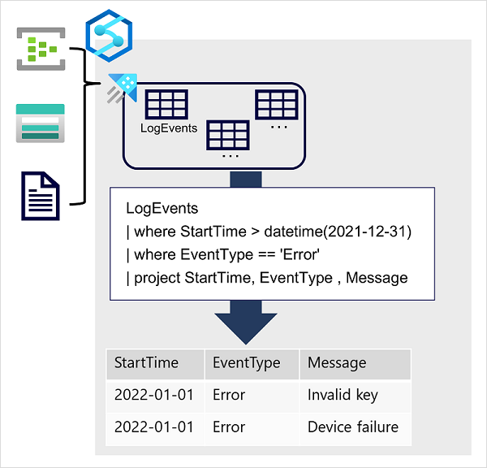

# Explore data analytics in Azure

Data analytics for the big data guys.

## Explore fundamentals of modern data warehousing

Send structured transactional database to a data lake for the data science people.

### Describe modern data warehousing

Generally, the following workflow is present:


1. **Data ingestion and processing**: data from one or more transactional data stores, files, real-time streams, or other sources is loaded into a data lake or a relational data warehouse. The load operation usually involves an *extract, transform, and load (ETL)* or *extract, load, and transform (ELT)* process in which the data is cleaned, filtered, and restructured for analysis:
   - In *ETL processes*, the data is transformed before being loaded into an analytical store.
   - In *ELT processes*, the data is copied to the store and then transformed.

    Either way, the resulting data structure is optimized for analytical queries. The data processing is often performed by distributed systems that can process high volumes of data in parallel using multi-node clusters. Data ingestion includes both batch processing of static data and real-time processing of streaming data.
2. **Analytical data store**: data stores for large scale analytics include relational data warehouses, file-system based data lakes, and hybrid architectures that combine features of data warehouses and *data lakes* (sometimes called data lakehouses or lake databases).
3. **Analytical data model**: while data analysts and data scientists can work with the data directly in the analytical data store, it’s common to create one or more data models that pre-aggregate the data to make it easier to produce reports, dashboards, and interactive visualizations. Often these data models are described as cubes, in which numeric data values are aggregated across one or more dimensions (for example, to determine total sales by product and region).
4. **Data visualization**: data analysts consume data from analytical models, and directly from analytical stores to create reports, dashboards, and other visualizations. Additionally, users in an organization who may not be technology professionals might perform self-service data analysis and reporting.

### Explore data ingestion pipelines

The following picture describes how data is ingested into an analytical data store:


A **pipeline** consists of one or more *activities* that operate on the data. You can create and run pipelines using *Azure Data Factory*, or you can use the same pipeline engine in *Azure Synapse Analytics* if you want to manage all of the components of your data warehousing solution in a unified workspace. Pipelines use *linked services* to load and process data – enabling you to use the right technology for each step of the workflow (for example Azure Blob => Azure SQL Database => Azure Databricks).

### Explore analytical data stores

There are two common types for analytical data storage:


First up is the *data warehouse*. This is a relational database in which the data is stored in a schema that is optimized for data analytics rather than transactional workloads. The data from a transactional store is *denormalized* into a schema in which numeric values are stored in central fact tables, which are related to one or more dimension tables that represent entities by which the data can be aggregated.


Out of this data, a *star schema* is generated. This holds two things:

- *Dimension tables*: They describe the business entities like products, people, places, etc. It contains a key column (or columns) that acts as a unique identifier, and descriptive columns.
- *Fact tables*: It stores observations or events. Furthermore, it contains dimension key columns that relate to dimension tables, and numeric measure columns. The dimension key columns determine the *dimensionality* of a fact table, while the dimension key values determine the *granularity* of a fact table.

A data warehouse is a great choice when you have transactional data that can be organized into a structured schema of tables, and you want to use SQL to query them.


Then we have the *data lake*. It is a file store, usually on a distributed file system for high performance data access. Technologies like *Spark or Hadoop* are often used to process queries on the stored files and return data for reporting and analytics. These systems often apply a *schema-on-read* approach to define tabular schemas on semi-structured data files at the point where the data is read for analysis, without applying constraints when it's stored.

Data lakes are great for supporting a mix of structured, semi-structured, and even unstructured data that you want to analyze without the need for schema enforcement when the data is written to the store.

By combining the two data storages, you get a *lake database* or *data lakehouse*. For example, *Azure Synapse Analytics* includes **PolyBase** which enables you to define external tables based on files in a datalake (and other sources) and query them using SQL (data lakehouse). It also supports a lake database approach in which you can use database templates to define the relational schema of your data warehouse, while storing the underlying data in data lake storage – separating the storage and compute for your data warehousing solution. In Spark-based systems this is called *Delta Lake*, but it's relative new.

There are three Azure services that you can use to **implement a large-scale analytical store**:

-  *Azure Synapse Analytics* is a unified, end-to-end solution for large scale data analytics containing a SQL Server based relational data warehouse with the flexibility of a data lake and open-source Apache Spark. It includes native support for log and telemetry analytics with Azure Synapse Data Explorer pools, as well as built in data pipelines for data ingestion and transformation. All of this can be managed through *Azure Synapse Studio*, which includes the ability to create interactive notebooks in which Spark code and markdown content can be combined.
-  *Azure Databricks* is an Azure implementation of the popular Databricks platform including data analytics solution built on Apache Spark, and offers native SQL capabilities as well as workload-optimized Spark clusters for data analytics and data science. You might want to consider using Azure Databricks as your analytical store if you want to use existing expertise with the platform or if you need to operate in a multi-cloud environment or support a cloud-portable solution.
-  *Azure HDInsight* is an Azure service that supports multiple open-source data analytics cluster types. Although not as user-friendly as Azure Synapse Analytics and Azure Databricks, it can be a suitable option if your analytics solution relies on multiple open-source frameworks or if you need to migrate an existing on-premises Hadoop-based solution to the cloud.

Each of these services can be thought of as an analytical data store, in the sense that they provide a schema and interface through which the data can be queried. In many cases however, the data is actually stored in a data lake and the service is used to process the data and run queries. Some solutions might even combine the use of these services. An extract, load, and transform (ELT) ingestion process might copy data into the data lake, and then use one of these services to transform the data, and another to query it. For example, a pipeline might use a MapReduce job running in HDInsight or a notebook running in Azure Databricks to process a large volume of data in the data lake, and then load it into tables in a SQL pool in Azure Synapse Analytics.

## Explore fundamentals of real-time analytics

Exploring processing real-time data.

### Understand batch and stream processing

Data processing is simply the conversion of raw data to meaningful information through a process. There are two general ways:

- *Batch processing*, in which multiple data records are collected and stored before being processed together in a single operation.
- *Stream processing* in which a source of data is constantly monitored and processed in real time as new data events occur.

In **batch processing**, newly arriving data elements are collected and stored, and the whole group is processed together as a batch. Exactly when each group is processed can be determined in a number of ways like for example on a scheduled time interval or when a certain amount of data is received.

In **stream processing**, each new piece of data is processed when it arrives. Unlike batch processing, there's no waiting until the next batch processing interval - data is processed as individual units in real-time rather than being processed a batch at a time.

There are certain differences between the two apart from the way they handle the data:

- *Data scope*: Batch processing can process all the data in the dataset. Stream processing typically only has access to the most recent data received, or within a rolling time window (the last 30 seconds, for example).
- *Data size*: Batch processing is suitable for handling large datasets efficiently. Stream processing is intended for individual records or micro batches consisting of few records.
- *Performance*: Latency is the time taken for the data to be received and processed. The latency for batch processing is typically a few hours. Stream processing typically occurs immediately, with latency in the order of seconds or milliseconds.
- *Analysis*: You typically use batch processing to perform complex analytics. Stream processing is used for simple response functions, aggregates, or calculations such as rolling averages.

There is also this case where you combine batch and stream processing:


1. Data events from a streaming data source are captured in real-time.
2. Data from other sources is ingested into a data store (often a data lake) for batch processing.
3. If real-time analytics is not required, the captured streaming data is written to the data store for subsequent batch processing.
4. When real-time analytics is required, a stream processing technology is used to prepare the streaming data for real-time analysis or visualization; often by filtering or aggregating the data over temporal windows.
5. The non-streaming data is periodically batch processed to prepare it for analysis, and the results are persisted in an analytical data store (often referred to as a data warehouse) for historical analysis.
6. The results of stream processing may also be persisted in the analytical data store to support historical analysis.
7. Analytical and visualization tools are used to present and explore the real-time and historical data.

### Explore common elements of stream processing architecture

Stream processing mostly looks like this:


1. First you have an event that generates some data.
2. The generated data is captured in a streaming source for processing, like a folder in a cloud data store or a queue.
3. The event data is processed, often by a perpetual query that operates on the event data to select data for specific types of events, project data values, or aggregate data values over temporal (time-based) periods (or windows).
4. The results of the stream processing operation are written to an output (or sink), which may be a file, a database table, a real-time visual dashboard, or something else.

Microsoft offers some solutions for this. Under the term *Real-time analytics*, we have:

- *Azure Stream Analytics*: A platform-as-a-service (PaaS) solution that you can use to define streaming jobs that ingest data from a streaming source, apply a perpetual query, and write the results to an output.
- *Spark Structured Streaming*: An open-source library that enables you to develop complex streaming solutions on Apache Spark based services, including Azure Synapse Analytics, Azure Databricks, and Azure HDInsight.
- *Azure Data Explorer*: A high-performance database and analytics service that is optimized for ingesting and querying batch or streaming data with a time-series element, and which can be used as a standalone Azure service or as an Azure Synapse Data Explorer runtime in an Azure Synapse Analytics workspace.

There are also a couple of Azure *sources* for stream processing:

- *Azure Event Hubs*: A data ingestion service that you can use to manage queues of event data, ensuring that each event is processed in order, exactly once.
- *Azure IoT Hub*: A data ingestion service that is similar to Azure Event Hubs, but which is optimized for managing event data from Internet-of-things (IoT) devices.
- *Azure Data Lake Store Gen 2*: A highly scalable storage service that is often used in batch processing scenarios, but which can also be used as a source of streaming data.
- *Apache Kafka*: An open-source data ingestion solution that is commonly used together with Apache Spark. You can use Azure HDInsight to create a Kafka cluster.

And there are also a couple of Azure *sinks*:

- *Azure Event Hubs*: Used to queue the processed data for further downstream processing.
- *Azure Data Lake Store Gen 2* or *Azure blob storage*: Used to persist the processed results as a file.
- *Azure SQL Database* or *Azure Synapse Analytics*, or *Azure Databricks*: Used to persist the processed results in a database table for querying and analysis.
- *Microsoft Power BI*: Used to generate real time data visualizations in reports and dashboards.

### Explore Azure Stream Analytics

**Azure Stream Analytics** is a service for complex event processing and analysis of streaming data. Stream Analytics is used to:

- Ingest data from an input, such as an Azure event hub, Azure IoT Hub, or Azure Storage blob container.
- Process the data by using a query to select, project, and aggregate data values.
- Write the results to an output, such as Azure Data Lake Gen 2, Azure SQL Database, Azure Synapse Analytics, Azure Functions, Azure event hub, Microsoft Power BI, or others.

Azure Stream Analytics is a great technology choice when you need to continually capture data from a streaming source, filter or aggregate it, and send the results to a data store or downstream process for analysis and reporting.



To use this, you'll need to create a **Stream Analytics job** in an Azure subscription, configure its *input(s) and output(s)*, and define the query that the job will use to process the data. The query is expressed using structured query language (SQL) syntax, and can incorporate static reference data from multiple data sources to supply lookup values that can be combined with the streaming data ingested from an input.

You can also use a **Stream Analysis cluster**, which uses the same underlying processing engine as a Stream Analytics job, but in a dedicated tenant (so your processing is not affected by other customers) and with configurable scalability that enables you to define the right balance of throughput and cost for your specific scenario.

### Explore Apache Spark on Microsoft Azure

**Apache Spark** is a distributed processing framework for large scale data analytics. You can use Spark on Microsoft Azure in the following services:

- Azure Synapse Analytics
- Azure Databricks
- Azure HDInsight

Spark can be used to run code (usually written in Python, Scala, or Java) in parallel across multiple cluster nodes, enabling it to process very large volumes of data efficiently. Spark can be used for both batch processing and stream processing. To process streaming data, you can use the **Spark Structured Streaming library**, which provides an application programming interface (API) for ingesting, processing, and outputting results from perpetual streams of data.


Spark Structured Streaming is built on a ubiquitous structure in Spark called a dataframe, which encapsulates a table of data. You use the Spark Structured Streaming API to read data from a real-time data source, such as a Kafka hub, a file store, or a network port, into a "boundless" dataframe that is continually populated with new data from the stream. You then define a query on the dataframe that selects, projects, or aggregates the data - often in temporal windows. The results of the query generate another dataframe, which can be persisted for analysis or further processing.

The Spark runtimes in Azure Synapse Analytics and Azure Databricks include support for a **Delta Lake**. This is an open-source storage layer that adds support for transactional consistency, schema enforcement, and other common data warehousing features to data lake storage. It also unifies storage for streaming and batch data, and can be used in Spark to define relational tables for both batch and stream processing. This combined with Spark Structured Streaming is a good solution when you need to abstract batch and stream processed data in a data lake behind a relational schema for SQL-based querying and analysis.

### Explore Azure Data Explorer

**Azure Data Explorer** can be used to  analyzing large volumes of diverse data from data sources such as websites, applications, IoT devices, and more. For example, by outputting Azure Stream Analytics logs to Azure Data Explorer, you can complement Stream Analytics low latency alerts handling with Data Explorer's deep investigation capabilities. The service is also encapsulated as a runtime in *Azure Synapse Analytics*, where it is referred to as Azure Synapse Data Explorer; enabling you to build and manage analytical solutions that combine SQL, Spark, and Data Explorer analytics in a single workspace.



Data is ingested into Data Explorer through one or more connectors or by writing a minimal amount of code. It also supports batching and streaming in near real time to optimize data ingestion. The ingested data is stored in tables in a Data Explorer database, where automatic indexing enables high-performance queries.

Azure Data Explorer is a great choice of technology when you need to:

- Capture and analyze real-time or batch data that includes a time-series element; such as log telemetry or values emitted by Internet-of-things (IoT) devices.
- Explore, filter, and aggregate data quickly by using the intuitive and powerful Kusto Query Language (KQL).

**Kusto Query Language (KQL)** is a language that is specifically optimized for fast read performance – particularly with telemetry data that includes a timestamp attribute. The most basic query retrieves all data from a table:

```KQL
TableName
```

Or you can filter on specific columns of this table:

```KQL
TableName
| where StartTime > datetime(2021-12-31) 
| where EventType == 'Error'
| project StartTime, EventType , Message
```
