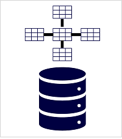

# Explore data analytics in Azure

Data analytics for the big data guys.

## Explore fundamentals of modern data warehousing

Send structured transactional database to a data lake for the data science people.

### Describe modern data warehousing

Generally, the following workflow is present:

1. **Data ingestion and processing**: data from one or more transactional data stores, files, real-time streams, or other sources is loaded into a data lake or a relational data warehouse. The load operation usually involves an *extract, transform, and load (ETL)* or *extract, load, and transform (ELT)* process in which the data is cleaned, filtered, and restructured for analysis:
   - In *ETL processes*, the data is transformed before being loaded into an analytical store.
   - In *ELT processes*, the data is copied to the store and then transformed.

    Either way, the resulting data structure is optimized for analytical queries. The data processing is often performed by distributed systems that can process high volumes of data in parallel using multi-node clusters. Data ingestion includes both batch processing of static data and real-time processing of streaming data.
2. **Analytical data store**: data stores for large scale analytics include relational data warehouses, file-system based data lakes, and hybrid architectures that combine features of data warehouses and *data lakes* (sometimes called data lakehouses or lake databases).
3. **Analytical data model**: while data analysts and data scientists can work with the data directly in the analytical data store, it’s common to create one or more data models that pre-aggregate the data to make it easier to produce reports, dashboards, and interactive visualizations. Often these data models are described as cubes, in which numeric data values are aggregated across one or more dimensions (for example, to determine total sales by product and region).
4. **Data visualization**: data analysts consume data from analytical models, and directly from analytical stores to create reports, dashboards, and other visualizations. Additionally, users in an organization who may not be technology professionals might perform self-service data analysis and reporting.

### Explore data ingestion pipelines

The following picture describes how data is ingested into an analytical data store:

A **pipeline** consists of one or more *activities* that operate on the data. You can create and run pipelines using *Azure Data Factory*, or you can use the same pipeline engine in *Azure Synapse Analytics* if you want to manage all of the components of your data warehousing solution in a unified workspace. Pipelines use *linked services* to load and process data – enabling you to use the right technology for each step of the workflow (for example Azure Blob => Azure SQL Database => Azure Databricks).

### Explore analytical data stores

There are two common types for analytical data storage:

First up is the *data warehouse*. This is a relational database in which the data is stored in a schema that is optimized for data analytics rather than transactional workloads. The data from a transactional store is *denormalized* into a schema in which numeric values are stored in central fact tables, which are related to one or more dimension tables that represent entities by which the data can be aggregated.

Out of this data, a *star schema* is generated. This holds two things:

- *Dimension tables*: They describe the business entities like products, people, places, etc. It contains a key column (or columns) that acts as a unique identifier, and descriptive columns.
- *Fact tables*: It stores observations or events. Furthermore, it contains dimension key columns that relate to dimension tables, and numeric measure columns. The dimension key columns determine the *dimensionality* of a fact table, while the dimension key values determine the *granularity* of a fact table.

A data warehouse is a great choice when you have transactional data that can be organized into a structured schema of tables, and you want to use SQL to query them.

Then we have the *data lake*. It is a file store, usually on a distributed file system for high performance data access. Technologies like *Spark or Hadoop* are often used to process queries on the stored files and return data for reporting and analytics. These systems often apply a *schema-on-read* approach to define tabular schemas on semi-structured data files at the point where the data is read for analysis, without applying constraints when it's stored.

Data lakes are great for supporting a mix of structured, semi-structured, and even unstructured data that you want to analyze without the need for schema enforcement when the data is written to the store.

By combining the two data storages, you get a *lake database* or *data lakehouse*. For example, *Azure Synapse Analytics* includes **PolyBase** which enables you to define external tables based on files in a datalake (and other sources) and query them using SQL (data lakehouse). It also supports a lake database approach in which you can use database templates to define the relational schema of your data warehouse, while storing the underlying data in data lake storage – separating the storage and compute for your data warehousing solution. In Spark-based systems this is called *Delta Lake*, but it's relative new.

There are three Azure services that you can use to **implement a large-scale analytical store**:

-  *Azure Synapse Analytics* is a unified, end-to-end solution for large scale data analytics containing a SQL Server based relational data warehouse with the flexibility of a data lake and open-source Apache Spark. It includes native support for log and telemetry analytics with Azure Synapse Data Explorer pools, as well as built in data pipelines for data ingestion and transformation. All of this can be managed through *Azure Synapse Studio*, which includes the ability to create interactive notebooks in which Spark code and markdown content can be combined.
-  *Azure Databricks* is an Azure implementation of the popular Databricks platform including data analytics solution built on Apache Spark, and offers native SQL capabilities as well as workload-optimized Spark clusters for data analytics and data science. You might want to consider using Azure Databricks as your analytical store if you want to use existing expertise with the platform or if you need to operate in a multi-cloud environment or support a cloud-portable solution.
-  *Azure HDInsight* is an Azure service that supports multiple open-source data analytics cluster types. Although not as user-friendly as Azure Synapse Analytics and Azure Databricks, it can be a suitable option if your analytics solution relies on multiple open-source frameworks or if you need to migrate an existing on-premises Hadoop-based solution to the cloud.

Each of these services can be thought of as an analytical data store, in the sense that they provide a schema and interface through which the data can be queried. In many cases however, the data is actually stored in a data lake and the service is used to process the data and run queries. Some solutions might even combine the use of these services. An extract, load, and transform (ELT) ingestion process might copy data into the data lake, and then use one of these services to transform the data, and another to query it. For example, a pipeline might use a MapReduce job running in HDInsight or a notebook running in Azure Databricks to process a large volume of data in the data lake, and then load it into tables in a SQL pool in Azure Synapse Analytics.
